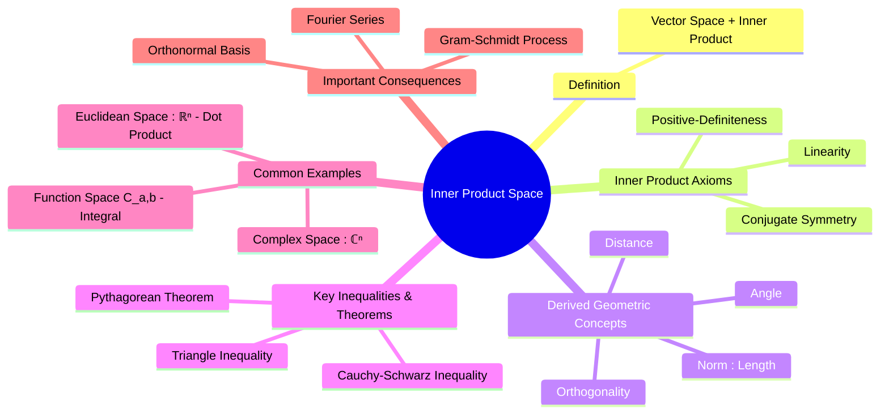

---
tags:
  - linear-algebra
  - vector-spaces
  - inner-product
  - orthogonality
  - functional-analysis
  - engineering-math
created: 2025-09-09
aliases:
  - Inner Product Space
  - Inner Product
  - "Examples : Inner Product Spaces"
  - Inner Product Space Definition and Properties
subject: "[[Mathematics]]"
parent: "[[Vector Space Definition and Properties|Vector Spaces]]"
---
### Inner Product Spaces
#inner-product #vector-space #orthogonality

> An **inner product space** is a [[Vector Space Definition and Properties|vector space]] equipped with an additional operation called an **inner product**. This operation generalizes the standard dot product in $\mathbb{R}^n$ and allows us to introduce geometric concepts like **length (norm)**, **distance**, and **angle (orthogonality)** into abstract vector spaces, including function spaces.

---
#### Definition and Axioms
#inner-product/axioms

An inner product on a complex vector space $V$ is a function that associates a scalar, denoted $\langle \mathbf{u}, \mathbf{v} \rangle$, with every pair of vectors $\mathbf{u}, \mathbf{v} \in V$. This function must satisfy the following [[axioms]] for all vectors $\mathbf{u}, \mathbf{v}, \mathbf{w} \in V$ and any scalar $c$.

1.  **Conjugate Symmetry**:
    $$\boxed{\quad \langle \mathbf{u}, \mathbf{v} \rangle = \overline{\langle \mathbf{v}, \mathbf{u} \rangle} \quad}$$
    (The bar denotes the complex conjugate. For real vector spaces, this simplifies to $\langle \mathbf{u}, \mathbf{v} \rangle = \langle \mathbf{v}, \mathbf{u} \rangle$.)

2.  **Linearity in the First Argument**:
    $$\boxed{\quad \langle c\mathbf{u} + \mathbf{v}, \mathbf{w} \rangle = c\langle \mathbf{u}, \mathbf{w} \rangle + \langle \mathbf{v}, \mathbf{w} \rangle \quad}$$

3.  **Positive-Definiteness**:
    $$\boxed{\quad \langle \mathbf{v}, \mathbf{v} \rangle \ge 0, \quad \text{and} \quad \langle \mathbf{v}, \mathbf{v} \rangle = 0 \iff \mathbf{v} = \mathbf{0} \quad}$$

---
#### Induced Norm, Distance, and Angle
#norm #distance #orthogonality

The inner product naturally defines geometric properties:

*   **[[Norm of a Vector|Norm]] (Length)** of a vector $\mathbf{v}$:
    $$\boxed{\quad ||\mathbf{v}|| = \sqrt{\langle \mathbf{v}, \mathbf{v} \rangle} \quad}$$
*   **Distance** between two vectors $\mathbf{u}$ and $\mathbf{v}$:
    $$\boxed{\quad d(\mathbf{u}, \mathbf{v}) = ||\mathbf{u} - \mathbf{v}|| = \sqrt{\langle \mathbf{u} - \mathbf{v}, \mathbf{u} - \mathbf{v} \rangle} \quad}$$
*   **Angle** $\theta$ between two non-zero vectors:
    $$ \cos\theta = \frac{\text{Re}(\langle \mathbf{u}, \mathbf{v} \rangle)}{||\mathbf{u}|| \ ||\mathbf{v}||} $$
*   **[[Orthogonality]]**: Two vectors $\mathbf{u}$ and $\mathbf{v}$ are **orthogonal** if their inner product is zero.
    $$\boxed{\quad \mathbf{u} \perp \mathbf{v} \iff \langle \mathbf{u}, \mathbf{v} \rangle = 0 \quad}$$

#### Fundamental Inequalities and Theorems
#cauchy-schwarz #triangle-inequality

1.  **Cauchy-Schwarz Inequality**: Relates the inner product to the norms.
    $$\boxed{\quad |\langle \mathbf{u}, \mathbf{v} \rangle| \le ||\mathbf{u}|| \ ||\mathbf{v}|| \quad}$$
2.  **Triangle Inequality**: The norm of a sum is less than or equal to the sum of the norms.
    $$\boxed{\quad ||\mathbf{u} + \mathbf{v}|| \le ||\mathbf{u}|| + ||\mathbf{v}|| \quad}$$
3.  **Pythagorean Theorem**: If two vectors are orthogonal, the square of the norm of their sum is the sum of their squared norms.
    $$\boxed{\quad \text{If } \langle \mathbf{u}, \mathbf{v} \rangle = 0, \text{ then } ||\mathbf{u} + \mathbf{v}||^2 = ||\mathbf{u}||^2 + ||\mathbf{v}||^2 \quad}$$

---
#### Common Examples of Inner Product Spaces
#inner-product/examples

1.  **Euclidean Space $\mathbb{R}^n$**: The standard inner product is the **dot product**.
    $$ \langle \mathbf{u}, \mathbf{v} \rangle = \mathbf{u}^T \mathbf{v} = \sum_{i=1}^n u_i v_i $$
2.  **Complex Space $\mathbb{C}^n$**: The standard inner product is:
    $$ \langle \mathbf{u}, \mathbf{v} \rangle = \mathbf{u}^T \overline{\mathbf{v}} = \sum_{i=1}^n u_i \overline{v_i} $$
3.  **Function Space $C[a, b]$** (Space of continuous real functions on $[a,b]$):
    $$ \langle f(t), g(t) \rangle = \int_a^b f(t) g(t) \, dt $$
    This inner product is fundamental to [[Fourier Series|Fourier Series]] analysis.

---
### Related Concepts
#related-concepts

> [[Orthogonality]]

[[Vector Space Definition and Properties|Vector Spaces]]
[[Gram-Schmidt Orthogonalization]]
[[Fourier Series|Fourier Series]]
[[Linear Algebra]]