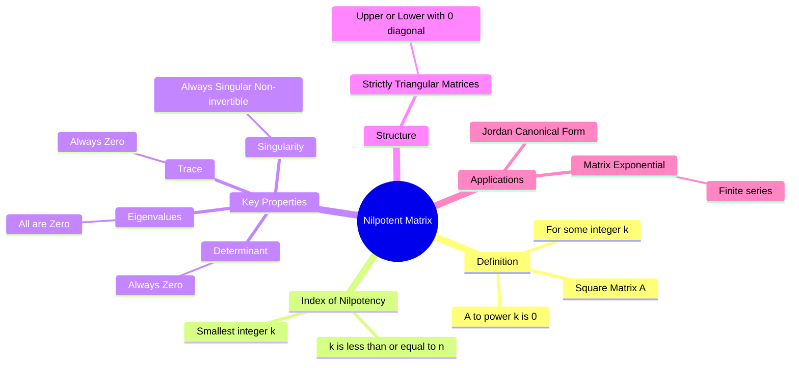

---
tags:
  - mathematics
  - linear-algebra
  - matrices
  - gate
  - eigenvalues
aliases:
  - Nilpotent Matrix
  - Index of Nilpotency
subject: "[[Mathematics]]"
parent:
  - Matrices
  - Linear Algebra
confidence: 10
---
###### Mind Map

---
### Nilpotent Matrices
#linear-algebra/matrices #special-matrices

> A **Nilpotent Matrix** is a square matrix that becomes the zero matrix when raised to a certain positive integer power. In a sense, it represents an operator that eventually "annihilates" any vector it is applied to repeatedly.

#### Definition and Index
#nilpotent/definition

A square matrix $A$ of size $n \times n$ is called **Nilpotent** if there exists a positive integer $k$ such that:
$$\boxed{\quad A^k = \mathbf{0} \quad}$$
where $\mathbf{0}$ is the null (zero) matrix.

**Index of Nilpotency:**

The **smallest** positive integer $k$ for which $A^k = \mathbf{0}$ is called the index of nilpotency.
*   If $k$ is the index, then $A^{k-1} \neq \mathbf{0}$.
*   The index $k$ is always less than or equal to the size of the matrix: $k \le n$.

---
#### 🔥Eigenvalues and Characteristic Equation
#eigenvalues #gate/trick

This is the most important property for GATE questions.
Since $A^k = 0$, if $\lambda$ is an eigenvalue of $A$, then $\lambda^k$ must be an eigenvalue of $A^k$.
$$\lambda^k = 0 \implies \lambda = 0$$

* **Property:** **All eigenvalues of a nilpotent matrix are ZERO.**
* **[[Characteristic Polynomial and Equation|Characteristic Polynomial]]:** Since all eigenvalues are 0, the characteristic equation is simply:
    $$\boxed{\quad \lambda^n = 0 \quad}$$

---
#### Important Properties
#linear-algebra/properties

1.  **Determinant:** Since $\det(A) = \prod \lambda_i$ and all $\lambda_i = 0$:
    $$\det(A) = 0$$
    (Nilpotent matrices are always **Singular** / Non-invertible).
2.  **Trace:** Since $\text{tr}(A) = \sum \lambda_i$:
    $$\text{tr}(A) = 0$$
3.  **Strictly Triangular Structure:**
    Any triangular matrix (upper or lower) with **zeros on the main diagonal** is nilpotent.
    *   Example: $A = \begin{bmatrix} 0 & 2 & 3 \\ 0 & 0 & 5 \\ 0 & 0 & 0 \end{bmatrix}$ is nilpotent with index $\le 3$.
4.  **Matrix Exponential:**
    For a nilpotent matrix, the [[Taylor Series|infinite series]] for the matrix exponential $e^A$ terminates and becomes a finite polynomial:
    $$e^A = I + A + \frac{A^2}{2!} + \dots + \frac{A^{k-1}}{(k-1)!}$$
    (Terms from $A^k$ onwards are zero).

---
#### Example

Consider a $2 \times 2$ matrix $A = \begin{bmatrix} 0 & 1 \\ 0 & 0 \end{bmatrix}$.

1.  **Check Power:**
    $$A^2 = \begin{bmatrix} 0 & 1 \\ 0 & 0 \end{bmatrix} \begin{bmatrix} 0 & 1 \\ 0 & 0 \end{bmatrix} = \begin{bmatrix} 0 & 0 \\ 0 & 0 \end{bmatrix} = \mathbf{0}$$
    Since $A \neq 0$ and $A^2 = 0$, $A$ is nilpotent with **index 2**.
2.  **Eigenvalues:** The matrix is upper triangular with 0s on the diagonal. $\lambda_1 = 0, \lambda_2 = 0$.
3.  **Trace:** $0+0 = 0$.
4.  **Determinant:** $(0)(0) - (0)(1) = 0$.

---
#### Inverse of $(I - A)$

If $A$ is nilpotent with index $k$ ($A^k=0$), then the matrix $(I-A)$ is invertible, and its inverse is given by the finite geometric series:
$$(I - A)^{-1} = I + A + A^2 + \dots + A^{k-1}$$

---
### Related Concepts
#topic/related-concepts

> [[Eigenvalues and Eigenvectors]]

[[Types of Matrices]]
[[Determinant of a Matrix]]
[[Cayley-Hamilton Theorem]]
[[Triangular Matrices]]
[[Matrix Operations|Trace of a Matrix]]
[[State Transition Matrix (STM)|Matrix Exponential]]