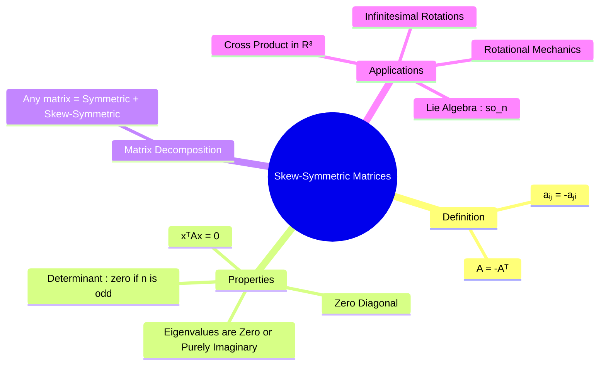

---
tags:
  - linear-algebra
  - matrix-theory
  - skew-symmetric-matrix
  - engineering-math
created: 2025-09-09
aliases:
  - Skew-Symmetric Matrix
  - Anti-Symmetric Matrix
subject: "[[Mathematics]]"
parent:
  - Linear Algebra
confidence: 9
---

---
### Skew-Symmetric Matrices
#skew-symmetric-matrix #linear-algebra

> A **skew-symmetric** (or anti-symmetric) matrix is a square matrix that is equal to the negative of its transpose. These matrices are the counterparts to [[Symmetric Matrices]] and play a crucial role in representing rotations, angular velocities, and concepts like the cross product in linear algebraic form.

#### Definition
#skew-symmetric-matrix/definition

A square matrix $A$ is **skew-symmetric** if it is equal to the negative of its transpose:
$$\boxed{\quad A = -A^T \quad}$$
This means that the entry in the $i$-th row and $j$-th column is the negative of the entry in the $j$-th row and $i$-th column.
$$ a_{ij} = -a_{ji} $$
A direct consequence of this is that all the diagonal elements must be zero, since for $i=j$, we have $a_{ii} = -a_{ii}$, which implies $2a_{ii}=0$, so $a_{ii}=0$.

**Example**: A general $3 \times 3$ skew-symmetric matrix looks like this:
$$ A = \begin{bmatrix} 0 & a & b \\ -a & 0 & c \\ -b & -c & 0 \end{bmatrix} $$

---
#### Key Properties of Skew-Symmetric Matrices
#skew-symmetric-matrix/properties

1.  **Eigenvalues**: The eigenvalues of a real skew-symmetric matrix are always either **zero or purely imaginary**.
2.  **Determinant**:
    *   If $n$ is **odd**, the determinant of an $n \times n$ skew-symmetric matrix is **always zero**.
    *   If $n$ is **even**, the determinant is non-negative and is the square of a polynomial in the matrix entries called the Pfaffian.
3.  **[[Quadratic Forms#Matrix Representation|Quadratic Form]]**: For any real vector $\mathbf{x}$, the quadratic form associated with a skew-symmetric matrix is always zero. $$\boxed{\quad \mathbf{x}^T A \mathbf{x} = 0 \quad}$$
    This is because $\mathbf{x}^T A \mathbf{x}$ is a scalar, so it equals its transpose: $\mathbf{x}^T A \mathbf{x} = (\mathbf{x}^T A \mathbf{x})^T = \mathbf{x}^T A^T \mathbf{x} = \mathbf{x}^T (-A) \mathbf{x} = -(\mathbf{x}^T A \mathbf{x})$. The only scalar equal to its own negative is zero.
    > See [[ee_2026#^q35]]

> [!important] Product of Skew-Symmetric Matrices
> If $A^T=-A$ and $B^T=-B$, then  
> $$(AB)^T = B^T A^T = BA.$$
> The product $AB$ is **skew-symmetric iff**  
> $$BA=-AB \;\;(\Leftrightarrow\; AB+BA=\mathbf{0}).$$  
> **Note:** Skew-symmetric matrices generally do **not** anticommute; this condition is necessary and sufficient.

---
#### Decomposition of a Square Matrix
#matrix-decomposition

Any square matrix $M$ can be uniquely expressed as the sum of a symmetric matrix ($S$) and a skew-symmetric matrix ($K$).
$$\begin{align}
S &= \frac{1}{2}(M + M^T) \quad (\text{Symmetric part}) \\
K &= \frac{1}{2}(M - M^T) \quad (\text{Skew-symmetric part})
\end{align}$$
So, $M = S+K$.

> [!tip] Conceptual Synthesis: Skew-Symmetric Quadratic Forms
> The instruction in [[Quadratic Forms#Matrix Representation]] to extract the symmetric part of a matrix ($A_{sym} = \frac{A+A^T}{2}$) perfectly aligns with the properties of skew-symmetric matrices. 
> 
> Because any matrix $M$ can be decomposed into $S + K$ (Symmetric + Skew-Symmetric), its quadratic form is $x^T M x = x^T S x + x^T K x$. 
> 
> Since the quadratic form of any skew-symmetric matrix is always zero ($x^T K x = 0$) [[#Key Properties of Skew-Symmetric Matrices]], that portion of the matrix contributes absolutely nothing to $Q$. If a matrix is **entirely** skew-symmetric, its symmetric part is 0, making its total quadratic form $0$.

---
#### Applications
#skew-symmetric-matrix/applications

1.  **Cross Product**: The cross product of two vectors in $\mathbb{R}^3$ can be represented as a matrix-vector multiplication using a skew-symmetric matrix. If $\mathbf{a} = (a_1, a_2, a_3)$, then the transformation $\mathbf{x} \mapsto \mathbf{a} \times \mathbf{x}$ is given by multiplication with the matrix $[\mathbf{a}]_\times$:
    $$\boxed{\quad \mathbf{a} \times \mathbf{x} = [\mathbf{a}]_\times \mathbf{x} = \begin{bmatrix} 0 & -a_3 & a_2 \\ a_3 & 0 & -a_1 \\ -a_2 & a_1 & 0 \end{bmatrix} \begin{bmatrix} x_1 \\ x_2 \\ x_3 \end{bmatrix} \quad}$$

2.  **Infinitesimal Rotations and Angular Velocity**: Skew-symmetric matrices represent infinitesimal rotations. In mechanics, the angular velocity vector $\boldsymbol{\omega}$ is associated with a skew-symmetric matrix $\Omega$ such that the velocity $\mathbf{v}$ of a point with position $\mathbf{r}$ in a rotating frame is $\mathbf{v} = \boldsymbol{\omega} \times \mathbf{r} = \Omega \mathbf{r}$.
    The **matrix exponential** of a skew-symmetric matrix is an [[Orthogonal Matrices|Orthogonal Matrix]] which represents a finite rotation.

---
### Related Concepts
#related-concepts

> [[Symmetric Matrices]]

[[Orthogonal Matrices]]
[[Eigenvalues and Eigenvectors]]
[[Determinant of a Matrix]]
[[Vector Operations]]
