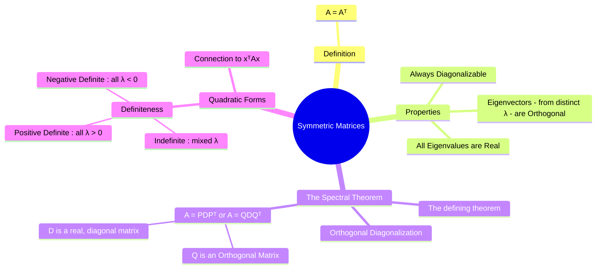

---
tags:
  - linear-algebra
  - matrix-theory
  - symmetric-matrix
  - eigenvalues
  - spectral-theorem
  - engineering-math
created: 2025-09-09
aliases:
  - Symmetric Matrix
  - Properties of Symmetric Matrices
  - The Spectral Theorem for Real Symmetric Matrices
subject: "[[Mathematics]]"
parent: Linear Algebra
confidence: 9
formula:
  - "Symmetric Matrices : $$A=A^T$$"
  - "The Spectral Theorem for Real Symmetric Matrices : $$A = PDP^T = PDP^{-1}$$"
---

---
### Symmetric Matrices
#symmetric-matrix #linear-algebra #spectral-theorem

> A **symmetric matrix** is a square matrix that is equal to its own [[Transpose and Inverse of a Matrix|transpose]]. This simple, elegant property leads to some of the most important and well-behaved results in linear algebra. Symmetric matrices are guaranteed to have real [[Eigenvalues and Eigenvectors|eigenvalues]], an [[Orthonormal Basis]] of [[Eigenvalues and Eigenvectors|eigenvectors]], and are always [[Diagonalization of a Matrix|diagonalizable]]. They are central to many applications, including quadratic forms, mechanics, and stability analysis.

#### Definition
#symmetric-matrix/definition

A square matrix $A$ is **symmetric** if it is equal to its transpose:
$$\boxed{\quad A = A^T \quad}$$
This means that the entry in the $i$-th row and $j$-th column is equal to the entry in the $j$-th row and $i$-th column for all $i$ and $j$.
$$ a_{ij} = a_{ji} $$

---
#### 🔥Key Properties of Symmetric Matrices
#symmetric-matrix/properties

Real symmetric matrices have three exceptionally important properties that are not true for general matrices:

1.  **All Eigenvalues are Real**: A symmetric matrix never has complex eigenvalues. This simplifies analysis greatly.
2.  **Orthogonal Eigenvectors**: Eigenvectors corresponding to **distinct** eigenvalues are always [[Orthogonality|orthogonal]].
3.  **Always Diagonalizable**: Every real symmetric matrix is [[Diagonalization of a Matrix|diagonalizable]]. There will always be a full set of $n$ linearly independent eigenvectors.

These properties are encapsulated in the Spectral Theorem.

> [!important] Product of Symmetric Matrices
> If $A^T=A$ and $B^T=B$, then  
> $$(AB)^T = B^T A^T = BA.$$
> Hence, the product $AB$ is **symmetric iff**  
> $$AB = BA \;\;(\Leftrightarrow\; AB-BA=\mathbf{0}).$$  
> **Note:** Symmetric matrices do **not** generally commute; this condition is necessary and sufficient.

---
#### The Spectral Theorem for Real Symmetric Matrices
#spectral-theorem

This is the most important theorem concerning symmetric matrices. It states that a real square matrix $A$ is symmetric if and only if it is **orthogonally diagonalizable**.

This means that a symmetric matrix $A$ can be factored as:
$$\boxed{\quad A = PDP^T = PDP^{-1} \quad}$$
where:
* $P$ is an [[Orthogonal Matrices|orthogonal matrix]] (its columns form an [[Orthonormal Basis]] for $\mathbb{R}^n$, and $P^{-1} = P^T$). The columns of P are the orthonormal eigenvectors of A.
* $D$ is a [[Diagonalization of a Matrix|diagonal matrix]] whose diagonal entries are the real eigenvalues of A, corresponding to the eigenvectors in P.

This is a stronger result than standard [[Diagonalization of a Matrix|diagonalization]], which only guarantees an invertible matrix $P$. For symmetric matrices, $P$ can always be chosen to be orthogonal.

---
#### Symmetric Matrices and Quadratic Forms
#quadratic-forms #definiteness

> See [[Quadratic Forms]]

Symmetric matrices are intrinsically linked to **quadratic forms**. A quadratic form is a polynomial function of several variables where every term has degree two, which can be written as $Q(\mathbf{x}) = \mathbf{x}^T A \mathbf{x}$ for a symmetric matrix $A$.

The signs of the eigenvalues of $A$ determine the **definiteness** of the matrix and the nature of the quadratic form:

* **Positive Definite**: $\mathbf{x}^T A \mathbf{x} > 0$ for all $\mathbf{x} \neq \mathbf{0}$.
    * Condition: All eigenvalues are positive ($\lambda_i > 0$).
* **Positive Semidefinite**: $\mathbf{x}^T A \mathbf{x} \ge 0$ for all $\mathbf{x}$.
    * Condition: All eigenvalues are non-negative ($\lambda_i \ge 0$).
* **Negative Definite**: $\mathbf{x}^T A \mathbf{x} < 0$ for all $\mathbf{x} \neq \mathbf{0}$.
    * Condition: All eigenvalues are negative ($\lambda_i < 0$).
* **Indefinite**: $\mathbf{x}^T A \mathbf{x}$ takes on both positive and negative values.
    * Condition: $A$ has both positive and negative eigenvalues.

This property is crucial in optimization (determining if a critical point is a minimum, maximum, or saddle point) and in [[Control Systems]] for [[Lyapunov stability]] analysis.

---
### Related Concepts
#related-concepts

> [[Diagonalization of a Matrix|Diagonalization]]

[[Hermitian Matrices]]
[[Eigenvalues and Eigenvectors]]
[[Orthogonal Matrices]]
[[Orthogonality]]
[[Orthonormal Basis]]
[[Inner Product Space]]
[[Quadratic Forms]]
