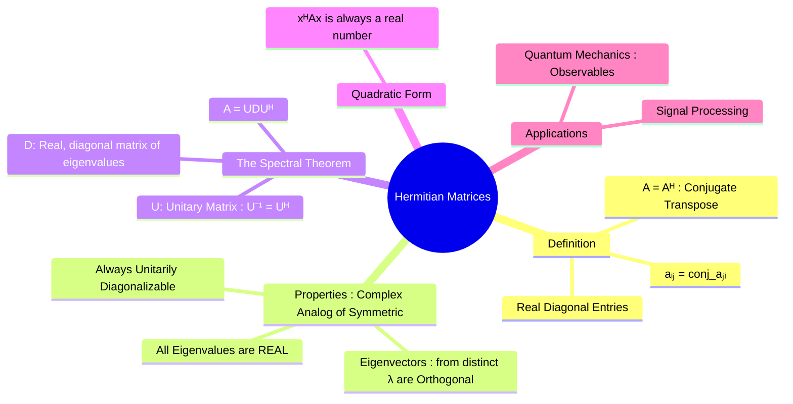

---
tags:
  - linear-algebra
  - matrix-theory
  - hermitian-matrix
  - complex-matrices
  - quantum-mechanics
  - engineering-math
created: 2025-09-09
aliases:
  - Hermitian Matrix
  - Self-Adjoint Matrix
  - The Spectral Theorem for Hermitian Matrices
subject: "[[Mathematics]]"
parent:
  - Linear Algebra
formula:
  - "Hermitian Matrices : $$A = A^H \\quad \\text{where} \\quad A^H = (\\overline{A})^T$$"
  - "The Spectral Theorem for Hermitian Matrices : $$A = UDU^H = UDU^{-1}$$"
---
### Hermitian Matrices
#hermitian-matrix #complex-matrices #quantum-mechanics

> A **Hermitian matrix** (or self-adjoint matrix) is the complex-number generalization of a real [[Symmetric Matrices|symmetric matrix]]. It is a square matrix that is equal to its own **conjugate transpose**. Hermitian matrices are of paramount importance in physics, particularly in quantum mechanics, because they guarantee that physical observables (like energy or momentum) have real-valued measurements ([[Eigenvalues and Eigenvectors|eigenvalues]]).

---
#### Definition
#hermitian-matrix/definition

A square matrix $A$ with complex entries is **Hermitian** if it is equal to its conjugate transpose, denoted $A^H$ or $A^\dagger$.
$$\boxed{\quad A = A^H \quad \text{where} \quad A^H = (\overline{A})^T \quad}$$
This means that the entry in the $i$-th row and $j$-th column is the complex conjugate of the entry in the $j$-th row and $i$-th column.
$$ a_{ij} = \overline{a_{ji}} $$
A direct consequence of this is that the diagonal elements must be real numbers, since for $i=j$, we have $a_{ii} = \overline{a_{ii}}$, which is only true for real numbers.

**Example**: A general $2 \times 2$ Hermitian matrix:
$$ A = \begin{bmatrix} a & b+ic \\ b-ic & d \end{bmatrix} \quad \text{where } a, b, c, d \in \mathbb{R} $$

---
#### Key Properties of Hermitian Matrices
#hermitian-matrix/properties

Hermitian matrices share properties analogous to real symmetric matrices, but defined in the context of complex vector spaces.

1.  **All Eigenvalues are Real**: This is the most crucial property. Although the matrix itself has complex entries, its eigenvalues are always real numbers.
2.  **Orthogonal Eigenvectors**: Eigenvectors corresponding to **distinct** eigenvalues are **orthogonal** with respect to the standard complex inner product ($\langle \mathbf{u}, \mathbf{v} \rangle = \mathbf{u}^T \overline{\mathbf{v}}$).
3.  **Always Diagonalizable**: Every Hermitian matrix is **unitarily diagonalizable**.

![[Eigenvalues on plot.png]]

---
#### The Spectral Theorem for Hermitian Matrices
#spectral-theorem

This theorem is the complex counterpart to the spectral theorem for symmetric matrices. It states that a matrix $A$ is Hermitian if and only if it is **unitarily diagonalizable**.

This means a Hermitian matrix $A$ can be factored as:
$$\boxed{\quad A = UDU^H = UDU^{-1} \quad}$$
where:
*   **U** is a **[[Unitary Matrices|Unitary Matrix]]** (the complex analog of an orthogonal matrix, satisfying $U^{-1} = U^H$). Its columns form an orthonormal basis of eigenvectors for $\mathbb{C}^n$.
*   **D** is a **diagonal matrix** whose diagonal entries are the real eigenvalues of $A$.

---
#### Hermitian Quadratic Form
#quadratic-forms

For any complex vector $\mathbf{x}$, the expression $\mathbf{x}^H A \mathbf{x}$ is called a Hermitian quadratic form. If $A$ is a Hermitian matrix, this quantity is **always a real number**.
$$ (\mathbf{x}^H A \mathbf{x})^H = \mathbf{x}^H A^H (\mathbf{x}^H)^H = \mathbf{x}^H A \mathbf{x} $$
Since the result is equal to its own conjugate transpose (and it's a scalar), it must be real. This property is what allows Hermitian matrices to represent real physical quantities.

---
### Related Concepts
#related-concepts

> [[Symmetric Matrices]] (The real-valued equivalent)

[[Skew-Hermitian Matrices]] (The counterpart, where $A = -A^H$)
[[Unitary Matrices]] (The complex equivalent of an [[Orthogonal Matrices]])
[[Eigenvalues and Eigenvectors]]
[[Diagonalization of a Matrix]]
