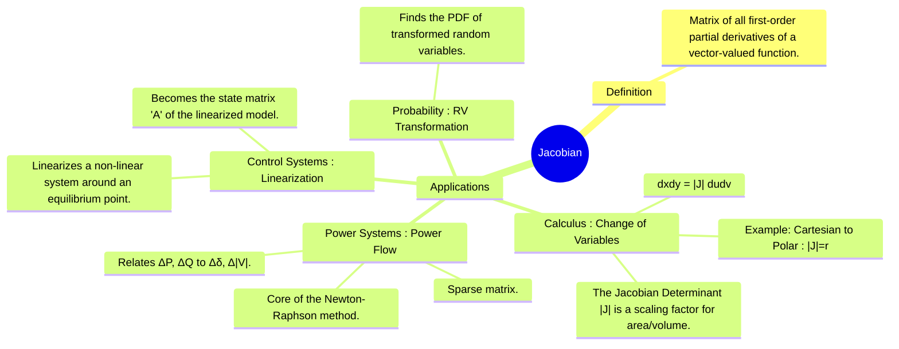

---
tags:
  - jacobian
  - matrix
  - calculus
  - power-systems
  - control-systems
  - probability
  - mathematics
created: 2025-09-08
aliases:
  - Jacobian Matrix
  - Jacobian Determinant
subject:
  - "[[Mathematics]]"
  - "[[Power System]]"
  - "[[Control Systems]]"
parent:
  - Vector Calculus
---
### The Jacobian
#jacobian #multivariable-calculus #linearization

> The **Jacobian** is a matrix containing all the first-order [[partial derivatives]] of a vector-valued function. It represents the best linear approximation of the function near a given point. The Jacobian appears in several critical contexts across the GATE syllabus, serving as a tool for coordinate transformation, numerical analysis, and linearization. Its specific form and use - either as a matrix or its determinant - depend on the application.

---
#### 1. Jacobian in Multivariable Calculus (Change of Variables)
#jacobian-determinant #change-of-variables

In the context of multiple integrals, the **[[Determinant of a Matrix|determinant]] of the Jacobian matrix** acts as a scaling factor when changing coordinate systems. It relates the differential area or volume element from one coordinate system to another.

For a transformation from $(u,v)$ coordinates to $(x,y)$ coordinates, where $x=g(u,v)$ and $y=h(u,v)$, the Jacobian determinant is:
$$\boxed{\quad J = \frac{\partial(x,y)}{\partial(u,v)} = \det \begin{pmatrix}
\frac{\partial x}{\partial u} & \frac{\partial x}{\partial v} \\
\frac{\partial y}{\partial u} & \frac{\partial y}{\partial v}
\end{pmatrix} \quad}$$
The relationship between the differential areas is:
$$\boxed{\quad dx\,dy = |J| \,du\,dv \quad}$$

*   **Example (Cartesian to Polar)**: For the transformation $x=r\cos\theta, y=r\sin\theta$, the Jacobian determinant is $J=r$. Therefore, $dx\,dy = r\,dr\,d\theta$.

---
#### 2. Jacobian Matrix in Power System Analysis (Power Flow)
#power-flow #newton-raphson

The Jacobian matrix is the core of the **[[Newton-Raphson Method for Load Flow|Newton-Raphson method]]** for solving non-linear power flow equations. It relates the changes in real and reactive power injections ($\Delta P, \Delta Q$) to the changes in bus voltage angles and magnitudes ($\Delta \delta, \Delta |V|$).
$$\boxed{\quad
\begin{bmatrix} \Delta P \\ \Delta Q \end{bmatrix} =
\begin{bmatrix} J_1 & J_2 \\ J_3 & J_4 \end{bmatrix}
\begin{bmatrix} \Delta \delta \\ \Delta |V| \end{bmatrix}
\quad}$$
Where the [[Block Matrices|sub-matrices]] are blocks of [[partial derivatives]]:
*   $J_1 = \frac{\partial P}{\partial \delta}$
*   $J_2 = \frac{\partial P}{\partial |V|}$
*   $J_3 = \frac{\partial Q}{\partial \delta}$
*   $J_4 = \frac{\partial Q}{\partial |V|}$

This Jacobian matrix has the same [[Sparsity|sparsity pattern]] as the [[Bus Admittance Matrix (Y-bus) Formulation|Y-bus matrix]], a property that is heavily exploited to speed up computations.

> See [[Newton-Raphson Method for Load Flow]]

---
#### 3. Jacobian in Control Systems (Linearization)
#linearization #state-space

For a non-linear continuous-time system described by $\dot{\mathbf{x}} = f(\mathbf{x}, \mathbf{u})$, we can linearize the system around an equilibrium point $(\mathbf{x}_0, \mathbf{u}_0)$. The state matrix **A** of the resulting linear state-space model ($\Delta\dot{\mathbf{x}} = \mathbf{A}\Delta\mathbf{x} + \mathbf{B}\Delta\mathbf{u}$) is the Jacobian of the function $f$ with respect to the state vector $\mathbf{x}$.
$$\boxed{\quad \mathbf{A} = \frac{\partial f}{\partial \mathbf{x}} \bigg|_{(\mathbf{x}_0, \mathbf{u}_0)} =
\begin{bmatrix}
\frac{\partial f_1}{\partial x_1} & \frac{\partial f_1}{\partial x_2} & \dots \\
\frac{\partial f_2}{\partial x_1} & \frac{\partial f_2}{\partial x_2} & \dots \\
\vdots & \vdots & \ddots
\end{bmatrix}_{(\mathbf{x}_0, \mathbf{u}_0)}
\quad}$$

---
#### 4. Jacobian in Probability (Transformation of Random Variables)
#transformation-of-variables #random-variables

When transforming a set of continuous random variables, the Jacobian determinant is used to find the joint PDF of the new variables. If $Y_1 = g_1(X_1, X_2)$ and $Y_2 = g_2(X_1, X_2)$, the joint PDF of $Y_1, Y_2$ is:
$$f_{Y_1,Y_2}(y_1, y_2) = f_{X_1,X_2}(x_1, x_2) |J|$$
Where the Jacobian $J$ is the determinant of the inverse transformation:
$$J = \frac{\partial(x_1,x_2)}{\partial(y_1,y_2)} = \det \begin{pmatrix}
\frac{\partial x_1}{\partial y_1} & \frac{\partial x_1}{\partial y_2} \\
\frac{\partial x_2}{\partial y_1} & \frac{\partial x_2}{\partial y_2}
\end{pmatrix}$$
For a single variable $Y=g(X)$, this simplifies to $f_Y(y) = f_X(x) |\frac{dx}{dy}|$.

> See [[Transformation of Variables]]

---
### Related Concepts
#related-concepts

> [[Transformation of Variables]]

[[Power Flow Equations]]
[[Newton-Raphson Method for Load Flow]]
[[Linearization]]
[[State-Space Representation of LTI Systems]]
[[Continuous Random Variables]]
[[Discrete Random Variables]]
