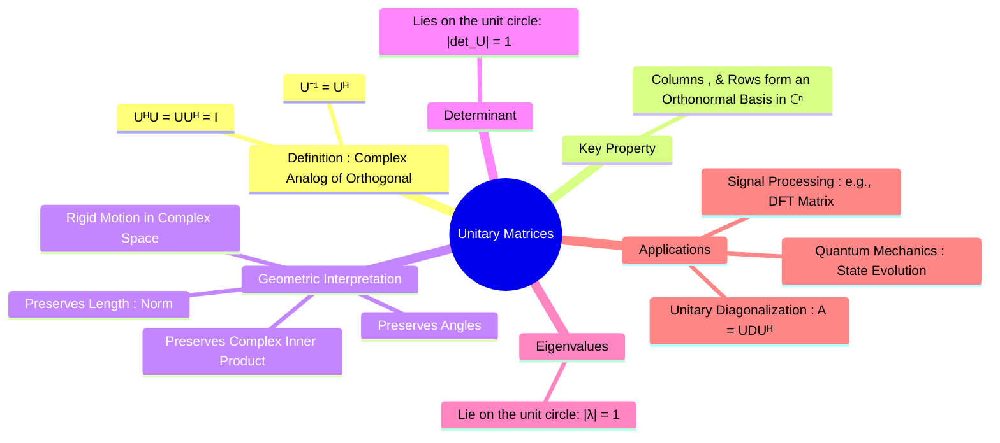

---
tags:
  - linear-algebra
  - matrix-theory
  - unitary-matrix
  - complex-matrices
  - quantum-mechanics
  - engineering-math
created: 2025-09-09
aliases:
  - Unitary Matrix
  - Unitary Transformation
subject: "[[Mathematics]]"
parent:
  - Linear Algebra
formula:
  - "Unitary Matrices : $$U^{-1} = U^H$$"
  - "Determinant of Unitary Matrices : $$|\\det(U)| = 1$$"
  - "Eigenvalues of Unitary Matrices : $$|\\lambda| = 1$$"
---
### Unitary Matrices
#unitary-matrix #complex-matrices #linear-algebra

> A **unitary matrix** is the complex-number equivalent of a real [[Orthogonal Matrices|Orthogonal Matrix]]. It is a square matrix whose columns (and rows) form an orthonormal basis in a complex vector space. Computationally, its defining feature is that its inverse is equal to its **conjugate transpose**. Unitary transformations are fundamental in quantum mechanics as they describe the evolution of a quantum state over time, preserving probabilities.

---
#### Definition
#unitary-matrix/definition

A square matrix $U$ with complex entries is **unitary** if its inverse is equal to its conjugate transpose (Hermitian conjugate), denoted $U^H$ or $U^\dagger$.
$$\boxed{\quad U^{-1} = U^H \quad}$$
This is equivalent to the condition that multiplying the matrix by its conjugate transpose yields the identity matrix:
$$\boxed{\quad U^H U = U U^H = I \quad}$$

---
#### Key Properties
#unitary-matrix/properties

1.  **Orthonormal Columns/Rows**: The columns of a unitary matrix form an orthonormal basis for $\mathbb{C}^n$ with respect to the standard complex inner product ($\langle \mathbf{u}, \mathbf{v} \rangle = \mathbf{u}^T \overline{\mathbf{v}}$). The same is true for the rows.
2.  **Preservation of Inner Product**: A unitary matrix preserves the complex inner product.
    $$\boxed{\quad \langle U\mathbf{x}, U\mathbf{y} \rangle = \langle \mathbf{x}, \mathbf{y} \rangle \quad}$$
3.  **Preservation of Norm (Length)**: It preserves the length (norm) of complex vectors.
    $$\boxed{\quad ||U\mathbf{x}|| = ||\mathbf{x}|| \quad}$$

---
#### Other Important Properties

* **Determinant**: The determinant of a unitary matrix is a complex number that lies on the unit circle, meaning its absolute value is 1.
    $$\boxed{\quad |\det(U)| = 1 \quad}$$
* **Eigenvalues**: The eigenvalues of a unitary matrix also lie on the unit circle in the complex plane.
    $$\boxed{\quad |\lambda| = 1 \quad}$$
* **Product and Inverse**: The product of two unitary matrices is unitary, and the inverse of a unitary matrix is unitary.

---
#### Applications
#unitary-matrix/applications

1.  **Quantum Mechanics**: Unitary transformations describe the time evolution of a closed quantum system. If a state is represented by a vector $|\psi\rangle$, its state at a later time is given by $|\psi(t)\rangle = U(t)|\psi(0)\rangle$, where $U(t)$ is a unitary operator. This ensures that the total probability (the norm of the state vector) is conserved.
2.  **Unitary Diagonalization**: [[Hermitian Matrices]] and [[Skew-Hermitian Matrices]] are always diagonalizable by a unitary matrix, in the form $A = UDU^H$. This is the complex version of the spectral theorem.
3.  **Signal Processing**: The matrix representation of the Discrete Fourier Transform (DFT) is a specific and highly important unitary matrix.

---
### Related Concepts
#related-concepts

> [[Orthogonal Matrices]] (The real-valued equivalent)

[[Hermitian Matrices]]
[[Skew-Hermitian Matrices]]
[[Orthonormal Basis]]
[[Inner Product Space]]