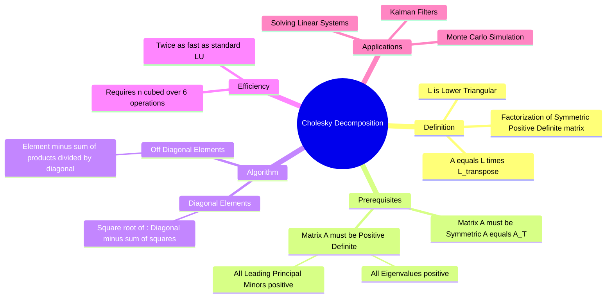

---
tags:
  - mathematics
  - linear-algebra
  - numerical-methods
  - gate
  - matrix-factorization
aliases:
  - Cholesky Factorization
  - Square Root Method
subject: "[[Mathematics]]"
parent: "[[LU Decomposition]]"
created: 2026-02-10
---
### Cholesky Decomposition
#linear-algebra/matrix-factorization #numerical-methods

> **Cholesky Decomposition** is a specialized and highly efficient form of LU decomposition applicable **only** to **Hermitian (or real Symmetric) and Positive Definite** matrices. It factors the matrix $A$ into a lower triangular matrix $L$ and its conjugate transpose $L^*$ (or $L^T$ for real matrices).

---
#### Definition
#cholesky/definition

For a real symmetric, positive-definite matrix $A$, the decomposition is defined as:
$$\boxed{\quad A = L L^T \quad}$$

Where:
*   $L$ is a **Lower Triangular Matrix** with positive diagonal entries.
*   $L^T$ is the Upper Triangular transpose of $L$.

*Comparison to LU:* In standard LU ($A=LU$), $L$ has 1s on the diagonal and $U$ is distinct. In Cholesky, $U$ is simply $L^T$, reducing the memory required to store the factors by half.

---
#### Prerequisites (GATE Critical)
#cholesky/conditions

The algorithm **fails** (involves square roots of negative numbers) if the matrix does not meet these criteria. For a matrix $A$ to allow Cholesky decomposition:
1.  **Symmetric:** $A = A^T$ (for real matrices).
2.  **Positive Definite:**
    *   All **Eigenvalues** must be strictly positive ($\lambda_i > 0$).
    *   All **Leading Principal Minors** (Sylvester's Criterion) must be positive.
    *   $x^T A x > 0$ for all non-zero vectors $x$.

---
#### Computational Algorithm
#cholesky/formula

By equating $A = L L^T$, we can derive formulas for the elements of $L$.

**For Diagonal Elements ($l_{kk}$):**
$$l_{kk} = \sqrt{a_{kk} - \sum_{j=1}^{k-1} l_{kj}^2}$$
*(Interpretation: The diagonal element is the square root of the original diagonal element minus the "energy" of the previous elements in that row).*

**For Off-Diagonal Elements ($l_{ik}$ where $i > k$):**
$$l_{ik} = \frac{1}{l_{kk}} \left( a_{ik} - \sum_{j=1}^{k-1} l_{ij}l_{kj} \right)$$

---
#### Example Calculation
Decompose $A = \begin{bmatrix} 4 & 2 \\ 2 & 10 \end{bmatrix}$.

1.  **Check Conditions:**
    *   Symmetric? Yes ($a_{12}=a_{21}=2$).
    *   Positive Definite? $D_1 = 4 > 0$. $D_2 = 40 - 4 = 36 > 0$. Yes.

2.  **Calculate $L = \begin{bmatrix} l_{11} & 0 \\ l_{21} & l_{22} \end{bmatrix}$:**
    *   **$l_{11}$:** $\sqrt{a_{11}} = \sqrt{4} = 2$.
    *   **$l_{21}$:** $\frac{a_{21}}{l_{11}} = \frac{2}{2} = 1$.
    *   **$l_{22}$:** $\sqrt{a_{22} - l_{21}^2} = \sqrt{10 - 1^2} = \sqrt{9} = 3$.

    $$\boxed{\quad L = \begin{bmatrix} 2 & 0 \\ 1 & 3 \end{bmatrix} \quad}$$

    *Verification:* $L L^T = \begin{bmatrix} 2 & 0 \\ 1 & 3 \end{bmatrix} \begin{bmatrix} 2 & 1 \\ 0 & 3 \end{bmatrix} = \begin{bmatrix} 4 & 2 \\ 2 & 10 \end{bmatrix} = A$.

---
#### Computational Efficiency
#numerical-methods/efficiency

*   **Operation Count:** Approximately $\frac{n^3}{6}$ FLOPS (Floating Point Operations).
*   **Comparison:** This is roughly **half** the computational cost of Gaussian Elimination (LU Decomposition), which requires $\frac{n^3}{3}$ FLOPS.
*   **Stability:** It is numerically very stable because the diagonal elements (square roots) tend to limit the growth of numbers during calculation.

---
### Related Concepts
#topic/related-concepts

> [[LU Decomposition]] (The general category)

[[Quadratic Forms]] (Positive Definiteness concepts)
[[Symmetric Matrices]]
[[Eigenvalues and Eigenvectors|Eigenvalues and Eigenvectors]]
[[Determinant of a Matrix]] ($\det(A) = (\det L)^2 = \prod l_{ii}^2$)
[[System of Linear Equations]]
