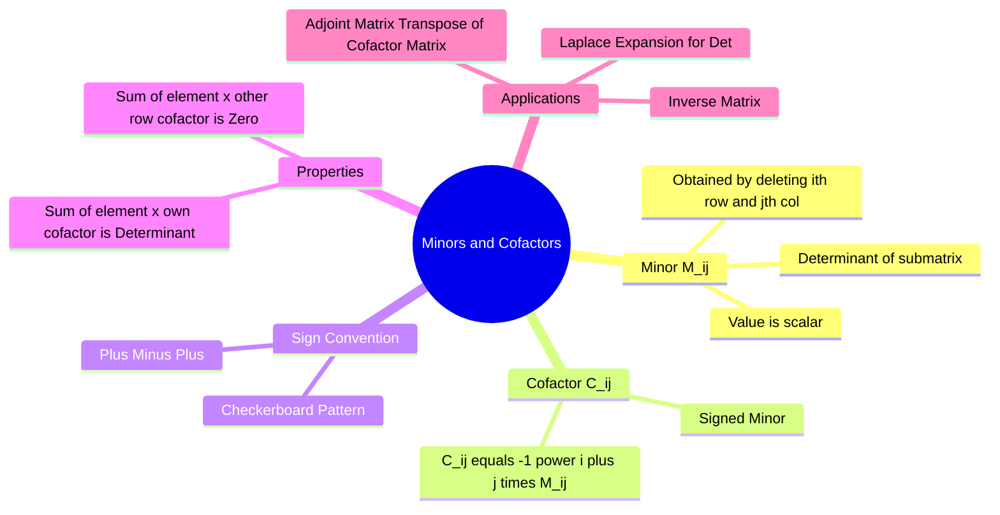

---
tags:
  - mathematics
  - linear-algebra
  - matrices
  - gate
  - determinants
aliases:
  - Minor of an Element
  - Cofactor Expansion
  - Signed Minor
subject: "[[Mathematics]]"
parent: "[[Determinant of a Matrix]]"
created: 2026-07-13
---
### Minors and Cofactors
#linear-algebra/determinants #matrices

> **Minors and Cofactors** are fundamental scalar values derived from a square matrix. They are the building blocks used to calculate the **Determinant** of higher-order matrices (via Laplace Expansion) and to find the **Inverse** of a matrix (via the Adjoint).

---
#### Minor ($M_{ij}$)
#minors/definition

The **Minor** of an element $a_{ij}$ in a square matrix $A$ is the determinant of the sub-matrix obtained by **deleting the $i$-th row and the $j$-th column**.

$$
M_{11}=
\left|
\begin{array}{c@{\hspace{0.8em}}c@{\hspace{0.8em}}c}
\cancel{a_{11}} & \cancel{a_{12}} & \cancel{a_{13}}\\
\cancel{a_{21}} & {a_{22}} & a_{23}\\
\cancel{a_{31}} & {a_{32}} & a_{33}
\end{array}
\right|_{3\times3}
$$

* ==If $A$ is of order $n \times n$, the Minor $M_{ij}$ is a determinant of order $(n-1) \times (n-1)$.==
* **Notation:** $M_{ij}$.

> [!example]
> For $A = \begin{bmatrix} 1 & 2 & 3 \\ 4 & 5 & 6 \\ 7 & 8 & 9 \end{bmatrix}$, the minor of $a_{12}$ (element 2) is: $$M_{12} = \begin{vmatrix} 4 & 6 \\ 7 & 9 \end{vmatrix} = (4 \times 9) - (6 \times 7) = 36 - 42 = -6$$
^example

---
#### Cofactor ($C_{ij}$ or $A_{ij}$)
#cofactors/definition

The **Cofactor** of an element $a_{ij}$ is its Minor multiplied by a sign factor determined by its position.

$$\boxed{\quad C_{ij} = (-1)^{i+j} M_{ij} \quad}$$
^cofactor

*   If $(i+j)$ is **Even**: $C_{ij} = +M_{ij}$.
*   If $(i+j)$ is **Odd**: $C_{ij} = -M_{ij}$.

**Sign Checkerboard ($3 \times 3$):**
$$
\begin{bmatrix}
+ & - & + \\
- & + & - \\
+ & - & +
\end{bmatrix}
$$

> [!example] Example ([[#^example|continued]])
> For the minor calculated above ($M_{12} = -6$):
> Since $i=1, j=2 \implies i+j=3$ (Odd), $$C_{12} = (-1)^{3} (-6) = (-1)(-6) = 6$$
^example-continued

---
#### Key Properties (Crucial for GATE)
#gate/properties

These two properties are frequently tested in objective questions.

**Property A: Value of Determinant**
The sum of the products of elements of any row (or column) with their **corresponding cofactors** gives the Determinant of the matrix.
$$\boxed{\quad \det(A) = \sum_{k=1}^n a_{ik} C_{ik} \quad}$$
*(Example for Row 1: $\Delta = a_{11}C_{11} + a_{12}C_{12} + a_{13}C_{13}$)*

**Property B: Alien Cofactors (Zero Sum)**
The sum of the products of elements of any row (or column) with the **cofactors of some *other* row (or column)** is always **ZERO**.
$$\boxed{\quad \sum_{k=1}^n a_{ik} C_{jk} = 0 \quad (\text{where } i \neq j) \quad}$$
*(Example: Elements of Row 1 $\times$ Cofactors of Row 2: $a_{11}C_{21} + a_{12}C_{22} + a_{13}C_{23} = 0$)*

---
#### Applications
#linear-algebra/applications

1.  **Laplace Expansion:** Used to calculate determinants of matrices larger than $2 \times 2$.
2.  **Adjoint Matrix ($\text{adj } A$):**
    The Adjoint (or Adjugate) matrix is the **Transpose** of the Cofactor Matrix.
    $$\text{adj } A = [C_{ij}]^T$$
3.  **Inverse Matrix ($A^{-1}$):**
    $$A^{-1} = \frac{\text{adj } A}{\det(A)}$$

---
### Related Concepts
#topic/related-concepts

> [[Determinant of a Matrix]] (Direct application)

[[Inverse of a Matrix]]
[[Adjoint of a Matrix]]
[[Matrix Operations]]
[[Cramer's Rule]] (Uses determinants derived from minors)
