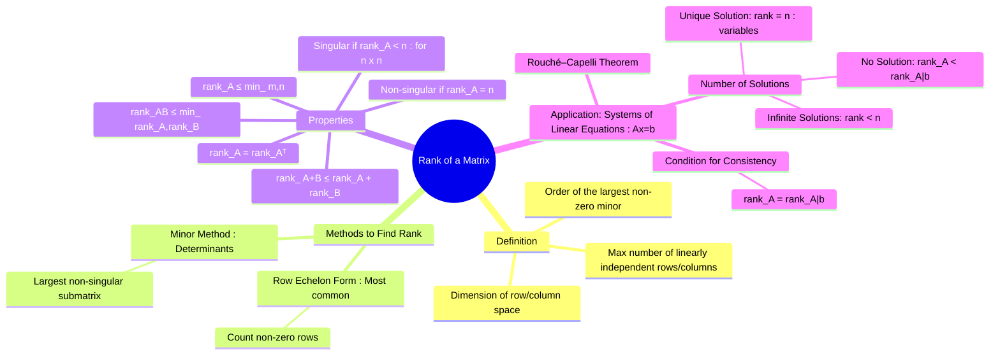

---
tags:
  - linear-algebra
  - matrix-theory
  - engineering-math
created: 2025-09-15
aliases:
  - Matrix Rank
  - Rank
  - Minor Method (using Determinants) for Rank of a Matrix
  - "Example : Rank of a Matrix"
subject: "[[Mathematics]]"
parent: Linear Algebra
formula:
  - "Relationship between Rank and Systems of Linear Equations : $$\\begin{array}{l|l|l} \\textbf{Condition} & \\textbf{System Type} & \\textbf{Number of Solutions} \\\\ \\hline \\text{rank}(A) < \\text{rank}([A|b]) & \\text{Inconsistent} & \\text{No Solution} \\\\ \\hline \\text{rank}(A) = \\text{rank}([A|b]) = r & \\text{Consistent} & \\text{At least one solution} \\\\ \\qquad \\hookrightarrow \\text{If } r = n \\text{ (no. of variables)} & & \\text{Unique Solution} \\\\ \\qquad \\hookrightarrow \\text{If } r < n \\text{ (no. of variables)} & & \\text{Infinitely Many Solutions} \\\\ \\end{array}$$"
---
### Rank of a Matrix
#matrix-rank #linear-algebra #linear-independence

> The **rank** of a matrix, denoted as $\rho(A)$ or $\text{rank}(A)$, is a measure of its "non-degeneracy." ==It represents the maximum number of linearly independent rows or columns in the matrix.== The rank provides fundamental insights into the properties of a matrix and the system of linear equations it represents, particularly regarding the existence and uniqueness of solutions.

---
#### Definitions of Rank
#matrix-rank/definition

The rank of a matrix can be defined in several equivalent ways:
1.  **Linear Independence**: The rank of a matrix $A$ is the maximum number of [[Linear Independence and Dependence of Vectors|Linear Independence]] row vectors or column vectors. (The row rank is always equal to the column rank).
2.  **Determinant of Minors**: The rank is the order (size) of the largest square submatrix of $A$ that has a non-zero [[Determinant of a Matrix|Determinant]]. Such a non-zero determinant is called a non-vanishing minor.
3.  **Dimension of Vector Space**: The rank is the dimension of the column space (or row space) of the matrix.

> [!pyq]- PYQ : 2019
> ![[ee_2019#^q24]]

---
#### Methods for Finding the Rank
#matrix-rank/calculation

##### 1. Row Echelon Form (Gaussian Elimination)
This is the most efficient method for determining the rank of a matrix, especially for larger matrices.
*   **Procedure**: Use elementary row operations to reduce the matrix to its **row echelon form**.
*   **Rule**: The rank of the matrix is equal to the number of non-zero rows in its row echelon form.
*   **Example**: Find the rank of $A = \begin{bmatrix} 1 & 2 & 3 \\ 2 & 4 & 6 \\ 3 & 1 & 4 \end{bmatrix}$
    $$\begin{align}
    A &= \begin{bmatrix} 1 & 2 & 3 \\ 2 & 4 & 6 \\ 3 & 1 & 4 \end{bmatrix} \\
    &\xrightarrow[R_3 \to R_3 - 3R_1]{R_2 \to R_2 - 2R_1} \begin{bmatrix} 1 & 2 & 3 \\ 0 & 0 & 0 \\ 0 & -5 & -5 \end{bmatrix} \\
    &\xrightarrow{R_2 \leftrightarrow R_3} \begin{bmatrix} 1 & 2 & 3 \\ 0 & -5 & -5 \\ 0 & 0 & 0 \end{bmatrix}
    \end{align}$$
    The matrix is now in row echelon form. It has **two non-zero rows**. Therefore, $\text{rank}(A) = 2$.

##### 2. Minor Method (using Determinants)
This method involves checking the determinants of all possible square submatrices.
*   **Procedure**:
    1.  Find the order of the highest order square submatrix. Let it be $r$.
    2.  Calculate the determinants of all $r \times r$ submatrices.
    3.  If at least one determinant is non-zero, then $\text{rank}(A) = r$.
    4.  If all $r \times r$ determinants are zero, check the determinants of $(r-1) \times (r-1)$ submatrices, and so on, until a non-zero determinant is found.

*   For the example above, the highest order minor is the determinant of A itself:
    $\det(A) = 1(16-6) - 2(8-18) + 3(2-12) = 10 + 20 - 30 = 0$.
    Since the $3 \times 3$ determinant is zero, the rank must be less than 3.
    Now check a $2 \times 2$ submatrix, e.g., $\begin{vmatrix} 1 & 2 \\ 3 & 1 \end{vmatrix} = 1-6 = -5 \neq 0$.
    Since we found a non-zero minor of order 2, $\text{rank}(A) = 2$.

---
#### 🔥Properties of Rank
#matrix-rank/properties

1.  For an $m \times n$ matrix $A$, the rank is bounded: $0 \le \text{rank}(A) \le \min(m, n)$.
2.  The rank of a matrix is equal to the rank of its transpose: $\text{rank}(A) = \text{rank}(A^T)$.
3.  The rank of a null matrix (all elements are zero) is 0.
4.  For an $n \times n$ identity matrix $I_n$, $\text{rank}(I_n) = n$.
5.  **Rank of a Product**: $\text{rank}(AB) \le \min(\text{rank}(A), \text{rank}(B))$.
6.  **Rank of a Sum**: $\text{rank}(A+B) \le \text{rank}(A) + \text{rank}(B)$.
7.  **Singularity**: An $n \times n$ square matrix $A$ is **singular** (non-invertible) if and only if its rank is less than its order, i.e., $\text{rank}(A) < n$.
8.  An $n \times n$ square matrix $A$ is **non-singular** ([[Inverse of a Matrix|invertible]]) if and only if it has **full rank**, i.e., $\text{rank}(A) = n$.

---
#### Rank and Systems of Linear Equations
#rouche-capelli-theorem #linear-systems

The rank is crucial for determining the consistency and number of solutions of a system of linear equations represented by $Ax=b$. Let $A$ be the coefficient matrix and $[A|b]$ be the augmented matrix.

$$\boxed{
\begin{array}{l|l|l}
\textbf{Condition} & \textbf{System Type} & \textbf{Number of Solutions} \\
\hline
\text{rank}(A) < \text{rank}([A|b]) & \text{Inconsistent} & \text{No Solution} \\
\hline
\text{rank}(A) = \text{rank}([A|b]) = r & \text{Consistent} & \text{At least one solution} \\
\qquad \hookrightarrow \text{If } r = n \text{ (no. of variables)} & & \text{Unique Solution} \\
\qquad \hookrightarrow \text{If } r < n \text{ (no. of variables)} & & \text{Infinitely Many Solutions} \\
\end{array}
}$$

*   The number of free variables (parameters) in the case of infinite solutions is given by $n-r$.

---
### Related Concepts
#matrix-theory/related-concepts

> [[Solving Systems of Linear Equations]]

[[Determinant of a Matrix|Determinant]]
[[Inverse of a Matrix]]
[[Linear Independence and Dependence of Vectors|Linear Independence]]
[[Vector Space Definition and Properties]]
[[Consistency of Linear Equations]]
