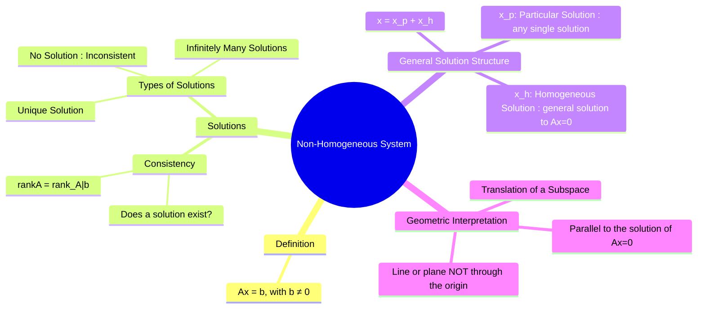

---
tags:
  - linear-algebra
  - matrix-theory
  - system-of-equations
  - engineering-math
created: 2025-09-09
aliases:
  - Non-Homogeneous System
  - Inhomogeneous System
  - Types of Solutions
  - "Ax = b : A is Coefficient Matrix"
  - Ax = 0 is Associated Homogeneous System
  - "Augmented Matrix : [A|b]"
subject: "[[Mathematics]]"
parent:
  - "[[Linear Algebra]]"
---
### Non-Homogeneous System of Linear Equations
#non-homogeneous-system #linear-algebra #system-of-equations

> A non-homogeneous system of linear equations is a system where the constant terms are not all zero. Unlike [[Homogeneous System of Linear Equations|homogeneous systems]], these systems are not guaranteed to have a solution; they can be **[[Consistency of Linear Equations|inconsistent]]**. When a solution does exist, its general form is a combination of a single particular solution and the general solution of the corresponding homogeneous system.

---
#### Definition
#system-of-equations/non-homogeneous

A system of linear equations is **non-homogeneous** if it can be written in the matrix form:
$$\boxed{\quad A\mathbf{x} = \mathbf{b} \quad}$$
where $A$ is the $m \times n$ coefficient matrix, $\mathbf{x}$ is the vector of variables, and $\mathbf{b}$ is a non-zero $m \times 1$ vector of constants.
The system $A\mathbf{x} = \mathbf{0}$ is called the **associated homogeneous system**.

---
#### Consistency and Types of Solutions
#consistency-check #augmented-matrix

The existence of solutions is determined by comparing the rank of the coefficient matrix $A$ with the rank of the **augmented matrix** $[A | \mathbf{b}]$.

1.  **No Solution (Inconsistent System)**: A solution does not exist if, after row reduction of the augmented matrix, a row of the form $[0 \ 0 \ \dots \ 0 \ | \ d]$ appears, where $d \neq 0$.
    *   Condition: $\text{rank}(A) < \text{rank}([A | \mathbf{b}])$.

2.  **Unique Solution (Consistent System)**: A single, unique solution exists.
    *   Condition: $\text{rank}(A) = \text{rank}([A | \mathbf{b}]) = n$ (the number of variables).
    *   This means there are no free variables.

3.  **Infinitely Many Solutions (Consistent System)**: An infinite number of solutions exist.
    *   Condition: $\text{rank}(A) = \text{rank}([A | \mathbf{b}]) < n$.
    *   This occurs when there is at least one free variable.

---
#### Structure of the General Solution
#particular-solution #homogeneous-solution

If a non-homogeneous system $A\mathbf{x} = \mathbf{b}$ is consistent, its general solution $\mathbf{x}$ can be expressed as the sum of two components:

$$\boxed{\quad \mathbf{x} = \mathbf{x}_p + \mathbf{x}_h \quad}$$
Where:
* $\mathbf{x}_p$ is any single specific solution to $A\mathbf{x} = \mathbf{b}$, known as the **particular solution**.
* $\mathbf{x}_h$ is the general solution to the associated homogeneous system $A\mathbf{x} = \mathbf{0}$. This is the [[Fundamental Subspaces of a Matrix|Null Space]] of $A$.

This structure is valid because $A\mathbf{x} = A(\mathbf{x}_p + \mathbf{x}_h) = A\mathbf{x}_p + A\mathbf{x}_h = \mathbf{b} + \mathbf{0} = \mathbf{b}$.

---
#### Geometric Interpretation
#geometric-interpretation

The solution set of a consistent non-homogeneous system is a **translation** of the solution set of its associated homogeneous system.
* The homogeneous solution $\mathbf{x}_h$ (the null space) is a subspace passing through the origin (a line, plane, etc.).
* The particular solution $\mathbf{x}_p$ acts as a **translation vector** that shifts this entire subspace away from the origin.

Therefore, the solution set for $A\mathbf{x} = \mathbf{b}$ is a line, plane, or higher-dimensional affine space that is **parallel** to the null space but does not pass through the origin (unless $\mathbf{x}_p$ happens to be zero, which is trivial).

---
### Related Concepts
#related-concepts

> [[Homogeneous System of Linear Equations]]

[[Rank of a Matrix]]
[[Rank-Nullity Theorem]]
[[Gaussian Elimination Method]]
[[Fundamental Subspaces of a Matrix]]
