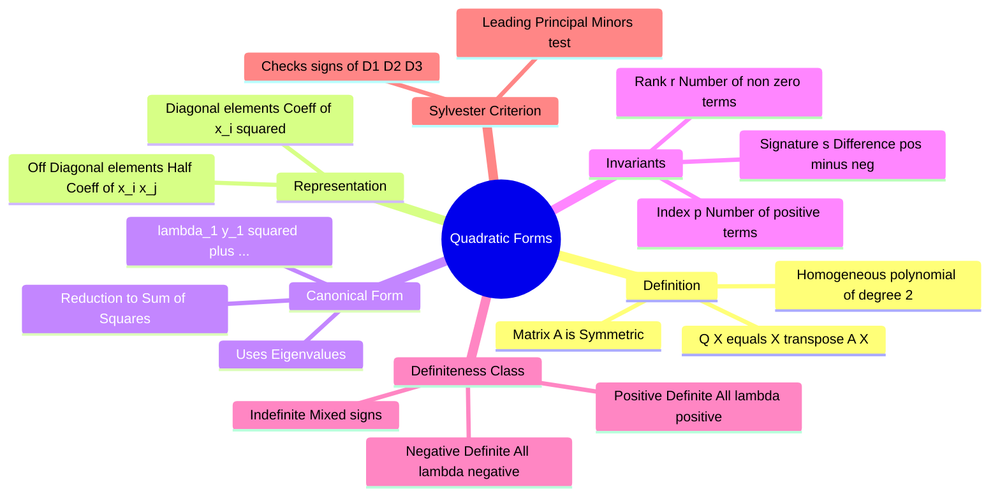

---
tags:
  - mathematics
  - linear-algebra
  - matrices
  - gate
  - optimization
aliases:
  - Definiteness of Matrices
  - Canonical Form
  - Sylvester's Law of Inertia
  - Positive Definite Matrix
subject: "[[Mathematics]]"
parent: "[[Matrix Operations|Matrices]]"
created: 2026-07-13
---
### Quadratic Forms
#linear-algebra/quadratic-forms #matrices

> A **Quadratic Form** is a homogeneous polynomial of degree two in $n$ variables. In engineering, it is the algebraic foundation for analyzing energy, optimization ([[Hessian Matrix]]), and stability (Lyapunov functions). It connects geometry (ellipsoids/paraboloids) with linear algebra ([[Eigenvalues and Eigenvectors|eigenvalues]]).

---
#### Matrix Representation
#quadratic-forms/representation

Any quadratic form $Q(x_1, x_2, \dots, x_n)$ can be expressed in matrix notation:
$$\boxed{\quad Q(X) = X^T A X = \sum_{i=1}^n \sum_{j=1}^n a_{ij} x_i x_j \quad}$$

Where:
*   $X = [x_1, x_2, \dots, x_n]^T$ is the variable vector.
*   **$A$ is a [[Symmetric Matrices#Definition|Real Symmetric Matrix]].** ($A = A^T$).
    > [!note] Note
    > 
    > > See [[ee_2026#^q35]]
    > 
    > If the given matrix is not symmetric, replace it with $A_{sym} = \frac{A + A^T}{2}$ without changing the value of $Q$.

**Constructing A from Polynomial:**
For $Q = ax_1^2 + bx_2^2 + cx_3^2 + 2dx_1x_2 + 2ex_2x_3 + 2fx_1x_3$:
*   **Diagonal ($a_{ii}$):** Coefficients of squared terms ($x_i^2$).
*   **Off-Diagonal ($a_{ij}$):** **Half** the coefficient of the cross-product terms ($x_i x_j$).

$$A = \begin{bmatrix} \text{coeff } x_1^2 & \frac{1}{2}\text{coeff } x_1 x_2 & \frac{1}{2}\text{coeff } x_1 x_3 \\ \frac{1}{2}\text{coeff } x_2 x_1 & \text{coeff } x_2^2 & \frac{1}{2}\text{coeff } x_2 x_3 \\ \frac{1}{2}\text{coeff } x_3 x_1 & \frac{1}{2}\text{coeff } x_3 x_2 & \text{coeff } x_3^2 \end{bmatrix}$$

---
#### Canonical Form (Diagonalization)
#quadratic-forms/canonical

Every quadratic form can be reduced to a **Canonical Form** (sum of squares) by an orthogonal transformation $X = PY$ (where $P$ is the modal matrix of eigenvectors):
$$Q = Y^T D Y = \lambda_1 y_1^2 + \lambda_2 y_2^2 + \dots + \lambda_n y_n^2$$
Where $\lambda_i$ are the **Eigenvalues** of matrix $A$.

**Key Invariants (Properties that don't change with transformation):**
1.  **Rank ($r$):** The number of non-zero terms (or non-zero eigenvalues).
2.  **Index ($p$):** The number of **positive** terms (positive eigenvalues).
3.  **Signature ($s$):** The difference between the number of positive and negative terms.
    $$\boxed{\quad s = p - (\text{negative terms}) = 2p - r \quad}$$

---
#### Classification of Definiteness
#quadratic-forms/definiteness

The nature of the quadratic form (and its stationary points) is determined by the signs of the eigenvalues of $A$. This is crucial for **Maxima/Minima** analysis.

| Classification | Condition on $Q(X)$ (for $X \neq 0$) | Condition on Eigenvalues ($\lambda_i$) | Geometry (2D) |
| :--- | :--- | :--- | :--- |
| **Positive Definite** | Always $> 0$ | All $\lambda_i > 0$ | Bowl (Min at 0) |
| **Positive Semi-Definite**| $\ge 0$ | All $\lambda_i \ge 0$ (at least one $0$) | Valley |
| **Negative Definite** | Always $< 0$ | All $\lambda_i < 0$ | Hill (Max at 0) |
| **Negative Semi-Definite**| $\le 0$ | All $\lambda_i \le 0$ (at least one $0$) | Ridge |
| **Indefinite** | Takes both +ve and -ve values | Some $\lambda > 0$, Some $\lambda < 0$ | Saddle |

---
#### Sylvester's Criterion (Principal Minors Test)
#quadratic-forms/sylvester

Instead of calculating eigenvalues, we can check the **Leading Principal Minors** ($D_k$ is the determinant of the top-left $k \times k$ submatrix).

**A. For Positive Definite:**
All leading principal minors must be **Positive**.
$$D_1 > 0, \quad D_2 > 0, \quad D_3 > 0, \dots, \quad D_n > 0$$

**B. For Negative Definite:**
The minors must **alternate in sign**, starting with negative.
$$D_1 < 0, \quad D_2 > 0, \quad D_3 < 0, \dots$$
(i.e., $(-1)^k D_k > 0$).

**C. For Indefinite:**
If neither pattern holds and $D_n \neq 0$ (non-singular).

> **Example:** $A = \begin{bmatrix} 2 & 1 \\ 1 & 3 \end{bmatrix}$
> *   $D_1 = |2| = 2$ (>0)
> *   $D_2 = \begin{vmatrix} 2 & 1 \\ 1 & 3 \end{vmatrix} = 6 - 1 = 5$ (>0)
> *   Both positive $\implies$ **Positive Definite**.

---
### Related Concepts
#topic/related-concepts

> [[Hessian Matrix]] (The Hessian is the matrix $A$ for the local quadratic approximation of a function)

[[Eigenvalues and Eigenvectors|Eigenvalues and Eigenvectors]]
[[Symmetric Matrices]] (Real symmetric matrices have real eigenvalues)
[[Maxima and Minima (Single Variable)]] (Definiteness determines Min/Max/Saddle)
[[Lyapunov Stability]] (Requires Positive Definite functions)
