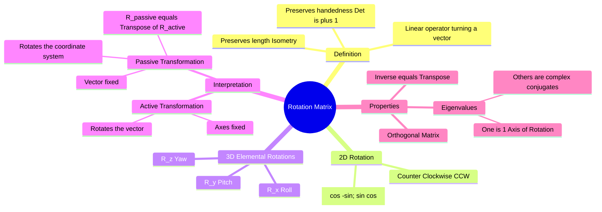

---
tags:
  - mathematics
  - linear-algebra
  - matrices
  - robotics
  - mechanics
  - gate
aliases:
  - Coordinate Rotation
  - Transformation Matrix
  - Orthogonal Matrix
  - Active Transformation (Vector Rotation)
  - Passive Transformation (Coordinate Rotation)
  - Rotation about Z-axis (Yaw)
  - Rotation about X-axis (Roll)
  - Rotation about Y-axis (Pitch)
subject: "[[Mathematics]]"
parent:
  - "[[Matrix Operations|Matrices]]"
  - "[[Linear Transformation]]"
formula:
  - "2D Rotation Matrix (Active) : $$\\begin{bmatrix} \\cos\\theta & -\\sin\\theta \\\\ \\sin\\theta & \\cos\\theta \\end{bmatrix}$$"
created: 2026-07-13
---
### Rotation Matrix
#linear-algebra/matrices #robotics

> A **Rotation Matrix** is a transformation matrix that is used to perform a rotation in Euclidean space. It is a specific subset of **[[Orthogonal Matrices]]** with a determinant of $+1$. It is fundamental in Mechanics (Rigid Body Dynamics), Robotics, and Electrical Drives ([[Park Transformation]]).

---
#### 2D Rotation Matrix (Active)
#rotation/2d

Consider a vector $\vec{v} = \begin{bmatrix} x \\ y \end{bmatrix}$. To rotate this vector **Counter-Clockwise (CCW)** by an angle $\theta$ about the origin to get $\vec{v}'$:

$$\boxed{\quad \begin{bmatrix} x' \\ y' \end{bmatrix} = \begin{bmatrix} \cos\theta & -\sin\theta \\ \sin\theta & \cos\theta \end{bmatrix} \begin{bmatrix} x \\ y \end{bmatrix} \quad}$$

*   **Memory Tip:** The first column is the new position of the basis vector $\hat{i} (1,0) \to (\cos\theta, \sin\theta)$. The second column is the new position of $\hat{j} (0,1) \to (-\sin\theta, \cos\theta)$.

---
#### Active vs. Passive Rotation (Crucial for GATE)
#rotation/interpretation

This is the most common source of sign errors.

1. **Active Transformation (Vector Rotation):**
    * The point/vector moves. The coordinate axes remain fixed.
    * Formula: $R(\theta)$.
2. **Passive Transformation (Coordinate Rotation):**
    * The coordinate axes rotate. The point/vector remains fixed in space, but its coordinates change relative to the new axes.
    * If axes rotate CCW by $\theta$, the coordinates relate via $R(-\theta)$ or $R^T$.
    $$\boxed{\quad R_{passive} = R_{active}^{-1} = R_{active}^T \quad}$$
    * *Example:* [[Park Transformation]] is traditionally a Passive rotation (aligning axes to the rotor).

---
#### 3D Elemental Rotations
#rotation/3d

Rotations about the principal axes ($x, y, z$) in a Right-Handed System (Active, CCW).

**A. Rotation about Z-axis (Yaw) - $R_z(\theta)$:**
$z$ coordinates do not change.
$$R_z(\theta) = \begin{bmatrix} \cos\theta & -\sin\theta & 0 \\ \sin\theta & \cos\theta & 0 \\ 0 & 0 & 1 \end{bmatrix}$$

**B. Rotation about X-axis (Roll) - $R_x(\theta)$:**
$x$ coordinates do not change.
$$R_x(\theta) = \begin{bmatrix} 1 & 0 & 0 \\ 0 & \cos\theta & -\sin\theta \\ 0 & \sin\theta & \cos\theta \end{bmatrix}$$

**C. Rotation about Y-axis (Pitch) - $R_y(\theta)$:**
$y$ coordinates do not change. **Note the sign switch** on the sine terms compared to X and Z.
$$R_y(\theta) = \begin{bmatrix} \cos\theta & 0 & \sin\theta \\ 0 & 1 & 0 \\ -\sin\theta & 0 & \cos\theta \end{bmatrix}$$

---
#### Key Properties
#linear-algebra/properties

1.  **Orthogonality:**
    Columns (and rows) are mutually orthogonal unit vectors.
    $$\boxed{\quad R^T R = R R^T = I \quad}$$
2.  **Inverse:**
    The inverse of a rotation matrix is its transpose.
    $$\boxed{\quad R^{-1} = R^T \quad}$$
    *   *Physical Meaning:* Rotating by $\theta$ and then rotating by $-\theta$ (which is $R^T$) brings you back to the start.
3.  **Determinant:**
    $$\det(R) = +1$$
    (If $\det(R) = -1$, it includes a **Reflection**, which is an Improper Rotation).
4.  **Eigenvalues:**
    *   In 3D, at least one eigenvalue is $\lambda = 1$. The eigenvector corresponding to $\lambda=1$ is the **Axis of Rotation**.
    *   The trace of the matrix determines the angle of rotation: $\text{Tr}(R) = 1 + 2\cos\theta$.

---
### Related Concepts
#topic/related-concepts

> [[Park Transformation]] (Application of 2D rotation to electrical machines)

[[Types of Matrix]]
[[Orthogonal Matrices]]
[[Algebra of Complex Numbers|Complex Numbers]] (Multiplication by $e^{j\theta}$ is a 2D rotation)
[[Eigenvalues and Eigenvectors|Eigenvalues and Eigenvectors]]
[[Vector Operations|Dot Product]] (Preserved under rotation)
