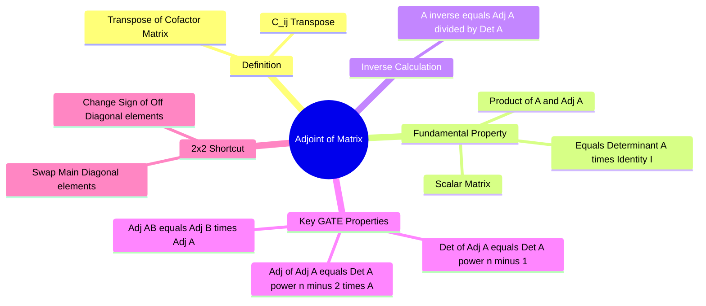

---
tags:
  - mathematics
  - linear-algebra
  - matrices
  - gate
  - determinants
aliases:
  - Adjugate Matrix
  - Classical Adjoint
  - adj(A)
subject: "[[Mathematics]]"
parent: "[[Matrix Operations]]"
confidence: 10
---
### Adjoint of a Matrix
#linear-algebra/matrices #adjoint

> The **Adjoint** (or Adjugate) of a square matrix $A$, denoted as $\text{adj}(A)$, is the **[[Transpose and Inverse of a Matrix|Transpose]] of the [[Minors and Cofactors|Cofactor Matrix]]** of $A$. It provides a direct algebraic method to compute the inverse of a matrix without using Gaussian elimination.

---
#### Definition and Construction
#adjoint/definition

Let $A = [a_{ij}]$ be a square matrix of order $n$.
Let $C_{ij}$ be the **Cofactor** of element $a_{ij}$.
The Cofactor Matrix is $C = [C_{ij}]$.

The Adjoint of $A$ is defined as:
$$\boxed{\quad \text{adj}(A) = [C_{ij}]^T \quad}$$

*   **Step 1:** Find the cofactor of every element.
*   **Step 2:** Form the matrix of cofactors.
*   **Step 3:** Take the Transpose.

---
#### The Fundamental Property
#adjoint/fundamental-theorem

This is the most important relationship involving the adjoint, often used to derive all other properties.
The product of a matrix and its adjoint produces a **Scalar Matrix** where the diagonal elements are the determinant $|A|$.

$$\boxed{\quad A \cdot \text{adj}(A) = \text{adj}(A) \cdot A = |A| I_n \quad}$$

Where $I_n$ is the identity matrix of order $n$.
$$A \cdot \text{adj}(A) = \begin{bmatrix} |A| & 0 & \cdots & 0 \\ 0 & |A| & \cdots & 0 \\ \vdots & \vdots & \ddots & \vdots \\ 0 & 0 & \cdots & |A| \end{bmatrix}$$

---
#### Properties of Adjoint (High Yield for GATE)
#gate/properties

Let $A$ be a non-singular square matrix of order $n$.

1.  **Determinant of Adjoint:**
    Taking the determinant of the Fundamental Property $|A \cdot \text{adj}(A)| = ||A|I|$:
    $$|A| \cdot |\text{adj}(A)| = |A|^n$$
    $$\boxed{\quad |\text{adj}(A)| = |A|^{n-1} \quad}$$

2.  **Adjoint of Adjoint ($\text{adj}(\text{adj } A)$):**
    This results in the original matrix scaled by the determinant:
    $$\boxed{\quad \text{adj}(\text{adj } A) = |A|^{n-2} A \quad}$$

3.  **Determinant of Adjoint of Adjoint:**
    $$\boxed{\quad |\text{adj}(\text{adj } A)| = |A|^{(n-1)^2} \quad}$$

4.  **Reversal Law (Product):**
    Similar to inverse and transpose, the order reverses.
    $$\boxed{\quad \text{adj}(AB) = \text{adj}(B) \cdot \text{adj}(A) \quad}$$

5.  **Transpose:**
    $$\text{adj}(A^T) = (\text{adj } A)^T$$

6.  **Scalar Multiplication:**
    $$\text{adj}(kA) = k^{n-1} \text{adj}(A)$$

7.  **Symmetry:**
    *   If $A$ is Symmetric, $\text{adj}(A)$ is **Symmetric**.
    *   If $A$ is Triangular, $\text{adj}(A)$ is **Triangular**.
    *   If $A$ is Singular ($|A|=0$), $\text{adj}(A)$ is **Singular** (from Property 1).

---
#### Shortcut for 2x2 Matrix
#gate/shortcut

For a $2 \times 2$ matrix $A = \begin{bmatrix} a & b \\ c & d \end{bmatrix}$:
1.  **Swap** the main diagonal elements ($a \leftrightarrow d$).
2.  **Change the sign** of the off-diagonal elements ($b \to -b, c \to -c$).

$$\boxed{\quad \text{adj}(A) = \begin{bmatrix} d & -b \\ -c & a \end{bmatrix} \quad}$$

---
#### Relation to Inverse
#matrices/inverse

The inverse is simply the Adjoint scaled by the reciprocal of the determinant.

$$\boxed{\quad A^{-1} = \frac{1}{|A|} \text{adj}(A) \quad}$$
*(Valid only if $|A| \neq 0$).*

---
### Related Concepts
#topic/related-concepts

> [[Minors and Cofactors]] (The building blocks)

[[Determinant of a Matrix]]
[[Inverse of a Matrix]]
[[Symmetric Matrices]]
[[Cayley-Hamilton Theorem]] (Can also be used to find inverse and thus adjoint)
