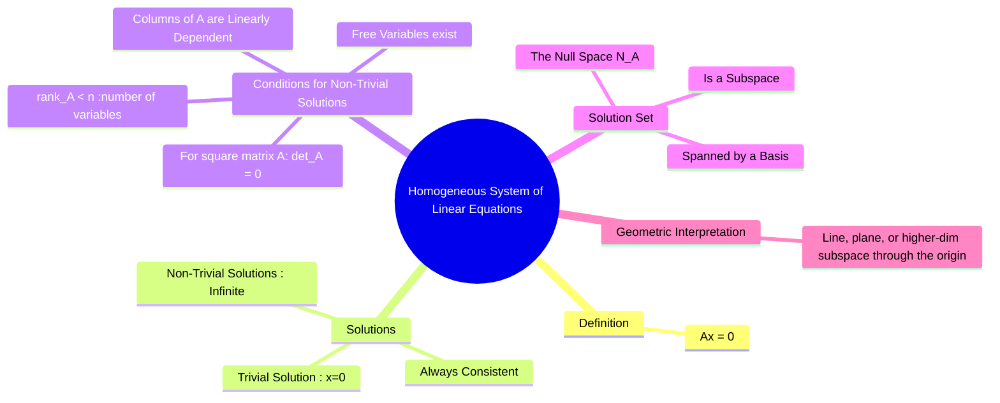

---
tags:
  - linear-algebra
  - matrix-theory
  - homogeneous-system
  - null-space
  - engineering-math
created: 2025-09-09
aliases:
  - Homogeneous System
  - Homogeneous Equations
  - "Ax = 0 : A is Coefficient Matrix"
subject: "[[Mathematics]]"
parent: Linear Algebra
confidence: 9
---

---
### Homogeneous System of Linear Equations
#homogeneous-system #linear-algebra #null-space

> A homogeneous system of linear equations is a system where all the constant terms are zero. These systems are fundamental because they are **always consistent**, meaning they always have at least one solution. The key question is not *if* a solution exists, but *how many* solutions exist: only the [[trivial solution]] or infinitely many [[non-trivial solutions]].

#### Definition
#system-of-equations/homogeneous

A system of linear equations is **homogeneous** if it can be written in the matrix form:
$$\boxed{\quad A\mathbf{x} = \mathbf{0} \quad}$$
where $A$ is the $m \times n$ coefficient matrix, $\mathbf{x}$ is the $n \times 1$ vector of variables, and $\mathbf{0}$ is the $m \times 1$ zero vector.

This system is always consistent because it always has the **[[trivial solution]]**, $\mathbf{x} = \mathbf{0}$.

---
#### Existence of Non-Trivial Solutions
#non-trivial-solution #consistency

The most important question for a homogeneous system is whether [[non-trivial solutions]] (solutions where $\mathbf{x} \neq \mathbf{0}$) exist. A non-trivial solution exists if and only if the system has at least one **free variable**. This leads to several equivalent conditions:

A homogeneous system $A\mathbf{x}=\mathbf{0}$ has a non-trivial solution if and only if:
> *   The system has at least one **free variable** after row reduction.
> *   The **[[Rank of a Matrix|rank]]** of the matrix $A$ is less than the number of variables $n$.
>     $$\boxed{\quad \text{rank}(A) < n \quad}$$
> *   The columns of the matrix $A$ are **linearly dependent**.
> *   For a square $n \times n$ matrix $A$, the **determinant is zero**.
>     $$\boxed{\quad \det(A) = 0 \quad}$$

If any of these conditions are met, the system has infinitely many solutions. If not, only the [[trivial solution]] exists.

---
#### The Solution Set: The Null Space
#null-space #subspace

The set of all solutions to the homogeneous equation $A\mathbf{x} = \mathbf{0}$ is the **Null Space** of the matrix $A$, denoted $N(A)$.

* The null space is always a [[Subspaces|Subspace]] of $\mathbb{R}^n$.
* If only the [[trivial solution]] exists, the null space is the zero subspace, $N(A) = \{\mathbf{0}\}$.
* If [[non-trivial solutions]] exist, the null space is a subspace of dimension $\text{nullity}(A) = n - \text{rank}(A)$, which is the number of free variables. The general solution can be written as a linear combination of [[Basis and Dimension of a Vector Space|basis vectors]] that [[Span of a Set of Vectors|span]] the null space.

#### Geometric Interpretation
#geometric-interpretation

The solution set to a homogeneous system can be visualized as a geometric object passing through the origin of $\mathbb{R}^n$.
* **Trivial Solution only**: The solution is a single point (the origin).
* **Non-Trivial Solutions**: The solution set is a **line, plane, or higher-dimensional subspace** passing through the origin. The dimension of this subspace is the nullity of the matrix $A$.

---
### Related Concepts
#related-concepts

> [[Non-Homogeneous System of Linear Equations]] (The counterpart, $A\mathbf{x}=\mathbf{b}$ where $\mathbf{b} \neq \mathbf{0}$)

[[Fundamental Subspaces of a Matrix]]
[[Rank-Nullity Theorem]]
[[Linear Independence and Dependence of Vectors|Linear Independence]]
[[Determinant of a Matrix]]
[[Subspaces|Subspace]]
