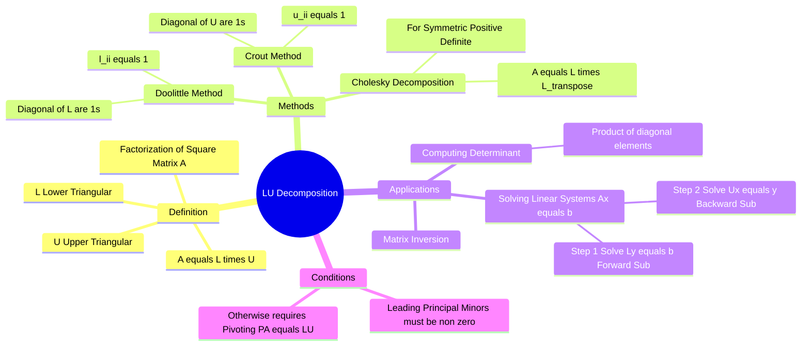

---
tags:
  - mathematics
  - linear-algebra
  - numerical-methods
  - gate
  - matrix-factorization
aliases:
  - LU Factorization
  - Doolittle Method
  - Crout Method
subject: "[[Mathematics]]"
parent: "[[Matrix Operations|Matrices]]"
confidence: 10
---
###### Mind Map

---
### LU Decomposition
#linear-algebra/matrix-factorization #numerical-methods

> **LU Decomposition** (or Factorization) factors a square matrix $A$ into the product of a **Lower Triangular Matrix ($L$)** and an **Upper Triangular Matrix ($U$)**. It is essentially the matrix form of [[Gaussian Elimination Method|Gaussian Elimination]] and is the most efficient computational method for solving systems of linear equations ($Ax=b$) or calculating [[Determinant of a Matrix|determinants]].

#### Definition and Structure
#lu-decomposition/definition

For a square matrix $A$, we write:
$$\boxed{\quad A = L \cdot U \quad}$$

Where:
*   **$L$ (Lower Triangular):** All elements *above* the main diagonal are zero.
*   **$U$ (Upper Triangular):** All elements *below* the main diagonal are zero.

$$
\begin{bmatrix} a_{11} & a_{12} & a_{13} \\ a_{21} & a_{22} & a_{23} \\ a_{31} & a_{32} & a_{33} \end{bmatrix}
=
\begin{bmatrix} l_{11} & 0 & 0 \\ l_{21} & l_{22} & 0 \\ l_{31} & l_{32} & l_{33} \end{bmatrix}
\cdot
\begin{bmatrix} u_{11} & u_{12} & u_{13} \\ 0 & u_{22} & u_{23} \\ 0 & 0 & u_{33} \end{bmatrix}
$$

##### Existence Condition

A matrix $A$ has an LU decomposition *without* row exchanges (pivoting) if and only if all its **Leading Principal Minors** are non-zero. If a pivot is zero, a Permutation matrix $P$ is needed ($PA = LU$).

---
#### Types of Decomposition (GATE Constraints)
#gate/methods

Since there are more unknowns ($n^2 + n$) than equations ($n^2$) in the matrix multiplication, we must constrain the diagonal elements to find a unique solution.

1.  **Doolittle's Method:**
    *   Constraint: The diagonal elements of **$L$ are all 1s** ($l_{ii} = 1$).
    *   $L$ is Unit Lower Triangular.
    *   Commonly used in standard Gaussian Elimination.

2.  **Crout's Method:**
    *   Constraint: The diagonal elements of **$U$ are all 1s** ($u_{ii} = 1$).
    *   $U$ is Unit Upper Triangular.

3.  **Cholesky Decomposition:**
    *   Used **only** for **Symmetric, Positive Definite** matrices ($A = A^T$).
    *   Constraint: $U = L^T$.
    *   Formula: $\boxed{A = L L^T}$.
    *   Diagonal elements $l_{ii} = \sqrt{a_{ii} - \sum l_{ik}^2}$.

---
#### Solving System of Equations ($Ax = b$)
#numerical-methods/solving

To solve $Ax = b$ using LU:

1.  **Decompose:** Find $L$ and $U$ such that $A = LU$.
2.  **Substitute:** $LUx = b$. Let $Ux = y$.
3.  **Forward Substitution:** Solve $Ly = b$ for $y$.
    *   Since $L$ is triangular, this is easy (solve top to bottom).
4.  **Backward Substitution:** Solve $Ux = y$ for $x$.
    *   Since $U$ is triangular, this is easy (solve bottom to top).

**Computational Cost:** $O(n^3/3)$ operations. This is much faster than finding $A^{-1}$ and multiplying, especially if solving for multiple $b$ vectors with the same $A$ (you decompose only once).

---
#### Computing Determinant
#linear-algebra/determinant

Using the property $\det(AB) = \det(A)\det(B)$:
$$\det(A) = \det(L) \cdot \det(U)$$
Since the determinant of a triangular matrix is the product of its diagonal elements:

$$\boxed{\quad \det(A) = \left( \prod_{i=1}^n l_{ii} \right) \cdot \left( \prod_{i=1}^n u_{ii} \right) \quad}$$

*   For **Doolittle**: $\det(L) = 1$, so $\det(A) = \prod u_{ii}$.
*   For **Crout**: $\det(U) = 1$, so $\det(A) = \prod l_{ii}$.

---
### Related Concepts
#topic/related-concepts

> [[Gaussian Elimination Method|Gauss-Jordan Elimination]] (The basis for the algorithm)

[[Determinant of a Matrix]]
[[Inverse of a Matrix]]
[[Symmetric Matrices]] (For Cholesky)
[[Quadratic Forms]] (Positive Definite condition for Cholesky)
[[Types of Matrices]] (Triangular matrices)