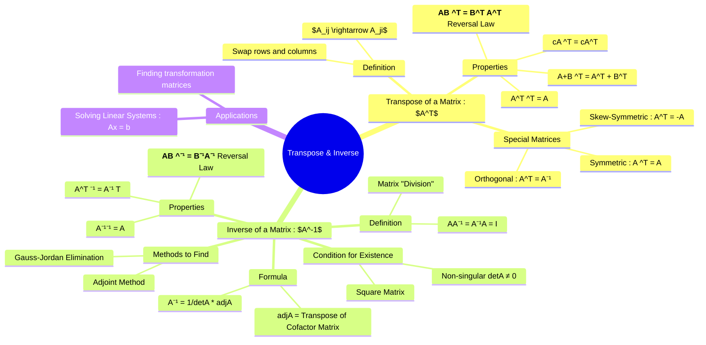

---
tags:
  - linear-algebra
  - matrix-theory
  - engineering-math
created: 2025-09-15
aliases:
  - Matrix Transpose
  - Matrix Inverse
  - Transpose
  - Inverse
  - "Example : Transpose of Matrix"
subject: "[[Mathematics]]"
parent:
  - Linear Algebra
confidence: 10
---
###### Mind Map

---
### Transpose and Inverse of a Matrix
#matrix-transpose #matrix-inverse #linear-algebra

> The **transpose** and **inverse** are two fundamental operations on matrices. The transpose rearranges the matrix's elements by swapping rows and columns. The inverse, conceptually similar to division for scalars, is a matrix that "undoes" the effect of the original matrix, and it only exists for non-singular square matrices. Both are crucial for solving systems of linear equations and understanding linear transformations.

#### Transpose of a Matrix ($A^T$)
#matrix-transpose

The **transpose** of a matrix $A$, denoted as $A^T$ or $A'$, is obtained by interchanging its rows and columns. If $A$ is an $m \times n$ matrix with elements $[a_{ij}]$, then $A^T$ is an $n \times m$ matrix with elements $[a_{ji}]$.
  
*   **Example**:
    $$ \text{If } A = \begin{bmatrix} 1 & 2 & 3 \\ 4 & 5 & 6 \end{bmatrix}_{2 \times 3}, \text{ then } A^T = \begin{bmatrix} 1 & 4 \\ 2 & 5 \\ 3 & 6 \end{bmatrix}_{3 \times 2} $$

##### Properties of Transpose
#matrix-transpose/properties
1.  **Involution**: $(A^T)^T = A$
2.  **Addition**: $(A+B)^T = A^T + B^T$
3.  **Scalar Multiplication**: $(kA)^T = kA^T$
4.  **Product Reversal Law**: The transpose of a product is the product of the transposes in reverse order. This is a very important property.
    $$\boxed{\quad (AB)^T = B^T A^T \quad}$$
5.  **Determinant**: $\det(A^T) = \det(A)$

##### Special Matrices based on Transpose
#special-matrices
*   **Symmetric Matrix**: A square matrix $A$ for which $A^T = A$. (e.g., elements are symmetric about the main diagonal).
*   **Skew-Symmetric Matrix**: A square matrix $A$ for which $A^T = -A$. (All main diagonal elements must be zero).
*   **Orthogonal Matrix**: A square matrix $A$ for which its transpose is also its inverse: $A^T = A^{-1}$, which implies $AA^T = A^T A = I$.

---
#### Inverse of a Matrix ($A^{-1}$)
#matrix-inverse

The **inverse** of a square matrix $A$, denoted as $A^{-1}$, is a matrix such that their product is the [[Identity Matrix|Identity Matrix]] $I$.
$$ A A^{-1} = A^{-1} A = I $$

##### Condition for Existence
#matrix-invertibility

For an inverse to exist, the matrix must satisfy two conditions:
1.  It must be a **square matrix** (i.e., $n \times n$).
2.  It must be **non-singular**, which means its determinant is non-zero ($\det(A) \neq 0$).

##### Formula for the Inverse
The inverse can be calculated using the [[Determinant of a Matrix|determinant]] and the [[Adjoint of a Matrix|adjoint of the matrix]].
$$\boxed{\quad A^{-1} = \frac{1}{\det(A)} \text{adj}(A) \quad}$$
where:
* $\det(A)$ is the determinant of matrix $A$.
* $\text{adj}(A)$ is the **Adjoint** (or Adjugate) of matrix $A$, which is the transpose of the cofactor matrix of $A$.
    * $\text{adj}(A) = C^T$, where $C_{ij} = (-1)^{i+j}M_{ij}$ and $M_{ij}$ is the minor of the element $a_{ij}$.

##### Shortcut for a 2x2 Matrix
For a 2x2 matrix, the inverse is particularly simple to calculate:
$$ \text{If } A = \begin{bmatrix} a & b \\ c & d \end{bmatrix}, \text{ then } A^{-1} = \frac{1}{ad-bc} \begin{bmatrix} d & -b \\ -c & a \end{bmatrix} $$

##### Properties of Inverse
#matrix-inverse/properties
1.  **Uniqueness**: If a matrix has an inverse, it is unique.
2.  **Involution**: $(A^{-1})^{-1} = A$
3.  **Product Reversal Law**: The inverse of a product is the product of the inverses in reverse order.
    $$\boxed{\quad (AB)^{-1} = B^{-1} A^{-1} \quad}$$
4.  **Transpose**: The inverse of the transpose is the transpose of the inverse.
    $$\quad (A^T)^{-1} = (A^{-1})^T$$
5.  **Scalar Multiplication**: $(kA)^{-1} = \frac{1}{k} A^{-1}$, for a non-zero scalar $k$.
6.  **Determinant**: $\det(A^{-1}) = \frac{1}{\det(A)}$

---
### Related Concepts
#matrix-theory/related-concepts

> [[Determinant of a Matrix|Determinant]]

[[Solving Systems of Linear Equations]]
[[Matrix Operations]]
[[Eigenvalues and Eigenvectors|Eigenvalues and Eigenvectors]]
[[Identity Matrix]]
[[Rotation Matrix]]
