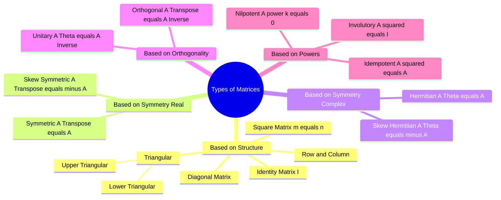

---
tags:
  - mathematics
  - linear-algebra
  - matrices
  - gate
aliases:
  - Special Matrices
  - Matrix Classification
subject: "[[Mathematics]]"
parent:
  - Matrices
  - Linear Algebra
confidence: 10
---
###### Mind Map

---
### Types of Matrices
#linear-algebra/matrices #special-matrices

> Understanding the specific properties of different matrix types is crucial for simplifying calculations regarding determinants, inverses, and eigenvalues in GATE.

#### Basic Structural Matrices
#matrices/structure

1.  **Square Matrix:** A matrix where the number of rows equals the number of columns ($m=n$).
2.  **Diagonal Matrix:** A square matrix where all non-diagonal elements are zero ($a_{ij} = 0$ for $i \neq j$).
3.  **Scalar Matrix:** A diagonal matrix where all diagonal elements are equal ($a_{ii} = k$).
4.  **Identity (Unit) Matrix ($I$):** A scalar matrix where all diagonal elements are 1.
5.  **Triangular Matrices:**
    * **Upper Triangular:** All elements *below* the main diagonal are zero ($a_{ij} = 0$ for $i > j$).
    * **Lower Triangular:** All elements *above* the main diagonal are zero ($a_{ij} = 0$ for $i < j$).
    * **Property:** The **eigenvalues** of any triangular (or diagonal) matrix are simply its diagonal elements.

---
#### Real Matrices based on Symmetry
#matrices/symmetry

Let $A$ be a real square matrix and $A^T$ be its transpose.

1.  **Symmetric Matrix:**
    $$\boxed{\quad A^T = A \quad}$$
    *   Elements are symmetric about the main diagonal ($a_{ij} = a_{ji}$).
2.  **Skew-Symmetric Matrix:**
    $$\boxed{\quad A^T = -A \quad}$$
    *   Elements satisfy $a_{ij} = -a_{ji}$.
    *   **Important:** All principal **diagonal elements must be zero** ($a_{ii} = 0$).
    *   **Property:** The determinant of a skew-symmetric matrix of **odd order** is always **zero**.

---
#### Complex Matrices based on Symmetry
#matrices/complex

Let $A$ be a complex matrix. $A^\theta$ (or $A^*$) denotes the **Conjugate Transpose** ($(\bar{A})^T$).

1.  **Hermitian Matrix:**
    $$\boxed{\quad A^\theta = A \quad}$$
    *   Diagonal elements must be **Real**.
    *   Eigenvalues are always **Real**.
2.  **Skew-Hermitian Matrix:**
    $$\boxed{\quad A^\theta = -A \quad}$$
    *   Diagonal elements must be either **Zero** or **Purely Imaginary**.
    *   Eigenvalues are either **Zero** or **Purely Imaginary**.

---
#### Orthogonal and Unitary Matrices
#matrices/orthogonal

1.  **Orthogonal Matrix (Real):**
    $$\boxed{\quad A A^T = A^T A = I \quad \text{or} \quad A^T = A^{-1} \quad}$$
    *   **Property:** The determinant is always $\pm 1$.
2.  **Unitary Matrix (Complex):**
    $$\boxed{\quad A A^\theta = A^\theta A = I \quad \text{or} \quad A^\theta = A^{-1} \quad}$$
    *   **Property:** The determinant has a modulus of 1 ($|\det A| = 1$).

---
#### Matrices based on Powers (Special Properties)
#matrices/powers

1.  **Idempotent Matrix:**
    $$\boxed{\quad A^2 = A \quad}$$
    *   Eigenvalues are either 0 or 1.
    *   Example: Projection matrices.
2.  **Involutory Matrix:**
    $$\boxed{\quad A^2 = I \quad}$$
    *   The matrix is its own inverse ($A = A^{-1}$).
    *   Eigenvalues are either 1 or -1.
3.  **Nilpotent Matrix:**
    $$\boxed{\quad A^k = 0 \quad}$$
    *   $k$ is the index of nilpotency.
    *   All eigenvalues are **Zero**.
    *   Determinant is **Zero**.

---
### Related Concepts
#topic/related-concepts

> [[Nilpotent Matrices]] (Detailed view)

[[Eigenvalues and Eigenvectors|Eigenvalues and Eigenvectors]]
[[Determinant of a Matrix]]
[[Inverse of a Matrix]]
[[Matrix Operations|Trace of a Matrix]]