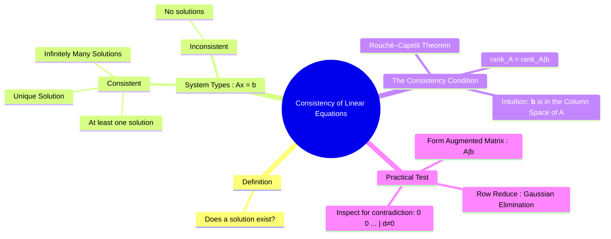

---
tags:
  - linear-algebra
  - matrix-theory
  - system-of-equations
  - consistency
  - engineering-math
created: 2025-09-09
aliases:
  - Consistent System
  - Inconsistent System
  - System Consistency
subject: "[[Mathematics]]"
parent: "[[Linear Algebra]]"
confidence: 9
---
###### Mind Map

---
### Consistency of Linear Equations
#consistency #linear-algebra #system-of-equations

> The **consistency** of a system of linear equations refers to whether the system has solutions or not. A system is **consistent** if it has at least one solution (either one unique solution or infinitely many). It is **inconsistent** if it has no solutions at all. Determining consistency is the first and most crucial step in solving any linear system.

---
#### The Three Possibilities for a Linear System
#consistent-system #inconsistent-system

For any system of linear equations $A\mathbf{x} = \mathbf{b}$, exactly one of the following is true:
1.  The system has **no solution**. (Inconsistent)
2.  The system has **exactly one solution**. (Consistent)
3.  The system has **infinitely many solutions**. (Consistent)

A system cannot, for instance, have exactly two or three distinct solutions.

---
#### The Consistency Condition (Rouché–Capelli Theorem)
#rouche-capelli-theorem #rank-condition

The fundamental theorem for determining consistency relates the rank of the coefficient matrix to the rank of the augmented matrix.

A system of linear equations $A\mathbf{x} = \mathbf{b}$ is consistent if and only if the rank of the coefficient matrix $A$ is equal to the rank of the augmented matrix $[A|\mathbf{b}]$.
$$\boxed{\quad \text{System is consistent} \iff \text{rank}(A) = \text{rank}([A | \mathbf{b}]) \quad}$$
**Intuitive Meaning**: This condition is equivalent to stating that the vector $\mathbf{b}$ lies in the [[Fundamental Subspaces of a Matrix|Column Space]] of $A$. In other words, $\mathbf{b}$ can be written as a linear combination of the columns of $A$. If it can't, no solution is possible.

---
#### Practical Test for Consistency
#gaussian-elimination #augmented-matrix

The most direct way to check for consistency is to use Gaussian elimination on the augmented matrix.

**Procedure:**
1.  Form the **augmented matrix** $[A | \mathbf{b}]$.
2.  Apply row operations to reduce the matrix to **echelon form**.
3.  Inspect the resulting matrix:
    *   **Inconsistent**: The system is inconsistent if there is any row of the form `[0 0 ... 0 | d]`, where $d$ is a non-zero constant. This row corresponds to the impossible equation $0 = d$.
    *   **Consistent**: If no such contradictory row exists, the system is consistent.

#### Determining the Number of Solutions (if consistent)
Once consistency is established, the number of solutions depends on the free variables:
*   **Unique Solution**: The system is consistent and there are **no free variables**. This happens when every column of the coefficient matrix $A$ has a pivot.
    *   Condition: $\text{rank}(A) = n$ (the number of variables).
*   **Infinitely Many Solutions**: The system is consistent and there is **at least one free variable**. This happens when at least one column of $A$ does not have a pivot.
    *   Condition: $\text{rank}(A) < n$.

#### Summary of Conditions
Let $r = \text{rank}(A)$ and $n$ be the number of variables.
*   **Inconsistent**: $\text{rank}(A) < \text{rank}([A | \mathbf{b}])$
*   **Consistent Unique Solution**: $\text{rank}(A) = \text{rank}([A | \mathbf{b}]) = n$
*   **Consistent Infinite Solutions**: $\text{rank}(A) = \text{rank}([A | \mathbf{b}]) < n$

---
### Related Concepts
#related-concepts

> [[Homogeneous System of Linear Equations]] (These are always consistent)

[[Non-Homogeneous System of Linear Equations]]
[[Gaussian Elimination Method|Gaussian Elimination]]
[[Fundamental Subspaces of a Matrix]]
[[Rank of a Matrix]]