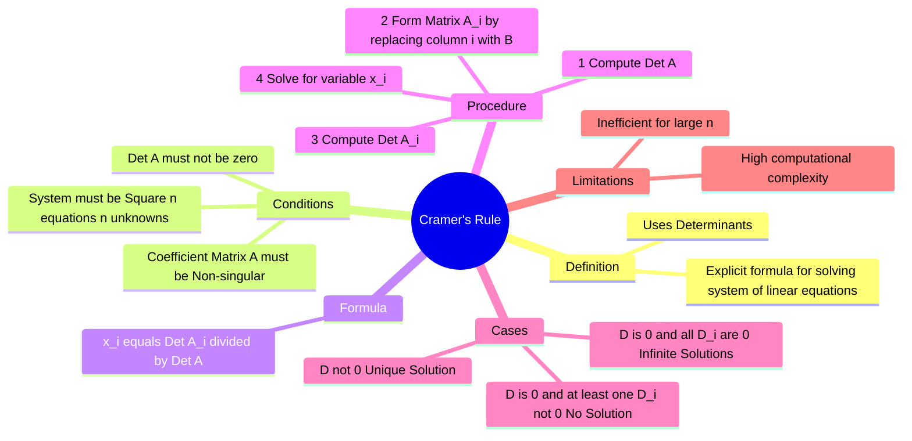

---
tags:
  - mathematics
  - linear-algebra
  - matrices
  - gate
aliases:
  - Cramers Rule
  - Determinant Method
  - "Example : Cramer's Rule"
subject: "[[Mathematics]]"
parent: "[[System of Linear Equations]]"
created: 2026-07-13
---
### Cramer's Rule
#linear-algebra/system-of-equations #determinants

> Cramer's Rule is a theorem in linear algebra that gives an explicit solution for a [[System of Linear Equations]] with as many equations as unknowns, valid whenever the system has a unique solution. It expresses the solution in terms of the [[Determinant of a Matrix|Determinants]] of the (square) coefficient matrix and of matrices obtained from it by replacing one column by the column vector of right-hand-sides.

---
#### The System setup
Consider a system of $n$ linear equations for $n$ unknowns, represented in matrix form as:
$$\boxed{\quad AX = B \quad}$$
Where:
*   $A$ is an $n \times n$ coefficient matrix.
*   $X$ is an $n \times 1$ column vector of variables ($x_1, x_2, \dots, x_n$).
*   $B$ is an $n \times 1$ column vector of constants.

---
#### The Formula
#cramers-rule/formula

If the determinant of the coefficient matrix is non-zero ($\det(A) \neq 0$), the system has a unique solution given by:

$$\boxed{\quad x_i = \frac{\det(A_i)}{\det(A)} = \frac{D_i}{D} \quad}$$

Where:
*   $D = \det(A)$ is the determinant of the original coefficient matrix.
*   $D_i = \det(A_i)$ is the determinant of the matrix formed by replacing the **$i$-th column** of $A$ with the constant vector $B$.

---
#### 2x2 Example
For a system:
$$ \begin{cases} a_1x + b_1y = c_1 \\ a_2x + b_2y = c_2 \end{cases} $$
Matrix form: $\begin{bmatrix} a_1 & b_1 \\ a_2 & b_2 \end{bmatrix} \begin{bmatrix} x \\ y \end{bmatrix} = \begin{bmatrix} c_1 \\ c_2 \end{bmatrix}$

The determinants are:
$$D = \begin{vmatrix} a_1 & b_1 \\ a_2 & b_2 \end{vmatrix} = a_1b_2 - a_2b_1$$
$$D_x = \begin{vmatrix} c_1 & b_1 \\ c_2 & b_2 \end{vmatrix} = c_1b_2 - c_2b_1 \quad \text{(Replace 1st col with constants)}$$
$$D_y = \begin{vmatrix} a_1 & c_1 \\ a_2 & c_2 \end{vmatrix} = a_1c_2 - a_2c_1 \quad \text{(Replace 2nd col with constants)}$$

**Solution:**
$$x = \frac{D_x}{D}, \qquad y = \frac{D_y}{D}$$

---
#### Analysis of Solutions
#linear-algebra/solution-types

Using Cramer's Rule logic (determinants), we can classify the nature of solutions:

1.  **Unique Solution (Consistent):**
    *   Condition: $D \neq 0$.
    *   The lines/planes intersect at exactly one point.

2.  **No Solution (Inconsistent):**
    *   Condition: $D = 0$ AND at least one $D_i \neq 0$.
    *   The equations represent parallel lines/planes that never meet.

3.  **Infinite Solutions (Dependent/Consistent):**
    *   Condition: $D = 0$ AND all $D_i = 0$.
    *   The equations represent coincident lines/planes.

---
#### Limitations
- **Computational Cost:** Calculating determinants for large matrices is computationally expensive ($O(n!)$ by definition or $O(n^3)$ via decomposition). Gaussian Elimination is generally preferred for numerical solving of $n > 3$.
- **Numerical Stability:** Division by small determinants can lead to large numerical errors.

---
### Related Concepts
#topic/related-concepts

> [[System of Linear Equations]]

[[Determinant of a Matrix]]
[[Inverse of a Matrix]] (Related via $A^{-1} = \frac{1}{\det(A)}\text{adj}(A)$)
[[Rank of a Matrix]]
[[Gaussian Elimination Method|Gauss-Jordan Elimination]]
[[Consistency of Linear Equations]]
