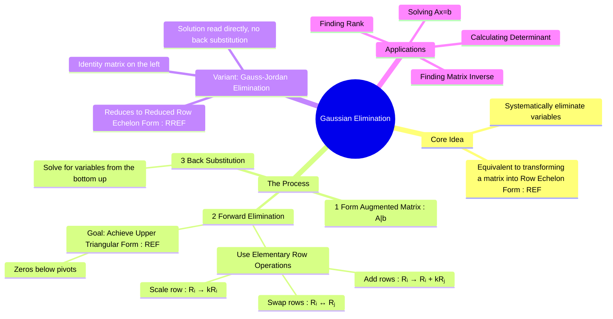

---
tags:
  - linear-algebra
  - matrix-theory
  - numerical-methods
  - systems-of-equations
  - engineering-math
created: 2025-09-15
aliases:
  - Gaussian Elimination
  - Row Echelon Form
  - Gauss-Jordan Elimination
  - "Example : Gaussian Elimination Method"
  - "Example : Gauss-Jordan Elimination"
  - Reduced Row Echelon Form (RREF)
  - Augmented Matrix
  - "Algorithm : Gaussian Elimination"
subject: "[[Mathematics]]"
parent: "[[Solving Systems of Linear Equations]]"
confidence: 10
---
###### Mind Map

---
### Gaussian Elimination Method
#gaussian-elimination #row-echelon-form #numerical-methods

> **Gaussian Elimination** is a systematic and robust algorithm for solving systems of linear equations. It works by transforming the system's augmented matrix, $[A|b]$ into an equivalent, simpler form—an **upper triangular matrix** (Row Echelon Form)—from which the solution can be found easily using back substitution. It is a fundamental tool in linear algebra and the basis for many other numerical methods.

#### 🔥The Procedure
#gaussian-elimination/procedure

The method consists of two main phases: Forward Elimination and Back Substitution.

**Step 1: Form the Augmented Matrix**
Represent the system of linear equations $Ax=b$ as an augmented matrix $[A|b]$.

**Step 2: Forward Elimination (Reduction to Row Echelon Form)**
The goal is to introduce zeros below the main diagonal elements (the pivots). This is achieved by applying a sequence of **Elementary Row Operations**:
1.  **Swapping (Pivoting)**: Interchange two rows ($R_i \leftrightarrow R_j$).
2.  **Scaling**: Multiply a row by a non-zero constant ($R_i \to k R_i, \text{ where } k \neq 0$).
3.  **Replacement**: Replace one row by the sum of itself and a multiple of another row ($R_i \to R_i + k R_j$).

This process is repeated until the matrix is in **Row Echelon Form (REF)**, which has the following properties:
*   All non-zero rows are above any rows of all zeros.
*   The leading entry (pivot) of a non-zero row is always to the right of the leading entry of the row above it.

**Step 3: Back Substitution**
Once the matrix is in REF, it represents a simpler, equivalent system of equations.
*   Solve the last equation for the last variable.
*   Substitute this value into the second-to-last equation to solve for the next variable.
*   Continue this process, moving from the bottom equation to the top, until all variables are found.

> [!Example]
> #gaussian-elimination/example
> 
> Solve the system:
> $x_1 + 2x_2 + x_3 = 3$
> $2x_1 + 5x_2 - x_3 = -4$
> $3x_1 - 2x_2 - x_3 = 5$
>
> **1. Augmented Matrix:**
> $$ [A|b] = \left[ \begin{array}{ccc|c} 1 & 2 & 1 & 3 \\ 2 & 5 & -1 & -4 \\ 3 & -2 & -1 & 5 \end{array} \right] $$
> 
> **2. Forward Elimination:**
> $$\begin{align}
> &\left[ \begin{array}{ccc|c} 1 & 2 & 1 & 3 \\ 2 & 5 & -1 & -4 \\ 3 & -2 & -1 & 5 \end{array} \right]
> \xrightarrow[R_3 \to R_3 - 3R_1]{R_2 \to R_2 - 2R_1}
> \left[ \begin{array}{ccc|c} 1 & 2 & 1 & 3 \\ 0 & 1 & -3 & -10 \\ 0 & -8 & -4 & -4 \end{array} \right] \\
> &\xrightarrow{R_3 \to R_3 + 8R_2}
> \left[ \begin{array}{ccc|c} 1 & 2 & 1 & 3 \\ 0 & 1 & -3 & -10 \\ 0 & 0 & -28 & -84 \end{array} \right] \quad \text{(This is Row Echelon Form)}
> \end{align}$$
> 
> **3. Back Substitution:**
> The REF matrix corresponds to the system:
> $x_1 + 2x_2 + x_3 = 3$
> $x_2 - 3x_3 = -10$
> $-28x_3 = -84$
> 
> * From the last equation: $x_3 = \frac{-84}{-28} \implies \boxed{x_3 = 3}$
> * Substitute $x_3$ into the second equation: $x_2 - 3(3) = -10 \implies x_2 - 9 = -10 \implies \boxed{x_2 = -1}$
> * Substitute $x_2$ and $x_3$ into the first equation: $x_1 + 2(-1) + 3 = 3 \implies x_1 - 2 + 3 = 3 \implies x_1 + 1 = 3 \implies \boxed{x_1 = 2}$
> 
> The unique solution is $(x_1, x_2, x_3) = (2, -1, 3)$.

---
#### Gauss-Jordan Elimination (A Variant)
#gauss-jordan-elimination

This method is an extension of Gaussian elimination. Instead of stopping at REF, the forward elimination process continues until the matrix is in **Reduced Row Echelon Form (RREF)**. In RREF:
*   Each pivot is 1.
*   Each pivot is the only non-zero entry in its column.

For an invertible square matrix, RREF is the identity matrix. The advantage is that **no back substitution is required**. The solution appears directly in the augmented part of the matrix. This method is also used to find the inverse of a matrix by reducing $[A|I]$ to $[I|A^{-1}]$.

---
#### Applications
#gaussian-elimination/applications
*   **Solving Systems of Linear Equations**: Its primary and most direct application.
*   **Finding the [[Rank of a Matrix]]**: The rank is the number of non-zero rows in the REF.
*   **Calculating the [[Determinant of a Matrix|Determinant]]**: The determinant is the product of the pivots, with sign adjustments for any row swaps.
*   **Finding the [[Inverse of a Matrix]]**: Using the Gauss-Jordan method on the augmented matrix $[A|I]$.

---
### Related Concepts
#linear-algebra/related-concepts

> [[Solving Systems of Linear Equations]]

[[Rank of a Matrix]]
[[Determinant of a Matrix|Determinant]]
[[Inverse of a Matrix|Matrix Inverse]]
[[Numerical Methods]]
