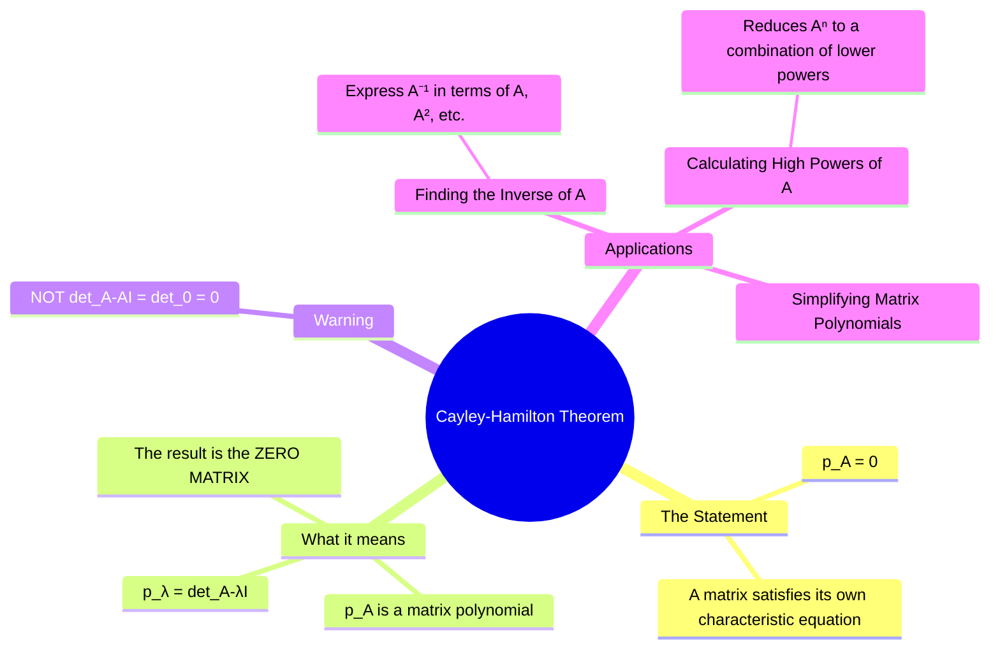

---
tags:
  - linear-algebra
  - fundamental-theorems
  - matrix-theory
  - engineering-math
created: 2025-09-09
aliases:
  - Cayley-Hamilton
subject: "[[Mathematics]]"
parent: "[[Characteristic Polynomial and Equation]]"
confidence: 9
---
###### Mind Map

---
### The Cayley-Hamilton Theorem
#cayley-hamilton-theorem #fundamental-theorems #matrix-polynomial

> The **Cayley-Hamilton Theorem** is a remarkable and powerful result in linear algebra which states that every square matrix "satisfies" its own [[Characteristic Polynomial and Equation#Definition and Derivation|characteristic equation]]. This means if you take the [[Characteristic Polynomial and Equation#Definition and Derivation|characteristic polynomial]] of a matrix $A$ and substitute the matrix $A$ itself into the polynomial, the result will be the zero matrix. This theorem provides a non-obvious relationship between a matrix and its eigenvalues and is a powerful tool for matrix calculations.

#### The Theorem Statement
#theorem-statement

Let $A$ be an $n \times n$ matrix and let $p(\lambda) = \det(A - \lambda I)$ be its [[Characteristic Polynomial and Equation#Definition and Derivation|characteristic polynomial]].
If the characteristic polynomial is written as:
$$ p(\lambda) = \lambda^n + c_{n-1}\lambda^{n-1} + \dots + c_1\lambda + c_0 $$
==Then the Cayley-Hamilton theorem states that the matrix $A$ satisfies this equation:==
$$\boxed{\quad p(A) = A^n + c_{n-1}A^{n-1} + \dots + c_1A + c_0I = \mathbf{0} \quad}$$
where ==$I$ is the $n \times n$ identity matrix== and ==$\mathbf{0}$ is the $n \times n$ zero matrix==.

> [!memory] Important Warning 🚩
> A common mistake is to think the proof is simply substituting $A$ for $\lambda$ in $\det(A - \lambda I)$ to get $\det(A - AI) = \det(\mathbf{0}) = 0$. This is incorrect because ==the result of the theorem is a **zero matrix**, not the scalar zero==. The proof is significantly more complex.

> [!pyq]- PYQ : 2018
> ![[ee_2018#^q44]]

---
#### Applications of the Cayley-Hamilton Theorem
#cayley-hamilton/applications

##### 1. Finding the Inverse of a Matrix ($A^{-1}$)

This theorem provides a method to find the inverse of a matrix without using methods like Gauss-Jordan elimination or the adjugate matrix.
==Starting from the theorem's equation:==
$$ A^n + c_{n-1}A^{n-1} + \dots + c_1A + c_0I = \mathbf{0} $$
==If $A$ is invertible, we can multiply the entire equation by $A^{-1}$:==
$$ A^{n-1} + c_{n-1}A^{n-2} + \dots + c_1I + c_0A^{-1} = \mathbf{0} $$
==Now, we can solve for $A^{-1}$:==
$$\boxed{\quad A^{-1} = -\frac{1}{c_0} (A^{n-1} + c_{n-1}A^{n-2} + \dots + c_1I) \quad}$$
==Note that $c_0 = p(0) = \det(A - 0I) = \det(A)$. So this is valid only if $\det(A) \neq 0$.==

##### 2.  Calculating Higher Powers of a Matrix ($A^k$)

==The theorem allows us to express any high power of $A$ as a linear combination of lower powers (specifically, powers up to $A^{n-1}$).==
From the characteristic equation, we can write:
$$ A^n = -c_{n-1}A^{n-1} - \dots - c_1A - c_0I $$
==This provides a recurrence relation. To find $A^{n+1}$, we can multiply by $A$ and substitute the expression for $A^n$ again. This process shows that **any power $A^k$ where $k \ge n$ can be expressed as a polynomial in $A$ of degree at most $n-1$**. This is extremely efficient for computation.==

> [!important] Points to Consider
> If the matrix already has simple shape (upper triangular, [[Block Matrices|block diagonal]]), direct multiplication is easier.
> 
> ==Use Cayley–Hamilton only when the [[Characteristic Polynomial and Equation|characteristic equation]] has multiple _different_ terms (distinct [[Eigenvalues and Eigenvectors|eigenvalues]]).==
> Then it reduces powers.
> 
> ==Don’t use it when the characteristic polynomial is like $(\lambda - c)^n$. Then it only gives $(A - cI)^n = 0$, which does not reduce low powers.==

---
### Related Concepts
#related-concepts

> [[Characteristic Polynomial and Equation]]

[[Eigenvalues and Eigenvectors]]
[[Determinant of a Matrix]]
[[Minimal Polynomial]] (The lowest degree polynomial that annihilates $A$, which divides the [[Characteristic Polynomial and Equation|characteristic polynomial]])
[[Block Matrices]]
