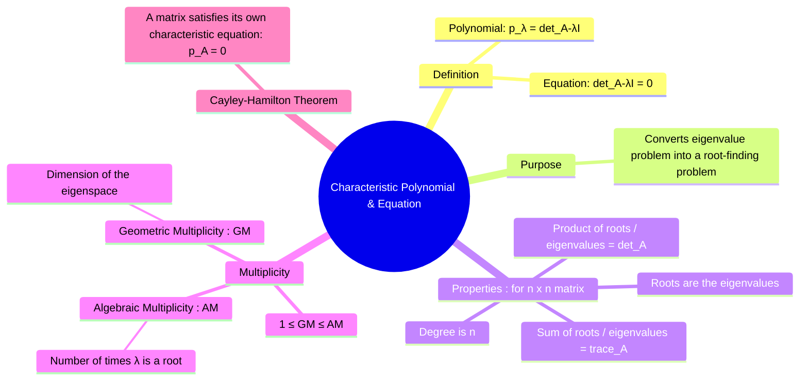

---
tags:
  - linear-algebra
  - eigenvalues
  - matrix-theory
  - polynomials
  - engineering-math
created: 2025-09-09
aliases:
  - Characteristic Equation
  - Characteristic Polynomial
subject: "[[Mathematics]]"
parent: "[[Eigenvalues and Eigenvectors]]"
confidence: 9
---
###### Mind Map

---
### Characteristic Polynomial and Equation
#characteristic-equation #eigenvalues #matrix-polynomial

> The **characteristic equation** is the central algebraic equation used to find the eigenvalues of a square matrix. It transforms the geometric problem of finding non-rotated vectors into the more familiar problem of finding the roots of a polynomial. The polynomial itself is called the **[[#Definition and Derivation|characteristic polynomial]]**.

#### Definition and Derivation
#characteristic-equation/definition

The search for eigenvalues and eigenvectors starts with the equation $A\mathbf{x} = \lambda\mathbf{x}$. This can be rewritten as:
$$ (A - \lambda I)\mathbf{x} = \mathbf{0} $$
For a non-zero eigenvector $\mathbf{x}$ to exist, this homogeneous system must have a non-trivial solution. This only happens if the matrix $(A - \lambda I)$ is singular (not invertible). A square matrix is singular if and only if its determinant is zero.

*   The **Characteristic Polynomial** of an $n \times n$ matrix $A$ is the polynomial in $\lambda$ given by:
    $$\boxed{\quad p(\lambda) = \det(A - \lambda I) \quad}$$
*   The **Characteristic Equation** is the equation formed by setting this polynomial to zero:
    $$\boxed{\quad \det(A - \lambda I) = 0 \quad}$$

The roots of the characteristic equation are the **eigenvalues** of the matrix $A$.

---
#### Properties of the Characteristic Polynomial
#matrix-invariants #trace #determinant

For an $n \times n$ matrix $A$, its characteristic polynomial $p(\lambda)$ has several important properties:
1.  **Degree**: The degree of $p(\lambda)$ is exactly $n$. This implies that an $n \times n$ matrix has exactly $n$ eigenvalues, counting multiplicities (though some may be complex numbers).
2.  **Trace**: The sum of the eigenvalues is equal to the **trace** of the matrix (the sum of the diagonal elements).
    $$\boxed{\quad \sum_{i=1}^n \lambda_i = \text{tr}(A) \quad}$$
3.  **Determinant**: The product of the eigenvalues is equal to the **determinant** of the matrix.
    $$\boxed{\quad \prod_{i=1}^n \lambda_i = \det(A) \quad}$$

---
#### Algebraic and Geometric Multiplicity
#algebraic-multiplicity #geometric-multiplicity

*   **Algebraic Multiplicity (AM)**: The algebraic multiplicity of an eigenvalue $\lambda_i$ is the number of times it appears as a root in the characteristic polynomial.
*   **Geometric Multiplicity (GM)**: The geometric multiplicity of an eigenvalue $\lambda_i$ is the dimension of its corresponding eigenspace, $E_{\lambda_i} = N(A - \lambda_i I)$.

These two multiplicities are related by the following inequality for any eigenvalue $\lambda_i$:
$$\boxed{\quad 1 \le \text{Geometric Multiplicity} \le \text{Algebraic Multiplicity} \quad}$$
A matrix is [[Diagonalization of a Matrix|diagonalizable]] if and only if the geometric multiplicity equals the algebraic multiplicity for all of its eigenvalues.

---
#### The Cayley-Hamilton Theorem
#cayley-hamilton-theorem

This remarkable theorem states that every square matrix satisfies its own characteristic equation.
If the characteristic polynomial of $A$ is $p(\lambda) = c_n\lambda^n + c_{n-1}\lambda^{n-1} + \dots + c_1\lambda + c_0$, then substituting the matrix $A$ for $\lambda$ yields the zero matrix:
$$\boxed{\quad p(A) = c_n A^n + c_{n-1}A^{n-1} + \dots + c_1 A + c_0 I = \mathbf{0} \quad}$$
This theorem can be used to find the inverse of a matrix or to express higher powers of $A$ as a linear combination of lower powers.

---
### Related Concepts
#related-concepts

> [[Eigenvalues and Eigenvectors]]

[[Diagonalization of a Matrix|Diagonalization]]
[[Determinant of a Matrix|Determinant]]
[[Trace of a Matrix]]
[[Subspaces|Subspace]]
