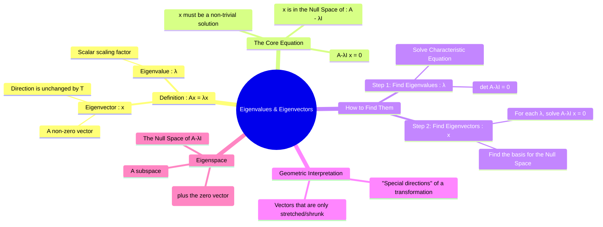

---
tags:
  - linear-algebra
  - eigenvalues
  - eigenvectors
  - matrix-theory
  - engineering-math
created: 2025-09-09
aliases:
  - Eigenvalues
  - Eigenvectors
  - Eigenvalue Problem
  - Characteristic Equation
  - Eigenvalues and Eigenvectors
subject:
  - "[[Mathematics]]"
  - "[[Control Systems]]"
parent: Linear Algebra
confidence: 9
formula:
  - "Characteristic Equation of the matrix A : $$\\det(A - \\lambda I) = 0$$"
trends:
  - "[[trends - Matrix]]"
---

###### Navigation

> [!navigation] Navigation
> - For physical mode shapes and rotation, see: [[Geometric Interpretation of Eigenvectors]]
> - For null space relations and independence, see: [[Eigenspaces and Multiplicity]]
> - For calculation methods and fast tips, see: [[Calculating Eigenvalues and Eigenvectors]]

###### Mind Map

---
### Eigenvalues and Eigenvectors

#eigenvalues #eigenvectors #linear-algebra

> For a given [[Linear Transformation|linear transformation]] represented by a square matrix $A$, <u>an **eigenvector** is a special non-zero vector that does not change its direction when the transformation is applied to it</u>. It is only scaled (stretched, shrunk, or reversed). <u>The **eigenvalue** is the scalar factor by which the eigenvector is scaled.</u> They are fundamental to understanding the "action" of a matrix and are crucial for applications like [[Diagonalization of a Matrix|diagonalization]], solving differential equations, and vibration analysis.

> [!concept]- Connection Between Eigenvectors, Eigenfunctions, and Vector Spaces
> 
> Any object that lives in a [[Vector Space Definition and Properties|Vector Space]]—numbers, polynomials, functions, signals—can have eigenvalues and eigenvectors/[[eigenfunctions]].
> 
> A **matrix** is just a linear [[operator]] on a _finite-dimensional_ vector space, while a **differential operator** is a linear operator on an _infinite-dimensional_ function space.
> 
> In both cases, an eigenvector/eigenfunction is something whose **direction/shape is preserved**, and the eigenvalue is the **scaling factor**.

> [!important] Eigenfunctions
> A function that, when an [[operator]] (such as a derivative, integral, or system operator) acts on it, returns a scalar multiple of the same function, only multiplied by a constant called the **eigenvalue**.
> 
> > See [[Eigen-signals of LTI Systems|Eigenfunctions of LTI Systems]]

---
#### Formal Definition

#eigenvalue-problem #characteristic-equation

Let $A$ be an $n \times n$ square matrix. ==A non-zero vector $\mathbf{x}$ is an **eigenvector** of $A$ if it satisfies the equation:==

$$\boxed{\quad A\mathbf{x} = \lambda\mathbf{x} \quad}$$

==for some scalar $\lambda$. The scalar $\lambda$ is called the **eigenvalue** corresponding to the eigenvector $\mathbf{x}$.==

To find the eigenvalues and eigenvectors, we rearrange the equation:

$$\begin{align}
A\mathbf{x} - \lambda\mathbf{x} &= \mathbf{0} \\
A\mathbf{x} - \lambda I \mathbf{x} &= \mathbf{0} \\
(A - \lambda I)\mathbf{x} &= \mathbf{0}
\end{align}$$

This is a [[Homogeneous System of Linear Equations|homogeneous system of linear equations]]. Since we are looking for a non-zero eigenvector $\mathbf{x}$, we require this system to have a **non-trivial solution**. This occurs only if the matrix $(A - \lambda I)$ is singular (not invertible), which means its [[Determinant of a Matrix|determinant]] must be zero.

$$\boxed{\quad \det(A - \lambda I) = 0 \quad}$$

This equation is called the **characteristic equation** of the matrix $A$.

> [!success] Why must $\det(A-\lambda I)=0$?
> 
> The equation
> 
> $$(A-\lambda I)\mathbf{x}=0$$
> 
> is a homogeneous system.
> 
> A non-trivial solution exists only when $(A-\lambda I)$ is singular (non-invertible).
> 
> A matrix is singular iff:
> 
> $$\det(A-\lambda I)=0$$

---
#### Engineering Context

> [!memory] Application Note: Stability Interpretation (Control Systems)
> 
> In [[control systems|control theory]], eigenvalues of the **state matrix** $A$ determine the stability of an LTI system.
> 
> 👉 See: _Stability of an LTI system_ table in [[State-Space Representation of LTI Systems#Terminology and Matrix Definitions|State-Space Representation of LTI Systems]]

> [!important] Physical Interpretation in Engineering
> 
> Eigenvalues often represent the natural modes of a system:
> 
> - Vibrational frequencies in mechanical systems
>     
> - System poles in control systems
>     
> - Resonance modes in circuits
>     
> - Principal axes in transformations
>     
> 
> Eigenvectors describe the corresponding mode shapes or dominant directions.

> [!nasa] EE Core Link: Matrix Exponentials & System Response
> 
> > See [[ee_2016(2)#^q49]]
> 
> For an LTI system $\dot{x} = Ax$ with initial condition $x(0)$, the state response is $x(t) = e^{At}x(0)$.
> 
> A critical property of eigenvectors under matrix exponentials is:
> 
> $$A\mathbf{x} = \lambda\mathbf{x} \implies e^{At}\mathbf{x} = e^{\lambda t}\mathbf{x}$$
> 
> - **Unhampered Modes:** If the initial condition is unaligned with any single eigenvector, the response is a linear combination of all system modes.
>     
> - **Pure Mode Trajectory:** If $x(0) = \alpha$ (where $\alpha$ is a pure eigenvector of $\lambda_1$), then the response stays completely within that eigenspace: $x(t) = e^{\lambda_1 t}\alpha$. No other modal frequencies will be excited.
>     

### Related Concepts

#related-concepts

> [[Properties of Eigenvalues and Eigenvectors]] (next topic)

[[Geometric Interpretation of Eigenvectors]] (For physical mode shapes and rotation)
[[Eigenspaces and Multiplicity]] (For null space relations and independence)
[[Calculating Eigenvalues and Eigenvectors]] (For calculation methods and fast tips)
[[Diagonalization of a Matrix]] (The primary application of eigenvalues and eigenvectors)
[[Linear Transformation]]
[[Determinant of a Matrix]]
[[Homogeneous System of Linear Equations]]
[[Control Systems]] (Eigenvalues of the system matrix determine stability)
[[Differential Equations]]
[[State-Space Representation of LTI Systems]]
[[Fundamental Subspaces of a Matrix|Null Space]]
[[Rank-Nullity Theorem]]
[[Characteristic Polynomial and Equation|Characteristic Polynomial]]
[[State-Space Representation of LTI Systems|Jordan Canonical Form (JCF)]]
[[State Transition Matrix (STM)|Matrix Exponential]]
[[Singular Matrix]]
[[Modal Analysis]]