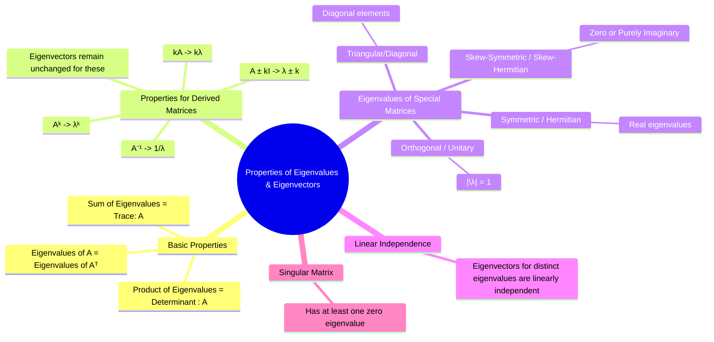

---
tags:
  - linear-algebra
  - matrix-theory
  - eigenvalues
  - eigenvectors
  - engineering-math
created: 2025-09-15
aliases:
  - Eigenvalue Properties
  - Eigenvector Properties
  - Eigenproperties
  - "Properties : Eigenvalues and Eigenvectors"
subject: "[[Mathematics]]"
parent: "[[Eigenvalues and Eigenvectors]]"
confidence: 9
formula:
  - "Properties of Derived Matrices : $$\\begin{array}{l|l|l} \\textbf{Matrix} & \\textbf{Eigenvalue} & \\textbf{Eigenvector} \\\\ \\hline A & \\lambda & x \\\\ A^k \\quad (k \\in \\mathbb{Z}^+) & \\lambda^k & x \\\\ A^{-1} \\quad (\\text{if invertible}) & 1/\\lambda & x \\\\ kA \\quad (k \\text{ is a scalar}) & k\\lambda & x \\\\ A \\pm kI & \\lambda \\pm k & x \\\\ A^T \\quad (\\text{Transpose}) & \\lambda & \\text{Generally different} \\\\ \\end{array}$$"
  - "Relationship between Eigenvalues and Determinant : $$\\prod_{i=1}^{n} \\lambda_i = \\det(A)$$"
  - "Relationship between Eigenvalues and Trace of a Matrix : $$\\sum_{i=1}^{n} \\lambda_i = \\text{tr}(A)$$"
---
###### Mind Map

---
### Properties of Eigenvalues and Eigenvectors
#eigenvalue-properties #matrix-properties #linear-algebra

> The eigenvalues and eigenvectors of a matrix are not arbitrary; they possess a rich set of properties that relate them to other fundamental matrix characteristics like the trace, [[Determinant of a Matrix|determinant]], and [[Rank of a Matrix|rank]]. Understanding these properties is crucial as they provide shortcuts for calculations, allow for consistency checks, and offer deep insights into the behavior of linear transformations and dynamic systems.

#### Sum and Product Properties
#eigenvalue-sum #eigenvalue-product #trace #determinant

For any $n \times n$ matrix $A$ with eigenvalues $\lambda_1, \lambda_2, \dots, \lambda_n$:

1.  **Sum of Eigenvalues equals Trace of the Matrix:** The sum of the eigenvalues is equal to the sum of the elements on the main diagonal ([[Matrix Operations#The Trace|the trace]]).
    $$\boxed{\quad \sum_{i=1}^{n} \lambda_i = \text{tr}(A) \quad}$$
2.  **Product of Eigenvalues equals Determinant of the Matrix:** The product of the eigenvalues is equal to the determinant of the matrix.
    $$\boxed{\quad \prod_{i=1}^{n} \lambda_i = \det(A) \quad}$$

> [!concept] Key Insight
> A matrix is singular (non-invertible) if and only if its [[Determinant of a Matrix#^zero-determinant-property|determinant is zero]]. Therefore, ==a matrix is **singular if and only if it has at least one eigenvalue equal to zero**==.
> 
> > [!related]
> > [[Inverse of a Matrix#Definition]]
> > [[Determinant of a Matrix#Determinants and Invertibility]]

---
#### 🔥Properties for Derived Matrices ==Important==
#derived-matrix-eigenvalues

If $\lambda$ is an eigenvalue of a matrix $A$ with corresponding eigenvector $x$, then the following relationships hold. ==A crucial point is that for most of these operations, the **eigenvector remains the same**.==

$$\boxed{
\begin{array}{l|l|l}
\textbf{Matrix} & \textbf{Eigenvalue} & \textbf{Eigenvector} \\
\hline
A & \lambda & x \\
A^k \quad (k \in \mathbb{Z}^+) & \lambda^k & x \\
A^{-1} \quad (\text{if invertible}) & 1/\lambda & x \\
kA \quad (k \text{ is a scalar}) & k\lambda & x \\
A \pm kI & \lambda \pm k & x \\
A^T \quad (\text{Transpose}) & \lambda & \text{Generally different} \\
\end{array}
}$$

> [!pyq]- PYQ : 2019, 2018
> ![[ee_2019#^q2]]
> 
> ---
> ![[ee_2018#^q17]]

---
#### Eigenvalues of Special Matrices
#special-matrix-eigenvalues

The structure of a matrix can place strong constraints on its eigenvalues.

![[Eigenvalues on plot.png]]

1.  **Triangular and Diagonal Matrices**: The eigenvalues are simply the elements on the main diagonal.
2.  **Real [[Symmetric Matrices]] ($A^T=A$)**:
    *   All eigenvalues are **real**.
    *   Eigenvectors corresponding to distinct eigenvalues are **orthogonal**.
3.  **Real [[Skew-Symmetric Matrices]] ($A^T=-A$)**:
    *   All eigenvalues are either **zero** or **purely imaginary**.
4.  **[[Orthogonal Matrices]] ($A^T A = I$)**:
    *   All eigenvalues have a magnitude of 1 (i.e., $|\lambda| = 1$). They lie on the unit circle in the complex plane.
5.  **Idempotent Matrices ($A^2 = A$)**:
    *   The eigenvalues are either 0 or 1.
6.  **Nilpotent Matrices ($A^k = 0$ for some k)**:
    *   All eigenvalues are zero.

---
#### Linear Independence of Eigenvectors
#linear-independence #eigenvectors

> [!definition] Theorem
> Eigenvectors corresponding to **distinct** (different) eigenvalues of a matrix are **linearly independent**.

* **Implication**: If an $n \times n$ matrix has $n$ distinct eigenvalues, it is guaranteed to have a set of $n$ linearly independent eigenvectors. Such a matrix is called **diagonalizable**, as these eigenvectors can form a [[Basis and Dimension of a Vector Space|basis]] for the vector space $\mathbb{R}^n$.

---
### Related Concepts
#linear-algebra/related-concepts

> [[Eigenvalues and Eigenvectors|Eigenvalues and Eigenvectors]]

[[Determinant of a Matrix|Determinant]]
[[Transpose and Inverse of a Matrix|Transpose of a Matrix]]
[[Diagonalization of a Matrix]]
[[Hermitian Matrices]]
[[Control Systems]] (Stability analysis depends on the location of eigenvalues)

