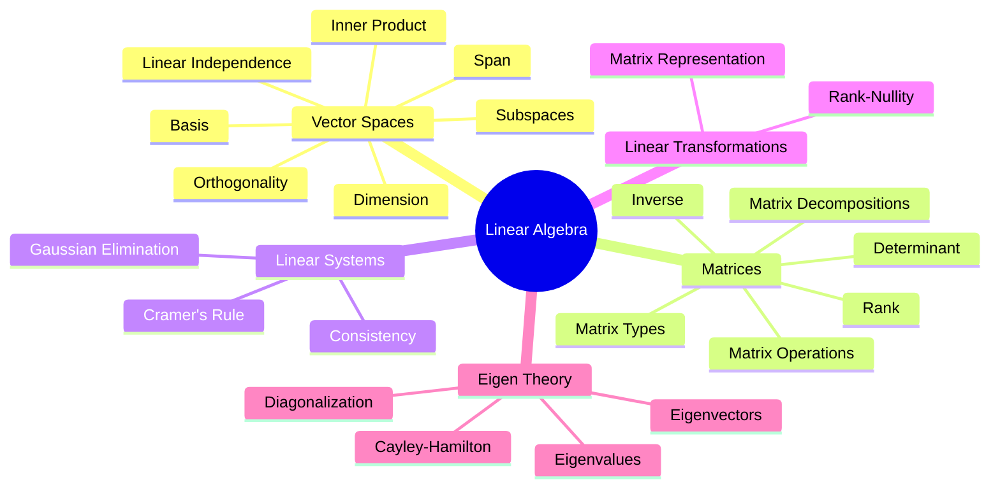

### Linear Algebra
#linear-algebra #mathematics #gate #map-of-content

> ==**Linear Algebra** is the branch of mathematics concerned with **vector spaces, linear transformations, systems of linear equations, and matrices**. It provides the mathematical foundation for solving engineering problems involving multiple variables, transformations, optimization, control systems, signal processing, machine learning, and numerical computation.==
>
> Every topic in Linear Algebra ultimately revolves around answering three questions:
>
> - **What is the space?**
> - **How do vectors behave inside the space?**
> - **How does a linear transformation change that space?**



---

#### 1. Vector Spaces

Everything in Linear Algebra begins with the concept of a **Vector Space**. Before studying matrices, you should understand what vectors are, where they live, and how they interact.

##### Core Concepts

- [[Vector Space Definition and Properties]]
- [[Subspaces]]
- [[Span of a Set of Vectors]]
- [[Linear Independence and Dependence of Vectors]]
- [[Basis and Dimension of a Vector Space]]

##### Geometry of Vector Spaces

- [[Norm of a Vector]]
- [[Inner Product Space]]
- [[Orthogonality]]
- [[Orthonormal Basis]]
- [[Gram-Schmidt Orthonormalization Process]]

---

#### 2. Linear Transformations

A Linear Transformation describes how vectors are mapped from one vector space into another while preserving linearity.

$$T(ax+by)=aT(x)+bT(y)$$

##### Topics

- [[Linear Transformation]]
- [[Matrix Representation of a Linear Transformation]]
- [[Rank and Nullity of a Linear Transformation]]
- [[Rank-Nullity Theorem]]
- [[Fundamental Subspaces of a Matrix]]

---

#### 3. Matrix Algebra

Matrices provide the computational representation of Linear Transformations.

##### Matrix Fundamentals

- [[Matrix Operations]]
- [[Types of Matrix]]
- [[Adjoint of a Matrix]]
- [[Determinant of a Matrix]]
- [[Inverse of a Matrix]]
- [[Properties of Transpose and Inverse]]
- [[Rank of a Matrix]]
- [[Minors and Cofactors]]

##### Matrix Types

- [[Symmetric Matrices]]
- [[Skew-Symmetric Matrices]]
- [[Hermitian Matrices]]
- [[Skew-Hermitian Matrices]]
- [[Orthogonal Matrices]]
- [[Unitary Matrices]]
- [[Nilpotent Matrices]]
- [[Block Matrices]]

##### Matrix Factorizations

- [[LU Decomposition]]
- [[Cholesky Decomposition]]

##### Applications

- [[Quadratic Forms]]
- [[Rotation Matrix]]

---

#### 4. Systems of Linear Equations

Engineering problems frequently reduce to solving multiple simultaneous equations.

$$AX=B$$

##### Topics

- [[System of Linear Equations]]
- [[Consistency of Linear Equations]]
- [[Homogeneous System of Linear Equations]]
- [[Non-Homogeneous System of Linear Equations]]
- [[Gaussian Elimination Method]]
- [[Cramer's Rule]]
- [[Solving Systems of Linear Equations]]
- [[Theory of Equations]]
- [[Roots of Polynomials]]

---

#### 5. Eigen Theory

Eigenvalues reveal the intrinsic properties of Linear Transformations.

If

$$Ax=\lambda x$$

then **x** is an Eigenvector and **λ** is its corresponding Eigenvalue.

##### Topics

- [[Eigenvalues and Eigenvectors]]
- [[Characteristic Polynomial and Equation]]
- [[Calculating Eigenvalues and Eigenvectors]]
- [[Properties of Eigenvalues and Eigenvectors]]
- [[Diagonalization of a Matrix]]
- [[Minimal Polynomial]]
- [[Cayley-Hamilton Theorem]]
- [[Eigenspaces and Multiplicity]]
- [[Geometric Interpretation of Eigenvectors]]

---

#### Learning Progression

```text
Vector Space
      ↓
Subspaces
      ↓
Span
      ↓
Linear Independence
      ↓
Basis & Dimension
      ↓
Inner Product
      ↓
Orthogonality
      ↓
Linear Transformation
      ↓
Matrices
      ↓
Linear Systems
      ↓
Rank
      ↓
Eigenvalues
      ↓
Diagonalization
```

> [!success] Study Strategy
>
> Learn Linear Algebra in exactly this order:
>
> 1. Vector Spaces
> 2. Basis & Dimension
> 3. Linear Transformations
> 4. Matrix Algebra
> 5. Systems of Linear Equations
> 6. Rank & Nullity
> 7. Eigenvalues & Eigenvectors
> 8. Diagonalization

> [!examtip] GATE Strategy
>
> GATE typically tests Linear Algebra in layers:
>
> - Matrix properties and identities
> - Rank and consistency of equations
> - Gaussian elimination
> - Eigenvalues and Eigenvectors
> - Cayley–Hamilton theorem
> - Orthogonality and Gram–Schmidt
> - Linear Transformations and Rank–Nullity
>
> Most multi-concept questions combine **Matrices → Rank → Eigenvalues**.

---

### Related Concepts

> [[Calculus]]

[[Differential Equations]]
[[Numerical Methods]]
[[Control Systems]]
[[Signals & Systems]]