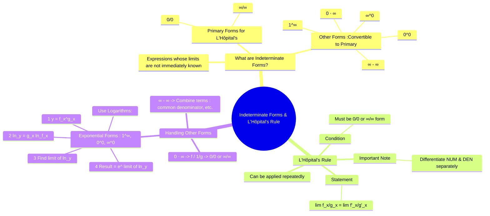

---
tags:
  - calculus
  - limits
  - differential-calculus
  - engineering-math
created: 2025-09-15
aliases:
  - L'Hopital's Rule
  - L'Hospital's Rule
  - Indeterminate Forms
  - "Example : 0/0 Form in Limits"
  - "Example : 0*infinity Form in Limits"
  - "Example : infinity - infinity Form in Limits"
  - "Example : 1^infinity Form in Limits"
subject: "[[Mathematics]]"
parent: "[[Limits, Continuity, and Differentiability]]"
confidence: 10
---
###### Mind Map

---
### Indeterminate Forms and L'Hôpital's Rule
#lhopitals-rule #indeterminate-forms #limits #calculus

> **Indeterminate forms** are expressions that arise in the context of limits, where the value of the limit cannot be determined by direct substitution. **L'Hôpital's Rule** is a powerful technique from differential calculus that allows us to evaluate limits of indeterminate forms of the type $\frac{0}{0}$ or $\frac{\infty}{\infty}$ by taking the derivatives of the numerator and denominator.

#### The Seven Indeterminate Forms
#indeterminate-forms

There are seven common indeterminate forms. L'Hôpital's rule applies directly to the first two; the others must be algebraically manipulated to fit one of the first two forms.
1.  **Ratio Forms**: $\quad \frac{0}{0}, \quad \frac{\infty}{\infty}$
2.  **Product Form**: $\quad 0 \cdot \infty$
3.  **Difference Form**: $\quad \infty - \infty$
4.  **Exponential Forms**: $\quad 1^\infty, \quad 0^0, \quad \infty^0$

---
#### L'Hôpital's Rule
#lhopitals-rule

**Statement**: Suppose that $\lim_{x \to a} f(x) = \lim_{x \to a} g(x) = 0$ or $\lim_{x \to a} f(x) = \lim_{x \to a} g(x) = \pm\infty$.
If the limit $\lim_{x \to a} \frac{f'(x)}{g'(x)}$ exists (or is $\pm\infty$), then:
$$\boxed{\quad \lim_{x \to a} \frac{f(x)}{g(x)} = \lim_{x \to a} \frac{f'(x)}{g'(x)} \quad}$$
This rule is also valid for one-sided limits and limits as $x \to \infty$ or $x \to -\infty$.

> **CRITICAL WARNING**: Differentiate the numerator and the denominator **separately**. Do **NOT** use the quotient rule.
> $$\frac{d}{dx}\left(\frac{f(x)}{g(x)}\right) \neq \frac{f'(x)}{g'(x)}$$

*   **Example (0/0 form)**: Evaluate $\lim_{x \to 0} \frac{\sin(x)}{x}$.
    *   Substituting $x=0$ gives $\frac{\sin(0)}{0} = \frac{0}{0}$. We can apply the rule.
        $$\lim_{x \to 0} \frac{\sin(x)}{x} = \lim_{x \to 0} \frac{\frac{d}{dx}(\sin x)}{\frac{d}{dx}(x)} = \lim_{x \to 0} \frac{\cos(x)}{1} = \frac{\cos(0)}{1} = 1$$

---
#### Handling Other Indeterminate Forms

##### Form $0 \cdot \infty$
Rewrite the product $f(x)g(x)$ as a quotient: $f(x)g(x) = \frac{f(x)}{1/g(x)}$ (to get 0/0) or $f(x)g(x) = \frac{g(x)}{1/f(x)}$ (to get $\infty/\infty$).

*   **Example**: Evaluate $\lim_{x \to 0^+} x \ln(x)$.
    *   This is a $0 \cdot (-\infty)$ form. Rewrite it as $\frac{\ln(x)}{1/x}$, which is now $\frac{-\infty}{\infty}$.
        $$\lim_{x \to 0^+} \frac{\ln(x)}{1/x} = \lim_{x \to 0^+} \frac{1/x}{-1/x^2} = \lim_{x \to 0^+} (-x) = 0$$

##### Form $\infty - \infty$
Combine the terms into a single fraction using techniques like finding a common denominator or rationalization to convert the expression into a $\frac{0}{0}$ or $\frac{\infty}{\infty}$ form.

*   **Example**: Evaluate $\lim_{x \to 0} \left( \frac{1}{x} - \frac{1}{\sin x} \right)$.
    *   This is an $\infty - \infty$ form. Combine the fractions.
        $$\lim_{x \to 0} \frac{\sin x - x}{x \sin x} \quad \left(\text{Now } \frac{0}{0} \text{ form}\right)$$
    *   Apply L'Hôpital's Rule:
        $$\lim_{x \to 0} \frac{\cos x - 1}{\sin x + x \cos x} \quad \left(\text{Still } \frac{0}{0} \text{ form}\right)$$
    *   Apply L'Hôpital's Rule again:
        $$\lim_{x \to 0} \frac{-\sin x}{\cos x + \cos x - x \sin x} = \frac{0}{1+1-0} = 0$$

##### Exponential Forms ($1^\infty, 0^0, \infty^0$)
Use the following logarithmic procedure:
1.  Let $y = f(x)^{g(x)}$.
2.  Take the natural logarithm of both sides: $\ln y = g(x) \ln(f(x))$.
3.  Evaluate the limit $L = \lim_{x \to a} \ln y = \lim_{x \to a} [g(x) \ln(f(x))]$. This will typically be a $0 \cdot \infty$ form, which can then be solved.
4.  The final answer is $e^L$.

*   **Example ($1^\infty$ form)**: Evaluate $\lim_{x \to \infty} \left(1 + \frac{1}{x}\right)^x$.
    1.  Let $y = \left(1 + \frac{1}{x}\right)^x$.
    2.  $\ln y = x \ln\left(1 + \frac{1}{x}\right)$.
    3.  Evaluate the limit of $\ln y$:
        $$\begin{align}
        L &= \lim_{x \to \infty} x \ln\left(1 + \frac{1}{x}\right) \quad (\infty \cdot 0 \text{ form}) \\
         &= \lim_{x \to \infty} \frac{\ln(1 + 1/x)}{1/x} \quad (0/0 \text{ form}) \\
         &= \lim_{x \to \infty} \frac{\frac{1}{1+1/x} \cdot (-1/x^2)}{-1/x^2} = \lim_{x \to \infty} \frac{1}{1+1/x} = 1
        \end{align}$$
    4.  The final result is $e^L = e^1 = e$.

---
### Related Concepts
#calculus/related-concepts

> [[Calculus - Limits, Continuity and Differentiability]]
> [[Calculus - Differentiation]]
> [[Calculus - Taylor Series]] (Taylor series expansions provide an alternative, powerful method for evaluating indeterminate forms)