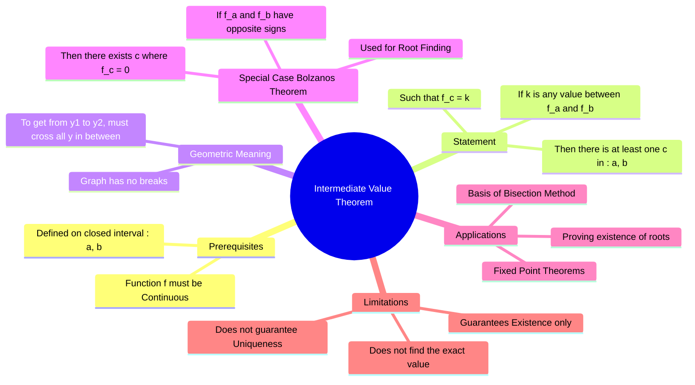

---
tags:
  - mathematics
  - calculus
  - continuity
  - gate
  - numerical-methods
aliases:
  - IVT
  - Bolzano's Theorem
  - Root Existence Theorem
  - "Example : Intermediate Value Theorem"
subject: "[[Mathematics]]"
parent:
  - "[[Limits, Continuity, and Differentiability]]"
confidence: 10
---
###### Mind Map

---
### Intermediate Value Theorem (IVT)
#calculus/theorems #ivt

> The Intermediate Value Theorem states that if a continuous function takes on two values at points $a$ and $b$, it must also take on every value *between* $f(a)$ and $f(b)$ at some point between $a$ and $b$. Intuitively, this means a continuous curve cannot jump over horizontal lines; it must cross them.

#### Formal Statement
#ivt/statement

Let $f(x)$ be a function that satisfies the following two conditions:
1. $f(x)$ is **continuous** on the closed interval $[a, b]$.
2. $k$ is any number strictly between $f(a)$ and $f(b)$ (i.e., $f(a) < k < f(b)$ or $f(b) < k < f(a)$).

Then, there exists at least one number $c$ in the open interval $(a, b)$ such that:
$$\boxed{\quad f(c) = k \quad}$$

> [!warning] Key Constraint
> The function **must** be continuous. If $f(x)$ has a jump discontinuity (like a step function), the theorem does not apply.

---
#### Bolzano's Theorem (Application to Roots)
#ivt/bolzanos-theorem #root-finding

This is the most common application of IVT in GATE and engineering mathematics, often used to determine if an equation has a solution within a specific range.

**Statement:**
If a function $f(x)$ is continuous on $[a, b]$ and if $f(a)$ and $f(b)$ have **opposite signs** (i.e., $f(a) \cdot f(b) < 0$), then there exists at least one root $c \in (a, b)$ such that:
$$\boxed{\quad f(c) = 0 \quad}$$

* **Interpretation:** If the curve is above the x-axis at one end and below it at the other, and it doesn't break, it *must* cross the x-axis at least once.
* **Numerical Methods:** This is the theoretical basis for the **[[Bisection Method]]**.

#### Implications and Nuances
#ivt/properties

1. **Existence, not Uniqueness:** IVT guarantees that *at least one* $c$ exists. There could be multiple points where $f(c) = k$.
2. **Existence, not Construction:** IVT tells you the value is there, but it does not tell you *how* to calculate $c$ (it is a non-constructive proof).
3. **Discontinuous Functions:** Consider $f(x) = \begin{cases} -1 & x < 0 \\ 1 & x \ge 0 \end{cases}$ on $[-1, 1]$. $f(-1)=-1$ and $f(1)=1$. 0 is between -1 and 1, but there is no $c$ where $f(c)=0$. IVT fails because $f$ is discontinuous at 0.
---
#### Example

**Problem:** Show that the equation $x^3 - x - 1 = 0$ has a root between 1 and 2.
**Solution:**
Let $f(x) = x^3 - x - 1$. Since it is a polynomial, it is continuous everywhere.
* Evaluate at lower bound: $f(1) = 1^3 - 1 - 1 = -1$.
* Evaluate at upper bound: $f(2) = 2^3 - 2 - 1 = 5$.
* Observation: $f(1)$ is negative, $f(2)$ is positive.
* Conclusion: By IVT (Bolzano's), since signs are opposite, there is a $c \in (1, 2)$ such that $f(c) = 0$.

---
### Related Concepts
#topic/related-concepts

> [[Limits, Continuity, and Differentiability|Limits, Continuity, Differentiability]]
> [[Mean Value Theorems]] (MVT) (Relates to slopes, whereas IVT relates to values)

[[Mean Value Theorems|Rolle's Theorem]] (A specific case of MVT involving roots)
[[Bisection Method]] (Numerical algorithm based on IVT)
[[Fixed Point Iteration]]
[[Topology]] (IVT is related to the connectivity of space)