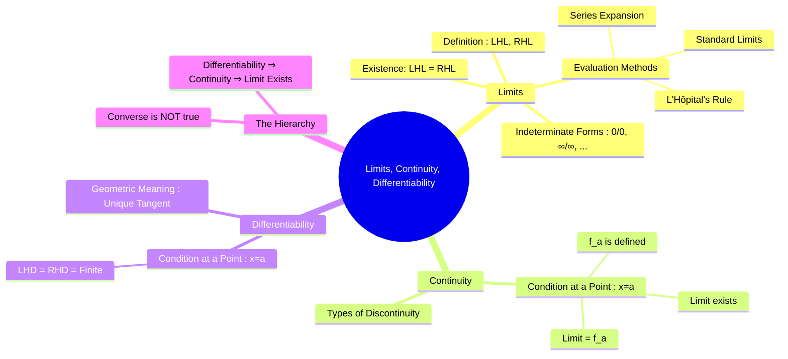

---
tags:
  - calculus
  - analysis
  - limits
  - continuity
  - differentiability
  - engineering-math
created: 2025-09-09
aliases:
  - Limits, Continuity, Differentiability
  - LCD
subject: "[[Mathematics]]"
parent:
  - Calculus
confidence: 9
define:
  - "Condition for Continuity : $$\\begin{align}1. \\quad &\\lim_{x \\to a} f(x) \\text{ must exist.} \\\\2. \\quad &f(a) \\text{ must be defined.} \\\\3. \\quad &\\lim_{x \\to a} f(x) = f(a)\\end{align}$$"
  - "Condition for existence of Limit : $$\\lim_{x \\to a} f(x) \\text{ exists} \\iff \\lim_{x \\to a^-} f(x) = \\lim_{x \\to a^+} f(x)$$"
  - "Condition for Differentiability : $$\\text{Differentiable at } a \\iff \\text{LHD} = \\text{RHD} = \\text{a finite value}$$"
  - "Fundamental Relationship in Limits, Continuity, and Differentiability : $\\text{Differentiability} \\implies \\text{Continuity} \\implies \\text{Limit Exists}$"
---
###### Mind Map

---
### Limits, Continuity, and Differentiability
#calculus-foundations #limits #continuity #differentiability

> These three concepts form the bedrock of differential calculus. They are ordered in a strict hierarchy: the existence of a **limit** is required for **continuity**, which in turn is a necessary condition for **differentiability**. Understanding this hierarchy is crucial for analyzing the behavior of functions at a point.

#### Limits
#limits

A limit describes the value that a function $f(x)$ approaches as its input $x$ approaches some value $a$.

* **Left-Hand Limit (LHL)**: The value $f(x)$ approaches as $x$ approaches $a$ from the left side ($x < a$).
    $$ \text{LHL} = \lim_{x \to a^-} f(x) $$
* **Right-Hand Limit (RHL)**: The value $f(x)$ approaches as $x$ approaches $a$ from the right side ($x > a$).
    $$ \text{RHL} = \lim_{x \to a^+} f(x) $$

**Condition for Existence**: For the limit to exist at $x=a$, the LHL must equal the RHL.
$$\boxed{\quad \lim_{x \to a} f(x) \text{ exists} \iff \lim_{x \to a^-} f(x) = \lim_{x \to a^+} f(x) \quad}$$

**Indeterminate Forms**: Standard methods fail when the limit takes forms like:
$$ \frac{0}{0}, \ \frac{\infty}{\infty}, \ 0 \times \infty, \ \infty - \infty, \ 1^\infty, \ 0^0, \ \infty^0 $$
**L'Hôpital's Rule**: For $\frac{0}{0}$ or $\frac{\infty}{\infty}$ forms:
$$\boxed{\quad \lim_{x \to a} \frac{f(x)}{g(x)} = \lim_{x \to a} \frac{f'(x)}{g'(x)} \quad}$$

---
#### Continuity
#continuity

A function is continuous at a point if there is no interruption in its graph—no holes, jumps, or vertical asymptotes.

**Condition for Continuity at a Point $x=a$**:
A function $f(x)$ is continuous at $x=a$ if all three of the following conditions are met:
$$\boxed{\quad \begin{align}
1. \quad &\lim_{x \to a} f(x) \text{ must exist.} \\
2. \quad &f(a) \text{ must be defined.} \\
3. \quad &\lim_{x \to a} f(x) = f(a)
\end{align} \quad}$$

---
#### Differentiability
#differentiability

A function is differentiable at a point if it is "smooth" and has a unique, non-vertical tangent line at that point. This means the function's rate of change is well-defined.

* **Left-Hand Derivative (LHD)** at $x=a$:
    $$ f'(a^-) = \lim_{h \to 0^-} \frac{f(a+h) - f(a)}{h} $$
* **Right-Hand Derivative (RHD)** at $x=a$:
    $$ f'(a^+) = \lim_{h \to 0^+} \frac{f(a+h) - f(a)}{h} $$

**Condition for Differentiability at a Point $x=a$**:
A function $f(x)$ is differentiable at $x=a$ if the LHD and RHD are equal and finite.
$$\boxed{\quad \text{Differentiable at } a \iff \text{LHD} = \text{RHD} = \text{a finite value} \quad}$$

---
### The Fundamental Relationship
#calculus-hierarchy

The relationship between these concepts is a one-way street.

$$\boxed{\quad \text{Differentiability} \implies \text{Continuity} \implies \text{Limit Exists} \quad}$$

> [!pyq]-
> ![[ee_2018#^q11]]

The converse is not true.
* **Continuity does NOT imply Differentiability**: A function can be continuous but have a sharp corner or cusp.
    * **Classic Example**: $f(x) = |x|$ at $x=0$.
        * It is continuous: $\lim_{x\to0} |x| = 0 = f(0)$.
        * It is not differentiable: LHD = -1 and RHD = +1. Since LHD $\neq$ RHD, the derivative does not exist.
* **Limit Existence does NOT imply Continuity**: A function can have a limit but be discontinuous if there is a "hole" in the graph.
    * **Example**: $f(x) = \frac{x^2-1}{x-1}$ at $x=1$. The limit is 2, but $f(1)$ is undefined.

---
### Related Concepts
#related-concepts

> [[Derivatives]]

[[Mean Value Theorems]]
[[Taylor Series]]
[[Functions]]