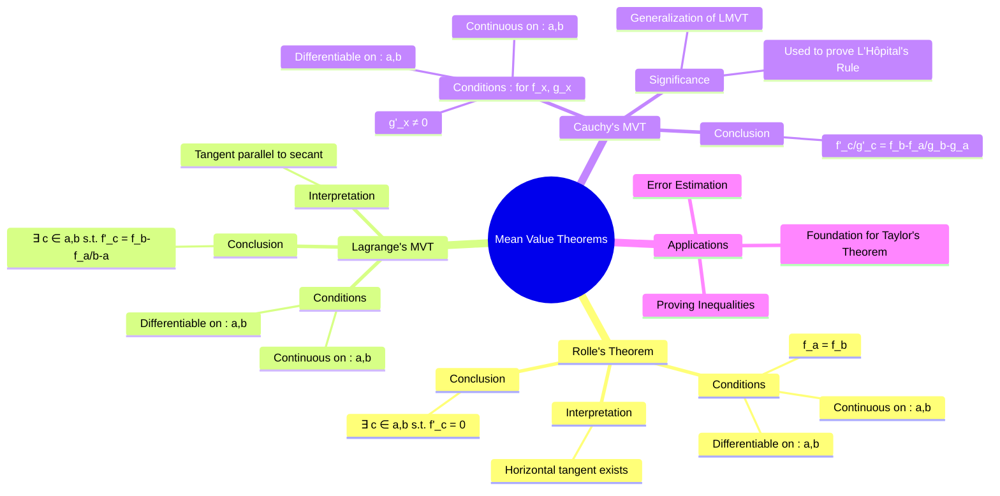

---
tags:
  - calculus
  - analysis
  - theorems
  - engineering-math
created: 2025-09-08
aliases:
  - MVT
  - Lagrange's Mean Value Theorem
  - Rolle's Theorem
  - Cauchy's Mean Value Theorem
subject: "[[Mathematics]]"
parent: "[[Calculus]]"
---
### Mean Value Theorems
#mean-value-theorem #calculus-theorems

> The Mean Value Theorems are a cornerstone of differential calculus, establishing a fundamental relationship between the average rate of change of a function over an interval and its instantaneous rate of change at a specific point within that interval. They are crucial for proving many other results, including Taylor's theorem.

---

#### Rolle's Theorem
#rolles-theorem

Rolle's Theorem is a special case of the Mean Value Theorem. It states that for a differentiable function that starts and ends at the same value, there must be at least one point in between where the derivative is zero (i.e., a stationary point).

**Statement**: If a function $f(x)$ satisfies the following three conditions:
1. It is continuous on the closed interval $[a, b]$.
2. It is differentiable on the open interval $(a, b)$.
3. $f(a) = f(b)$.

Then, there exists at least one number $c$ in the open interval $(a, b)$ such that:
$$\boxed{\quad f'(c) = 0 \quad}$$
**Geometric Interpretation**: If a smooth curve has the same height at its endpoints, there must be at least one point between them where the tangent to the curve is horizontal.

---
#### Lagrange's Mean Value Theorem (LMVT)
#lagranges-mvt #first-mean-value-theorem

This is the most commonly used Mean Value Theorem. It generalizes Rolle's theorem by removing the condition that $f(a) = f(b)$.

**Statement**: If a function $f(x)$ satisfies:
1. It is continuous on the closed interval $[a, b]$.
2. It is differentiable on the open interval $(a, b)$.

Then, there exists at least one number $c$ in the open interval $(a, b)$ such that the instantaneous rate of change at $c$ equals the average rate of change over $[a,b]$.
$$\boxed{\quad f'(c) = \frac{f(b) - f(a)}{b-a} \quad}$$
**Geometric Interpretation**: There is at least one point on the curve where the tangent line is parallel to the secant line that connects the endpoints of the curve, $(a, f(a))$ and $(b, f(b))$.

---
#### Cauchy's Mean Value Theorem (CMVT)
#cauchys-mvt #generalized-mvt

Cauchy's Mean Value Theorem is a generalization of Lagrange's MVT and is used to prove L'Hôpital's Rule. It deals with two functions instead of one.

**Statement**: If two functions, $f(x)$ and $g(x)$, satisfy:
1. They are both continuous on the closed interval $[a, b]$.
2. They are both differentiable on the open interval $(a, b)$.
3. $g'(x) \neq 0$ for all $x$ in $(a, b)$.

Then, there exists at least one number $c$ in the open interval $(a, b)$ such that:
$$\boxed{\quad \frac{f'(c)}{g'(c)} = \frac{f(b) - f(a)}{g(b) - g(a)} \quad}$$
**Note**: LMVT is a special case of CMVT where $g(x) = x$.

---
### Related Concepts
#related-concepts

> [[Differentiation]]

[[Maxima and Minima (Single Variable)]]
[[Limits, Continuity, and Differentiability]]
[[Indeterminate Forms (L'Hôpital's Rule)]] (Proven using Cauchy's MVT)
[[Taylor Series]] (The remainder term is derived using MVT)
