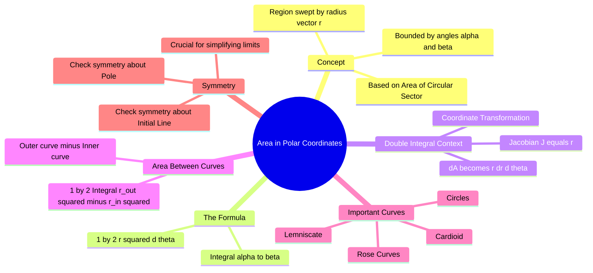

---
tags:
  - mathematics
  - calculus
  - integration
  - polar-coordinates
  - gate
created: 2026-07-13
aliases:
  - Polar Area
  - Area bounded by Polar Curves
subject: "[[Mathematics]]"
parent: Integral Calculus
formula:
  - "Area in Polar Coordinates : $$A = \\int_{\\alpha}^{\\beta} \\frac{1}{2} [f(\\theta)]^2 \\, d\\theta = \\frac{1}{2} \\int_{\\alpha}^{\\beta} r^2 \\, d\\theta$$"
  - "Area Between Two Polar Curves : $$A = \\frac{1}{2} \\int_{\\alpha}^{\\beta} \\left( r_{outer}^2 - r_{inner}^2 \\right) d\\theta$$"
---
### Area in Polar Coordinates
#calculus/integration #polar-coordinates

> Calculating the area of regions defined by polar equations $r = f(\theta)$ requires a different approach than rectangular coordinates. Instead of summing vertical rectangles ($y dx$), we sum infinite infinitesimal **circular sectors**.

---

#### The Fundamental Formula
#formula/polar-area

For a curve defined by $r = f(\theta)$ and bounded by two rays $\theta = \alpha$ and $\theta = \beta$:

The area $A$ of the sector is derived from the area of a circle sector ($A = \frac{1}{2}r^2\theta$). In calculus terms:
$$\boxed{\quad A = \int_{\alpha}^{\beta} \frac{1}{2} [f(\theta)]^2 \, d\theta = \frac{1}{2} \int_{\alpha}^{\beta} r^2 \, d\theta \quad}$$

**Key Conditions:**
*   The origin (pole) must be part of the sector sweep or boundary.
*   $\beta - \alpha \le 2\pi$ (To avoid overlapping/double counting area, unless intended).
*   $r$ is usually taken as positive.

---
#### Area Between Two Polar Curves
#calculus/area-between-curves

If a region is bounded between two curves $r_{outer} = f(\theta)$ and $r_{inner} = g(\theta)$ from $\theta = \alpha$ to $\theta = \beta$, the area is the difference of the two sectors:

$$\boxed{\quad A = \frac{1}{2} \int_{\alpha}^{\beta} \left( r_{outer}^2 - r_{inner}^2 \right) d\theta \quad}$$

> **GATE Warning:** Do **not** compute $(\frac{1}{2} \int (r_{outer} - r_{inner})^2 d\theta)$. You must square the radii individually before subtracting.

---
#### Connection to Double Integrals (Jacobian)
#calculus/double-integrals

In multivariable calculus, calculating area involves a double integral $\iint_R dA$. When converting from Cartesian $(x, y)$ to Polar $(r, \theta)$:
*   $x = r \cos\theta$
*   $y = r \sin\theta$
*   **The Jacobian:** $J = \frac{\partial(x,y)}{\partial(r,\theta)} = r$

Thus, the area element transforms as:
$$dA = dx \, dy \longrightarrow \boxed{\quad dA = r \, dr \, d\theta \quad}$$

The area formula becomes:
$$A = \iint_R r \, dr \, d\theta = \int_{\alpha}^{\beta} \left( \int_{0}^{f(\theta)} r \, dr \right) d\theta = \int_{\alpha}^{\beta} \left[ \frac{r^2}{2} \right]_0^{f(\theta)} d\theta = \frac{1}{2} \int_{\alpha}^{\beta} r^2 d\theta$$
*(This confirms the single integral formula derived geometrically).*

---
#### Symmetry Tips for GATE
#gate/tips

Identifying symmetry saves time by allowing you to integrate over a smaller range and multiply by an integer factor.

1.  **Symmetry about the Polar Axis (Initial Line / x-axis):**
    *   If the equation remains unchanged when $\theta$ is replaced by $-\theta$.
    *   *Example:* $r = a(1 + \cos\theta)$ (Cardioid). Integrate $0$ to $\pi$ and multiply by 2.
2.  **Symmetry about the Vertical Line ($\theta = \pi/2$ / y-axis):**
    *   If unchanged when $\theta$ is replaced by $(\pi - \theta)$.
    *   *Example:* $r = a \sin\theta$.
3.  **Symmetry about the Pole (Origin):**
    *   If unchanged when $r$ is replaced by $-r$ (or $\theta$ by $\theta + \pi$).
    *   *Example:* $r^2 = a^2 \cos(2\theta)$ (Lemniscate).

---
#### Common Polar Curves (Quick Reference)

| Curve | Equation | Area feature |
| :--- | :--- | :--- |
| **Circle** (Center origin) | $r = a$ | $A = \pi a^2$ |
| **Circle** (Tangent to pole) | $r = a \cos\theta$ or $r = a \sin\theta$ | Complete circle is $0$ to $\pi$. |
| **Cardioid** | $r = a(1 \pm \cos\theta)$ | $A = \frac{3}{2}\pi a^2$ |
| **Lemniscate** ($\infty$ shape) | $r^2 = a^2 \cos(2\theta)$ | One loop is $-\pi/4$ to $\pi/4$. |
| **Three-Leaved Rose** | $r = a \sin(3\theta)$ | Period is $\pi$. One petal is $0$ to $\pi/3$. |
| **Four-Leaved Rose** | $r = a \sin(2\theta)$ | Period is $2\pi$. One petal is $0$ to $\pi/2$. |

---
### Related Concepts
#topic/related-concepts

> [[Double Integrals]] (Using polar coordinates for evaluation)

[[Definite Integrals]]
[[Change of Variables (Jacobian)]]
[[Curve Tracing]] (Essential for determining limits of integration)
[[Arc Length in Polar Coordinates]]
[[Volume of Revolution]] (Using polar methods)
