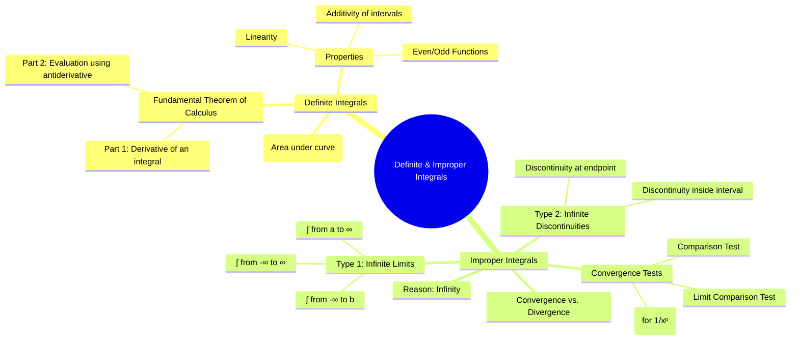

---
tags:
  - calculus
  - integration
  - analysis
  - improper-integrals
  - engineering-math
created: 2025-09-09
aliases:
  - Definite Integral
  - Improper Integral
  - Riemann Integral
subject: "[[Mathematics]]"
parent:
  - "[[Calculus]]"
---
### Definite and Improper Integrals
#calculus #integration

> A **definite integral**, $\int_a^b f(x) dx$, represents the net signed area under the curve of $f(x)$ from $x=a$ to $x=b$. An **improper integral** is a generalization of the definite integral to cases where either the interval of integration is infinite or the function has an infinite discontinuity within the interval. Improper integrals are evaluated using limits.

---

#### Definite Integrals
#definite-integral #ftc

The definite integral is formally defined as the limit of a Riemann sum, but it is practically evaluated using the Fundamental Theorem of Calculus (FTC).

##### Part 1: [[Fundamental Theorem of Calculus#FTC Part 1 Differentiation of an Integral|Fundamental Theorem of Calculus]]

![[Fundamental Theorem of Calculus#^ftc-1]]

---
##### Part 2: [[Fundamental Theorem of Calculus#FTC Part 2 The Evaluation Theorem|Fundamental Theorem of Calculus (Evaluation Theorem)]]
![[Fundamental Theorem of Calculus#^ftc-2]]

![[Evaluation of Definite Integrals#Properties of Definite Integrals]]

#### Improper Integrals
#improper-integrals #convergence

An integral is improper if it falls into one of two categories. The value of the integral is determined by taking a limit. If the limit is a finite number, the integral **converges**; otherwise, it **diverges**.

##### Type 1 : Infinite Limits of Integration
![[Evaluation of Improper Integrals#Type 1 Infinite Limits of Integration]]

##### Type 2 : Infinite Discontinuities
![[Evaluation of Improper Integrals#Type 2 Infinite Discontinuities]]

##### Convergence Tests
![[Evaluation of Improper Integrals#Convergence Tests (p-Integral Test)]]

**Direct Comparison Test**: Suppose $0 \le f(x) \le g(x)$ for all $x \ge a$.
* If $\int_a^\infty g(x)dx$ converges, then $\int_a^\infty f(x)dx$ also converges.
* If $\int_a^\infty f(x)dx$ diverges, then $\int_a^\infty g(x)dx$ also diverges.

---
**Limit Comparison Test**: Suppose $f(x)$ and $g(x)$ are positive functions. Let $L = \lim_{x \to \infty} \frac{f(x)}{g(x)}$.
* If $0 < L < \infty$, then $\int f(x)dx$ and $\int g(x)dx$ either both converge or both diverge.
* If $L=0$ and $\int g(x)dx$ converges, then $\int f(x)dx$ converges.
* If $L=\infty$ and $\int g(x)dx$ diverges, then $\int f(x)dx$ diverges.

---
### Related Concepts
#related-concepts

> [[Derivatives]]

[[Limits, Continuity, and Differentiability]]
[[The Laplace Transform]] (which are defined as improper integrals)
[[Gamma Function]]
[[Double Integrals]]
