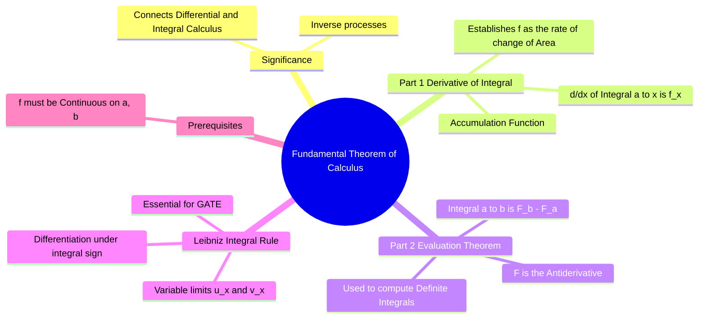

---
tags:
  - mathematics
  - calculus
  - integration
  - gate
  - theorems
aliases:
  - FTC
  - Newton-Leibniz Theorem
  - Leibniz Integral Rule
subject: "[[Mathematics]]"
parent: Integral Calculus
formula:
  - "Leibniz Integral Rule (Differentiation under Integral Sign) : $$\\frac{dI}{dx} = f(v(x)) \\cdot v'(x) - f(u(x)) \\cdot u'(x)$$"
created: 2026-07-13
---
### Fundamental Theorem of Calculus (FTC)
#calculus/theorems #integration

> The **Fundamental Theorem of Calculus** is the central theorem that unifies the two branches of calculus: Differential Calculus (rates of change) and Integral Calculus (accumulation/area). It establishes that differentiation and integration are effectively **inverse operations**.

---
#### FTC Part 1: Differentiation of an Integral
#ftc/part-1 #inverse-process

This part states that if you integrate a function and then differentiate the result, you get the original function back. It defines the "Accumulation Function".

> [!definition] Statement
> If $f(t)$ is continuous on $[a, b]$ and $F(x)$ is defined by the integral with a variable upper limit:
> $$F(x) = \int_{a}^{x} f(t) dt$$
> Then $F(x)$ is differentiable on $(a, b)$, and its derivative is $f(x)$.
> $$\boxed{\quad \frac{d}{dx} \left[ \int_{a}^{x} f(t) dt \right] = f(x) \quad}$$
^ftc-1

* **Geometric Interpretation:** The rate at which the area under the curve $y=f(t)$ accumulates as $x$ moves to the right is equal to the height of the curve $f(x)$ at that point.

---

#### Leibniz Integral Rule (Differentiation under Integral Sign)
#calculus/leibniz-rule #gate/high-yield

In GATE, problems often involve differentiating an integral where **both limits** are functions of $x$. This is a generalization of [[#FTC Part 1: Differentiation of an Integral|FTC Part 1]] using the Chain Rule.

> [!Formula]
> If $I(x) = \int_{u(x)}^{v(x)} f(t) dt$, then: $$\boxed{\quad \frac{dI}{dx} = f(v(x)) \cdot v'(x) - f(u(x)) \cdot u'(x) \quad}$$
> 
> **Where:**
> * $v(x)$ is the Upper Limit.
> * $u(x)$ is the Lower Limit.
> * $f(t)$ is the integrand.

> [!Example]
> Find $\frac{d}{dx} \int_{x}^{x^2} \sin(t) dt$.
> * Upper limit $v(x) = x^2 \Rightarrow v'(x) = 2x$.
> * Lower limit $u(x) = x \Rightarrow u'(x) = 1$.
> * Result: $\sin(x^2) \cdot (2x) - \sin(x) \cdot (1)$.

---

#### FTC Part 2: The Evaluation Theorem
#ftc/part-2 #definite-integral

> [!refer]
> [[Evaluation of Definite Integrals]] in details

This part provides the practical method for evaluating definite integrals using antiderivatives, rather than calculating Riemann sums.

> [!definition] Statement
> If $f(x)$ is continuous on the interval $[a, b]$ and $F(x)$ is any antiderivative of $f(x)$ (i.e., $F'(x) = f(x)$), then: $$\boxed{\quad \int_a^b f(x) \, dx = [F(x)]_a^b = F(b) - F(a) \quad}$$
^ftc-2

* **Significance:** This theorem transforms the difficult problem of finding limits of sums (areas) into the easier problem of finding an antiderivative.

---

#### Relationship between Part 1 and Part 2
#calculus/connection

*   **Part 1** says that the derivative of the accumulation function is the original function:
    $$\frac{d}{dx} \int_a^x f(t) dt = f(x)$$
*   **Part 2** says that the integral of the derivative is the net change in the function:
    $$\int_a^b F'(x) dx = F(b) - F(a)$$

This confirms that differentiation undoes integration (Part 1), and integration undoes differentiation (Part 2, up to a constant).

---
### Related Concepts
#topic/related-concepts

> [[Integral Calculus]]

[[Differential Calculus]]
[[Definite and Improper Integrals|Definite Integral]]
[[Indefinite Integrals]]
[[Mean Value Theorems]]
[[Definite and Improper Integrals|Improper Integral]] (Where FTC needs careful application of limits)
