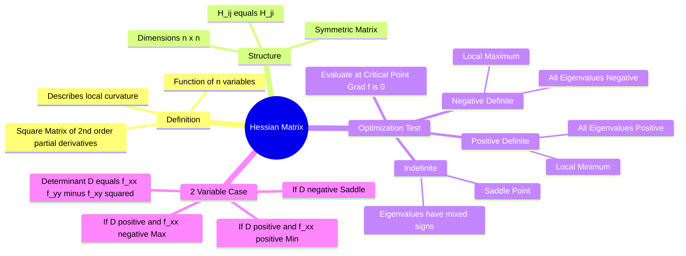

---
tags:
  - mathematics
  - calculus
  - optimization
  - linear-algebra
  - gate
  - multivariable-calculus
created: 2026-07-13
aliases:
  - Hessian
  - Second Derivative Matrix
  - Curvature Matrix
subject: "[[Mathematics]]"
parent:
  - Differential Calculus
---
### Hessian Matrix
#calculus/multivariable #optimization #linear-algebra

> The **Hessian Matrix** is a square matrix of second-order partial derivatives of a scalar-valued function. It describes the **local curvature** of a function of many variables. In optimization, it plays the same role as the second derivative ($f''(x)$) does in single-variable calculus, determining whether a critical point is a maximum, minimum, or saddle point.

---
#### Definition
#hessian/definition

Let $f(x_1, x_2, \dots, x_n)$ be a function $f: \mathbb{R}^n \to \mathbb{R}$ with continuous second-order partial derivatives. The Hessian Matrix $H$ (or $\nabla^2 f$) is the $n \times n$ matrix defined as:

$$\boxed{\quad H(f) = \begin{bmatrix} \frac{\partial^2 f}{\partial x_1^2} & \frac{\partial^2 f}{\partial x_1 \partial x_2} & \cdots & \frac{\partial^2 f}{\partial x_1 \partial x_n} \\ \frac{\partial^2 f}{\partial x_2 \partial x_1} & \frac{\partial^2 f}{\partial x_2^2} & \cdots & \frac{\partial^2 f}{\partial x_2 \partial x_n} \\ \vdots & \vdots & \ddots & \vdots \\ \frac{\partial^2 f}{\partial x_n \partial x_1} & \frac{\partial^2 f}{\partial x_n \partial x_2} & \cdots & \frac{\partial^2 f}{\partial x_n^2} \end{bmatrix} \quad}$$

Element-wise: $H_{ij} = \frac{\partial^2 f}{\partial x_i \partial x_j}$.

**Symmetry:**
By Schwarz's Theorem (assuming continuity), the order of differentiation does not matter ($\frac{\partial^2 f}{\partial x_i \partial x_j} = \frac{\partial^2 f}{\partial x_j \partial x_i}$). Therefore, the Hessian is always a **Symmetric Matrix**.
*   **Implication:** Its eigenvalues are always real.

---
#### The Second Derivative Test (n-variables)
#optimization/second-derivative-test

To classify a stationary point $x_0$ (where the Gradient $\nabla f(x_0) = 0$):
Evaluate the Hessian Matrix $H$ at $x_0$ and check its **Definiteness** (usually via **Eigenvalues** $\lambda$).

| Condition of Matrix $H$ | Eigenvalues | Nature of Critical Point | Curvature |
| :--- | :--- | :--- | :--- |
| **Positive Definite** | All $\lambda_i > 0$ | **Local Minimum** | Concave Up (Bowl) |
| **Negative Definite** | All $\lambda_i < 0$ | **Local Maximum** | Concave Down (Hill) |
| **Indefinite** | Some $\lambda > 0$, some $\lambda < 0$ | **Saddle Point** | Min in one direction, Max in another |
| **Semi-Definite** (Pos/Neg) | $\lambda_i \ge 0$ or $\lambda_i \le 0$ (some are 0) | **Inconclusive** | Could be min, max, or saddle |

---
#### The 2-Variable Case ($f(x, y)$)
#hessian/2d

For a function of two variables, the Hessian is $2 \times 2$:
$$H = \begin{bmatrix} f_{xx} & f_{xy} \\ f_{yx} & f_{yy} \end{bmatrix}$$
Let $D = \det(H) = f_{xx}f_{yy} - (f_{xy})^2$.
(This matches the notation $D = rt - s^2$ often used in calculus).

**Classification Rules:**
1.  **Saddle Point:** If $D < 0$ (Determinant is negative $\implies$ Eigenvalues have opposite signs).
2.  **Extremum:** If $D > 0$:
    *   **Local Minimum:** If $f_{xx} > 0$ (Trace is positive + Determinant is positive $\implies$ Both eigenvalues positive).
    *   **Local Maximum:** If $f_{xx} < 0$ (Trace is negative + Determinant is positive $\implies$ Both eigenvalues negative).
3.  **Inconclusive:** If $D = 0$.

---
#### Relation to Convexity
#calculus/convexity

The Hessian characterizes the global shape of the function over a domain (not just at critical points):
*   If $H(x)$ is **Positive Semi-Definite** for all $x$ in a domain, the function $f$ is **Convex** on that domain.
*   If $H(x)$ is **Negative Semi-Definite** for all $x$, the function $f$ is **Concave**.

---
#### Taylor Series Expansion

The Hessian appears in the quadratic term of the multi-variable Taylor series expansion around point $a$:
$$f(x) \approx f(a) + \nabla f(a)^T (x-a) + \frac{1}{2} (x-a)^T H(a) (x-a)$$
This clearly shows that if the gradient is zero, the local behavior is dominated by the quadratic form associated with the Hessian.

---
### Related Concepts
#topic/related-concepts

> [[Maxima and Minima (Single Variable)]] (Application of Hessian)

[[Partial Derivatives|Partial Differentiation]]
[[Normal Vector]] (Gradient $\nabla f$)
[[Eigenvalues and Eigenvectors|Eigenvalues and Eigenvectors]] (Used to check definiteness)
[[Quadratic Forms]] (The algebraic structure represented by the Hessian)
[[Taylor Series]]
