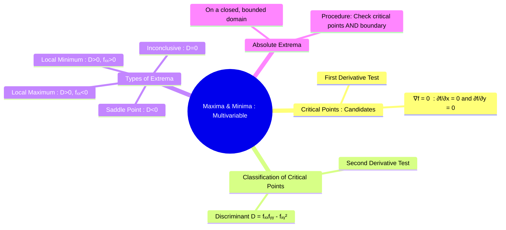

---
tags:
  - calculus
  - multivariable-calculus
  - optimization
  - maxima-minima
  - engineering-math
created: 2025-09-09
aliases:
  - Maxima and Minima
  - Multivariable Optimization
  - Extrema of Multivariable Functions
  - Discriminant (or the determinant of the Hessian matrix)
  - Critical Points (First Derivative Test)
subject: "[[Mathematics]]"
parent:
  - Functions of Two or More Variables
confidence: 9
---
###### Mind Map

---
### Maxima and Minima of Multivariable Functions
#multivariable-calculus #optimization #extrema

> Finding the maxima and minima of multivariable functions is the process of locating the local "peaks" (maxima) and "valleys" (minima) on a surface defined by $z=f(x,y)$. The process involves two main steps: first, identifying all potential candidates, called **critical points**, using first-order partial derivatives, and second, classifying these points using the **second derivative test**.

#### Critical Points (First Derivative Test)
#critical-points #gradient

A point $(a,b)$ in the domain of $f$ is a **critical point** if it satisfies one of the following conditions:
1.  Both first-order partial derivatives are zero: $\frac{\partial f}{\partial x}(a,b) = 0$ and $\frac{\partial f}{\partial y}(a,b) = 0$. This can be written concisely using the [[Gradient]]:
    $$\boxed{\quad \nabla f(a,b) = \mathbf{0} \quad}$$
2.  At least one of the partial derivatives does not exist at $(a,b)$.

Local maxima and minima can only occur at critical points. These points are the candidates that must be tested further.

---
#### The Second Derivative Test
#second-derivative-test #hessian-matrix

To classify a critical point $(a,b)$, we use the second-order partial derivatives. We first compute the **Discriminant** (or the determinant of the Hessian matrix), $D$, at the critical point.
Let:
$$ D(x,y) = f_{xx}(x,y) f_{yy}(x,y) - [f_{xy}(x,y)]^2 $$

$$
\boxed{\quad
D(x,y)
=
\frac{\partial^2 f}{\partial x^2}(x,y)\,
\frac{\partial^2 f}{\partial y^2}(x,y)
-
\left(
\frac{\partial^2 f}{\partial x\,\partial y}(x,y)
\right)^2
\quad }$$

Then, we evaluate $D(a,b)$ and $f_{xx}(a,b)$ to classify the point:
$$\boxed{\begin{align}
1. \quad &\text{If } D(a,b) > 0 \text{ and } f_{xx}(a,b) > 0, \text{ then } f \text{ has a}\textbf{ local minimum }\text{at } (a,b). \\
2. \quad &\text{If } D(a,b) > 0 \text{ and } f_{xx}(a,b) < 0, \text{ then } f \text{ has a}\textbf{ local maximum }\text{at } (a,b). \\
3. \quad &\text{If } D(a,b) < 0, \text{ then } f \text{ has a}\textbf{ saddle point }\text{at } (a,b). \\
4. \quad &\text{If } D(a,b) = 0, \text{ the test is } \textbf{inconclusive}.
\end{align}}$$ 
(Note: If $D>0$, $f_{xx}$ and $f_{yy}$ will have the same sign, so you can use either one in the test.)

---
#### Saddle Point
#saddle-point

A **[[Saddle Points|saddle point]]** is a critical point that is not a local extremum. Geometrically, it resembles a horse's saddle. The surface curves upwards in one direction and downwards in another direction from the critical point. This corresponds to the case where $D < 0$.

---
#### Absolute Maxima and Minima on a Closed Domain
#absolute-extrema #constrained-optimization

To find the absolute (global) maximum and minimum values of a continuous function $f$ on a closed, bounded set $R$:
1.  **Find Interior Critical Points**: Find the values of $f$ at all critical points inside the region $R$.
2.  **Find Boundary Extrema**: Find the maximum and minimum values of $f$ on the boundary of $R$. This often involves parameterizing the boundary and reducing the problem to a single-variable calculus optimization problem.
3.  **Compare Values**: The largest value from steps 1 and 2 is the absolute maximum, and the smallest value is the absolute minimum.

---
### Related Concepts
#related-concepts

> [[Partial Derivatives]]

[[Gradient]]
[[Symmetric Matrices]] (The Hessian matrix is symmetric)
[[Lagrange Multipliers]] (A method for constrained optimization)
[[Maxima and Minima]] (the single-variable case)