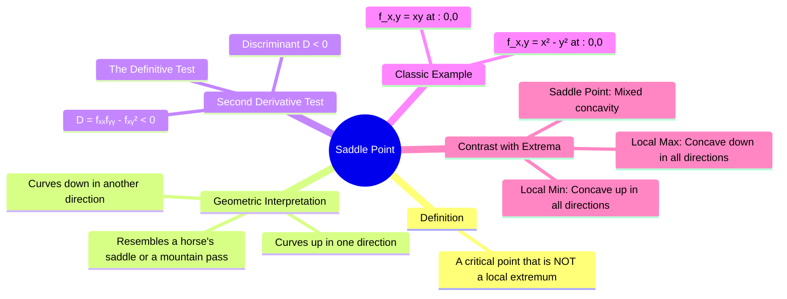

---
tags:
  - calculus
  - multivariable-calculus
  - optimization
  - critical-points
  - engineering-math
created: 2025-09-09
aliases:
  - Saddle Point
  - "Example : Hyperbolic Paraboloid"
  - "Example : Twisted Saddle"
  - "Example : Saddle"
subject: "[[Mathematics]]"
parent:
  - "[[Maxima and Minima of Multivariable Functions]]"
confidence: 9
---
###### Mind Map

---
### Saddle Points
#saddle-point #critical-points #multivariable-calculus

> A **saddle point** is a type of [[Maxima and Minima of Multivariable Functions#Critical Points (First Derivative Test)|critical point]] of a multivariable function that is neither a local maximum nor a local minimum. It represents a point where the function's slope is zero, but the function increases in some directions and decreases in others.

#### Geometric Interpretation
#geometric-interpretation

The name "saddle point" comes from its shape, which resembles the surface of a horse's saddle or a mountain pass. At the critical point:
*   Along one path, the function curves upwards, as if the point were a local minimum.
*   Along another path (often perpendicular), the function curves downwards, as if the point were a local maximum.

A key feature is this **mixed concavity**. Moving away from a saddle point, you can go both "uphill" and "downhill" simultaneously, depending on the direction you choose.

---
#### Identifying a Saddle Point: The Second Derivative Test
#second-derivative-test

The definitive way to classify a critical point $(a,b)$ as a saddle point is by using the [[Maxima and Minima of Multivariable Functions#The Second Derivative Test|second derivative test]].

A critical point $(a,b)$ where $\nabla f(a,b) = \mathbf{0}$ is a **saddle point** if the discriminant $D$ is negative at that point.
$$\boxed{\quad D(a,b) = f_{xx}(a,b)f_{yy}(a,b) - [f_{xy}(a,b)]^2 < 0 \quad}$$
If $D<0$, the signs of the second partial derivatives $f_{xx}$ and $f_{yy}$ are opposite (assuming $f_{xy}$ is not too large), which mathematically confirms the mixed concavity.

---
#### Classic Examples
#saddle-point/examples

1.  **Hyperbolic Paraboloid**: $f(x,y) = x^2 - y^2$
    *   **Critical Point**: $\nabla f = \langle 2x, -2y \rangle = \langle 0,0 \rangle \implies (0,0)$.
    *   **Second Derivatives**: $f_{xx}=2$, $f_{yy}=-2$, $f_{xy}=0$.
    *   **Discriminant**: $D = (2)(-2) - (0)^2 = -4$.
    *   Since $D<0$, the point $(0,0)$ is a saddle point. Along the x-axis ($y=0$), the function is $f(x,0)=x^2$ (a minimum). Along the y-axis ($x=0$), the function is $f(0,y)=-y^2$ (a maximum).

2.  **Twisted Saddle**: $f(x,y) = xy$
    *   **Critical Point**: $\nabla f = \langle y, x \rangle = \langle 0,0 \rangle \implies (0,0)$.
    *   **Second Derivatives**: $f_{xx}=0$, $f_{yy}=0$, $f_{xy}=1$.
    *   **Discriminant**: $D = (0)(0) - (1)^2 = -1$.
    *   Since $D<0$, the point $(0,0)$ is a saddle point.

---
### Related Concepts
#related-concepts

> [[Maxima and Minima of Multivariable Functions]]

[[Partial Derivatives]]
[[Gradient]]
[[Eigenvalues and Eigenvectors|Eigenvalues and Eigenvectors]] (The signs of the eigenvalues of the [[Hessian Matrix]] determine the type of critical point; a saddle point corresponds to having both positive and negative eigenvalues).