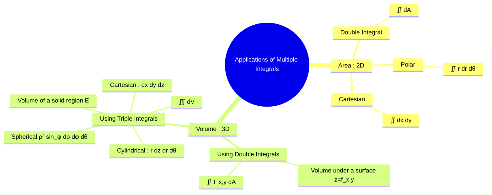

---
tags:
  - calculus
  - multiple-integrals
  - applications
  - area
  - volume
  - engineering-math
created: 2025-09-09
aliases:
  - Area by Double Integration
  - Volume by Multiple Integrals
  - "Multiple Integrals : Applications"
subject: "[[Mathematics]]"
parent:
  - Calculus
confidence: 9
---
###### Mind Map

---
### Applications of Multiple Integrals (Area, Volume)
#multiple-integrals/applications #area #volume

> The most direct geometric applications of multiple integrals are the calculation of the **area** of a two-dimensional region and the **volume** of a three-dimensional solid. Choosing the correct type of integral (double or triple) and the most suitable coordinate system is the key to solving these problems efficiently.

---
#### Area Calculation using Double Integrals
#area-calculation #double-integrals

The area of a closed, bounded region $R$ in the xy-plane is found by integrating the function $f(x,y)=1$ over that region. The differential area element $dA$ is chosen based on the geometry of the region.

$$\boxed{\quad \text{Area}(R) = \iint_R 1 \,dA \quad}$$

1.  **Cartesian Coordinates**: Used for regions bounded by functions of $x$ and $y$.
    *   For a region bounded by $a \le x \le b$ and $g_1(x) \le y \le g_2(x)$:
        $$ \text{Area}(R) = \int_a^b \int_{g_1(x)}^{g_2(x)} dy \, dx $$

2.  **Polar Coordinates**: Ideal for regions with circular symmetry (circles, sectors, annuli). Remember to include the Jacobian factor $r$.
    *   For a region bounded by $\alpha \le \theta \le \beta$ and $r_1(\theta) \le r \le r_2(\theta)$:
        $$\boxed{\quad \text{Area}(R) = \int_\alpha^\beta \int_{r_1(\theta)}^{r_2(\theta)} r \, dr \, d\theta \quad}$$

---
#### Volume Calculation
#volume-calculation

Volume can be calculated in two primary ways: using a double integral to find the volume under a surface, or using a triple integral to find the volume of a solid region.

##### 1. Volume using a Double Integral
This method calculates the volume of the solid that lies under a surface $z=f(x,y)$ and above a region $R$ in the xy-plane.
$$\boxed{\quad \text{Volume} = \iint_R f(x,y) \,dA \quad}$$
*   This can be thought of as summing up the volumes of infinitesimally small prisms of height $f(x,y)$ and base area $dA$.
*   To find the volume between two surfaces, $z_{top} = f(x,y)$ and $z_{bottom} = g(x,y)$, the integral becomes:
    $$ \text{Volume} = \iint_R [f(x,y) - g(x,y)] \,dA $$

##### 2. Volume using a Triple Integral
This is the most general method. The volume of a three-dimensional solid region $E$ is found by integrating the function $f(x,y,z)=1$ over that region. The choice of coordinate system for the volume element $dV$ is critical.
$$\boxed{\quad \text{Volume}(E) = \iiint_E 1 \,dV \quad}$$

*   **Cartesian Coordinates ($dV = dx\,dy\,dz$)**: Best for rectangular boxes and solids with simple planar boundaries.
*   **Cylindrical Coordinates ($dV = r\,dz\,dr\,d\theta$)**: Best for solids with an axis of symmetry, such as cylinders, cones, and paraboloids.
*   **Spherical Coordinates ($dV = \rho^2 \sin\phi \,d\rho\,d\phi\,d\theta$)**: Best for spheres, parts of spheres, and cones centered at the origin.

---
### Related Concepts
#related-concepts

> [[Double Integrals]]

[[Triple Integrals]]
[[Definite and Improper Integrals]]
[[Surface Integrals]]
[[Applications of Multiple Integrals (Mass, Center of Mass)]]
[[Coordinate Systems]]
