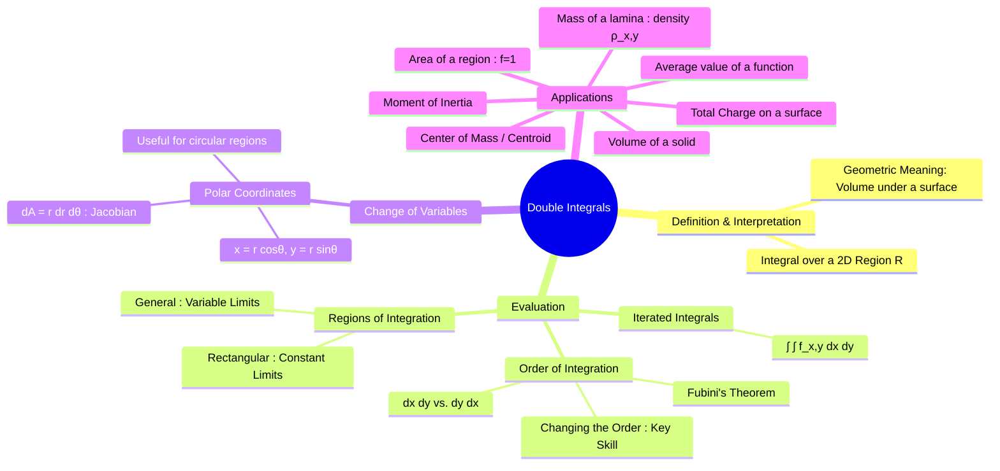

---
tags:
  - calculus
  - multiple-integrals
  - vector-calculus
  - engineering-math
created: 2025-09-09
aliases:
  - Double Integration
  - Area and Volume Integrals
  - Fubinis Theorem
  - Area Integration
subject: "[[Mathematics]]"
parent:
  - Calculus
confidence: 9
---
###### Mind Map

---
### Double Integrals
#multiple-integrals #calculus #volume-calculation

> A double integral is a generalization of a definite integral to functions of two variables, $f(x,y)$. It is used to integrate over a two-dimensional region in the xy-plane. Geometrically, if $f(x,y) \ge 0$, the double integral represents the volume of the solid region between the surface $z=f(x,y)$ and the xy-plane over the region $R$.

The double integral of a function $f(x,y)$ over a region $R$ is denoted as:
$$ \iint_R f(x,y) \,dA $$
where $dA$ is the differential area element, which can be $dx\,dy$ or $dy\,dx$.

---
#### Evaluation using Iterated Integrals
#iterated-integrals #fubinis-theorem

Double integrals are evaluated as **iterated integrals**. This means we integrate with respect to one variable at a time, treating the other variable as a constant. The order of integration depends on the description of the region $R$.

1.  **Rectangular Region**: If $R$ is a rectangle defined by $a \le x \le b$ and $c \le y \le d$, the integral is:
    $$ \int_c^d \left[ \int_a^b f(x,y) \,dx \right] \,dy \quad \text{or} \quad \int_a^b \left[ \int_c^d f(x,y) \,dy \right] \,dx $$
2.  **General Regions**:
    *   **Type I Region (Vertical Slices)**: Bounded by $x=a$, $x=b$, $y=g_1(x)$, and $y=g_2(x)$.
        $$ \iint_R f(x,y) \,dA = \int_a^b \int_{g_1(x)}^{g_2(x)} f(x,y) \,dy \,dx $$
    *   **Type II Region (Horizontal Slices)**: Bounded by $y=c$, $y=d$, $x=h_1(y)$, and $x=h_2(y)$.
        $$ \iint_R f(x,y) \,dA = \int_c^d \int_{h_1(y)}^{h_2(y)} f(x,y) \,dx \,dy $$

#### Changing the Order of Integration
#integration-order

A common and important problem is to change the order of integration. This often simplifies the integral.
**Procedure:**
1.  **Sketch the Region**: From the given limits of integration, determine and sketch the region $R$.
2.  **Re-describe the Region**: Describe the region using the opposite slicing method (e.g., from vertical to horizontal).
3.  **Write New Limits**: Formulate the new integral with the new limits.

For example, changing from Type I to Type II:
$$\boxed{\quad \int_a^b \int_{g_1(x)}^{g_2(x)} f(x,y) \,dy \,dx \quad \iff \quad \int_c^d \int_{h_1(y)}^{h_2(y)} f(x,y) \,dx \,dy \quad}$$

---
#### Double Integrals in Polar Coordinates
#polar-coordinates #change-of-variables

For regions with circular symmetry (circles, annuli, sectors), it's often easier to convert to polar coordinates.
**Transformation:**
*   $x = r \cos\theta$
*   $y = r \sin\theta$
*   $x^2 + y^2 = r^2$

The differential area element $dA$ in polar coordinates is given by the Jacobian of the transformation:
$$\boxed{\quad dA = dx\,dy = r\,dr\,d\theta \quad}$$
The integral becomes:
$$ \iint_R f(x,y) \,dx\,dy = \iint_S f(r\cos\theta, r\sin\theta) \, r\,dr\,d\theta $$
where $S$ is the region $R$ described in polar coordinates, typically $\alpha \le \theta \le \beta$ and $r_1(\theta) \le r \le r_2(\theta)$.

---
#### Applications of Double Integrals
#double-integral/applications

1.  **Area**: The area of a region $R$ is found by integrating the function $f(x,y)=1$.
    $$\boxed{\quad \text{Area}(R) = \iint_R 1 \,dA \quad}$$
2.  **Volume**: The volume of the solid under the surface $z=f(x,y)$ over region $R$ is $\iint_R f(x,y) \,dA$.
3.  **Mass of a Lamina**: For a thin plate (lamina) over region $R$ with variable surface density $\rho(x,y)$.
    $$\boxed{\quad M = \iint_R \rho(x,y) \,dA \quad}$$
4.  **Center of Mass $(\bar{x}, \bar{y})$**:
    $$\boxed{\quad \bar{x} = \frac{1}{M} \iint_R x \rho(x,y) \,dA \quad \text{and} \quad \bar{y} = \frac{1}{M} \iint_R y \rho(x,y) \,dA \quad}$$
    If density is constant ($\rho(x,y)=k$), the center of mass is called the **centroid**.
5.  **Moment of Inertia**:
    *   About x-axis: $I_x = \iint_R y^2 \rho(x,y) \,dA$
    *   About y-axis: $I_y = \iint_R x^2 \rho(x,y) \,dA$
6.  **Total Charge**: For a surface with charge density $\sigma(x,y)$:
    $$ Q = \iint_R \sigma(x,y) \,dA $$

---
### Related Concepts
#related-concepts

> [[Triple Integrals]] (Extension to three variables and 3D volumes)

[[Line Integrals]] (Integration along a curve)
[[Surface Integrals]] (Integration over a surface in 3D space)
[[Green's Theorem]] (Relates a line integral around a simple closed curve to a double integral over the plane region it encloses)
[[Partial Derivatives|Partial Derivative]] (Fundamental to the evaluation process)
[[Electromagnetic Fields]] (Used to calculate charge, flux, and other physical quantities)
