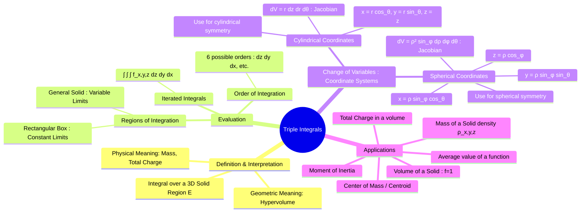

---
tags:
  - calculus
  - multiple-integrals
  - vector-calculus
  - engineering-math
  - volume-integrals
created: 2025-09-09
aliases:
  - Triple Integration
  - Volume Integrals
subject: "[[Mathematics]]"
parent:
  - Calculus
confidence: 9
---
###### Mind Map

---
### Triple Integrals
#multiple-integrals #calculus #volume-calculation

> A triple integral is the extension of a [[Definite and Improper Integrals|definite integral]] to functions of three variables, $f(x,y,z)$. It is used to integrate a function over a three-dimensional solid region $E$. While its geometric interpretation is a 4D "hypervolume," its primary physical applications involve calculating quantities like mass, charge, or the center of mass of a solid object with varying density.

The triple integral of a function $f(x,y,z)$ over a solid region $E$ is denoted as:
$$ \iiint_E f(x,y,z) \,dV $$
where $dV$ is the differential volume element, which can be $dx\,dy\,dz$ in any of the 6 possible permutations.

---
#### Evaluation using Iterated Integrals
#iterated-integrals

Triple integrals are evaluated as iterated integrals, integrating with respect to one variable at a time. The limits of the innermost integral typically depend on the two outer variables, the middle integral's limits can depend on the outermost variable, and the outermost integral has constant limits.

For a general solid region $E$, a common order of integration is:
$$ \iiint_E f(x,y,z) \,dV = \int_a^b \int_{g_1(x)}^{g_2(x)} \int_{u_1(x,y)}^{u_2(x,y)} f(x,y,z) \,dz \,dy \,dx $$
The key to setting up the integral is correctly describing the bounds of the solid region $E$.

---
#### Triple Integrals in Other Coordinate Systems
#cylindrical-coordinates #spherical-coordinates #change-of-variables

For solids with rotational symmetry, converting to cylindrical or spherical coordinates greatly simplifies the integration.

1.  **Cylindrical Coordinates**: Ideal for problems involving cylinders, cones, and paraboloids.
    *   **Transformation**: $x = r \cos\theta$, $y = r \sin\theta$, $z = z$
    *   **Volume Element**: The volume element includes the Jacobian factor $r$.
        $$\boxed{\quad dV = r \,dz \,dr \,d\theta \quad}$$
    *   **Integral Form**:
        $$ \iiint_E f(x,y,z) \,dV = \iiint_S f(r\cos\theta, r\sin\theta, z) \,r \,dz \,dr \,d\theta $$

2.  **Spherical Coordinates**: Ideal for problems involving spheres or cones centered at the origin.
    *   **Transformation**: $x = \rho \sin\phi \cos\theta$, $y = \rho \sin\phi \sin\theta$, $z = \rho \cos\phi$
        *   $\rho$: distance from the origin (radius)
        *   $\phi$: angle from the positive z-axis ($0 \le \phi \le \pi$)
        *   $\theta$: angle in the xy-plane from the positive x-axis ($0 \le \theta \le 2\pi$)
    *   **Volume Element**: The volume element includes the Jacobian factor $\rho^2 \sin\phi$.
        $$\boxed{\quad dV = \rho^2 \sin\phi \,d\rho \,d\phi \,d\theta \quad}$$
    *   **Integral Form**: The integral is transformed accordingly, using the function and region expressed in spherical coordinates.

---
#### Applications of Triple Integrals
#triple-integral/applications

1.  **Volume**: The volume of a solid region $E$ is found by integrating the function $f(x,y,z)=1$.
    $$\boxed{\quad \text{Volume}(E) = \iiint_E 1 \,dV \quad}$$
2.  **Mass of a Solid**: For a solid with variable density $\rho(x,y,z)$.
    $$\boxed{\quad M = \iiint_E \rho(x,y,z) \,dV \quad}$$
3.  **Center of Mass $(\bar{x}, \bar{y}, \bar{z})$**: This is the mass-weighted average position.
    $$\boxed{\quad \bar{x} = \frac{1}{M} \iiint_E x \rho(x,y,z) \,dV \quad}$$
    (Formulas for $\bar{y}$ and $\bar{z}$ are analogous, replacing $x$ with $y$ and $z$ respectively). If density is constant, this point is called the **centroid**.
4.  **Moment of Inertia**: Measures the solid's resistance to rotational motion about an axis. For example, the moment of inertia about the z-axis is:
    $$\boxed{\quad I_z = \iiint_E (x^2+y^2)\rho(x,y,z) \,dV = \iiint_E r^2\rho(x,y,z) \,dV \quad}$$
5.  **Total Charge**: For a solid with volume charge density $\rho_v(x,y,z)$:
    $$ Q = \iiint_E \rho_v(x,y,z) \,dV $$

---
### Related Concepts
#related-concepts

> [[Double Integrals]] (The foundation in two dimensions)

[[Gauss's Divergence Theorem|Divergence Theorem]] (Relates a triple integral over a solid to a surface integral over its boundary)
[[Line Integrals]]
[[Surface Integrals]]
[[Electromagnetic Fields]] (Used extensively in Gauss's Law to find total charge enclosed)
[[Coordinate Systems]]
