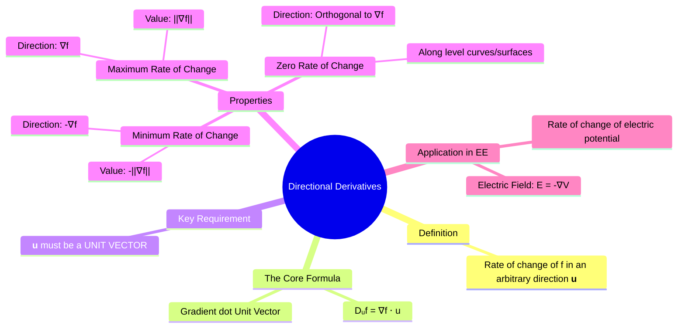

---
tags:
  - calculus
  - multivariable-calculus
  - directional-derivatives
  - gradient
  - vector-calculus
  - engineering-math
created: 2025-09-09
aliases:
  - Directional Derivative
subject: "[[Mathematics]]"
parent: "[[Gradient]]"
formula:
  - "Directional Derivatives : $$D_{\\mathbf{u}}f(P) = \\nabla f(P) \\cdot \\mathbf{u} \\quad \\quad \\left( \\text{where, }\\mathbf{u} = \\frac{\\mathbf{v}}{||\\mathbf{v}||} \\right)$$"
---
### Directional Derivatives
#directional-derivative #rate-of-change #gradient

> The **directional derivative** generalizes the concept of [[partial derivatives]] to measure the rate of change of a multivariable function at a given point in *any* arbitrary direction. While partial derivatives measure the rate of change along the coordinate axes, the directional derivative tells us the slope of the surface in any direction we choose. It is calculated using the [[Gradient]].

###### Mind Map

---

#### Definition and Calculation
#directional-derivative/formula

The directional derivative of a function $f(x,y,z)$ at a point $P(x_0, y_0, z_0)$ in the direction of a **unit vector** $\mathbf{u}$ is given by the dot product of the [[Gradient]] of $f$ at that point and the unit vector $\mathbf{u}$.
$$\boxed{\quad D_{\mathbf{u}}f(P) = \nabla f(P) \cdot \mathbf{u} \quad}$$
where $\nabla f$ is the gradient of $f$.

> [!important] Crucial Point
> The direction vector $\mathbf{u}$ **must be a unit vector**. If a direction is given as a vector $\mathbf{v}$, you must first normalize it: $$\boxed{\quad \mathbf{u} = \frac{\mathbf{v}}{||\mathbf{v}||} \quad}$$

> [!pyq]- PYQ : 2018
> ![[ee_2018#^q12]]

---
#### Properties and Geometric Interpretation
#maximum-rate-of-change #gradient-properties

The formula $D_{\mathbf{u}}f = \nabla f \cdot \mathbf{u}$ can be written as $D_{\mathbf{u}}f = ||\nabla f|| \ ||\mathbf{u}|| \cos\theta = ||\nabla f|| \cos\theta$, where $\theta$ is the angle between the gradient vector and the direction vector. This reveals three fundamental properties:

1.  **Maximum Rate of Change**:
    *   The rate of change is maximized when $\cos\theta = 1$ ($\theta = 0$), meaning the direction of motion is the same as the direction of the gradient.
    *   **Direction of maximum increase**: The gradient vector, $\nabla f$.
    *   **Value of maximum increase**: The magnitude of the gradient, $||\nabla f||$.

2.  **Minimum Rate of Change (Steepest Decrease)**:
    *   The rate of change is minimized (most negative) when $\cos\theta = -1$ ($\theta = \pi$), meaning the direction is opposite to the gradient.
    *   **Direction of maximum decrease**: The opposite of the gradient vector, $-\nabla f$.
    *   **Value of maximum decrease**: The negative magnitude of the gradient, $-||\nabla f||$.

3.  **Zero Rate of Change**:
    *   The rate of change is zero when $\cos\theta = 0$ ($\theta = \pi/2$), meaning the direction is orthogonal to the gradient.
    *   This occurs when moving along a **level curve** (for 2D) or **level surface** (for 3D), where the function's value is constant.

---
#### Application in Electrical Engineering
#directional-derivatives/applications #electromagnetic-fields 

A primary application is in field theory. The electric field $\mathbf{E}$ is related to the electric potential $V$ by the equation $\mathbf{E} = -\nabla V$. This means the electric field vector points in the direction of the **steepest decrease** in potential, and its magnitude is the value of this maximum rate of change.

---
### Related Concepts
#related-concepts

> [[Gradient]] (The key to calculating the directional derivative)

[[Partial Derivatives|Partial Derivative]]
[[Vectors]] (Dot product and normalization are essential)
[[Tangent Planes and Normal Lines]]
[[Electromagnetic Fields]]
