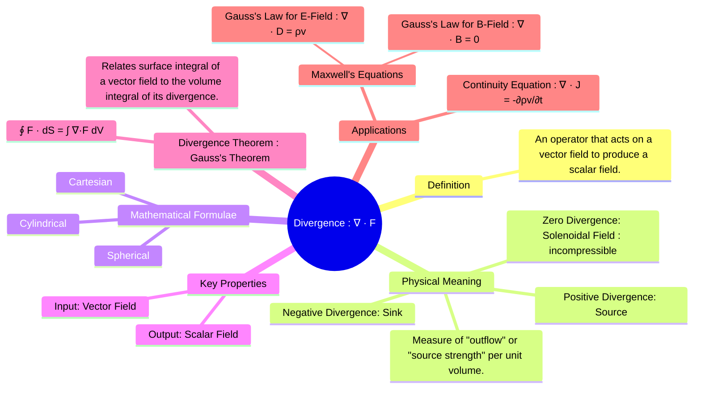

---
tags:
  - vector-calculus
  - electromagnetic-fields
  - mathematics
  - vector-field
  - divergence-theorem
created: 2025-09-08
aliases:
  - Div
  - del dot A
subject: "[[Mathematics]]"
parent:
  - Vector Calculus
confidence: 9
formula:
  - "Solenoidal Field : $$\\nabla \\cdot \\mathbf{F} = 0$$"
---
###### Mind Map

---
### Divergence
#divergence #vector-calculus #vector-field #del-operator

> The divergence is a vector operator that measures the magnitude of a vector field's source or sink at a given point. It operates on a vector field and produces a scalar field. In essence, it quantifies the "outflow" or "flux density" from an infinitesimal volume around a point.

A positive divergence signifies a source, a negative divergence signifies a sink, and zero divergence indicates that the field is **solenoidal** (incompressible).

#### Definition and Formulae
#divergence/definition

The divergence of a vector field $\mathbf{F}$ is defined as the dot product of the del operator ($\nabla$) and the vector field, $\nabla \cdot \mathbf{F}$.

1. **Cartesian Coordinates $(x, y, z)$**: For $\mathbf{F} = F_x \mathbf{\hat{a}_x} + F_y \mathbf{\hat{a}_y} + F_z \mathbf{\hat{a}_z}$
    $$\boxed{\quad \nabla \cdot \mathbf{F} = \frac{\partial F_x}{\partial x} + \frac{\partial F_y}{\partial y} + \frac{\partial F_z}{\partial z} \quad}$$

2. **Cylindrical Coordinates $(\rho, \phi, z)$**: For $\mathbf{F} = F_\rho \mathbf{\hat{a}_\rho} + F_\phi \mathbf{\hat{a}_\phi} + F_z \mathbf{\hat{a}_z}$
    $$\boxed{\quad \nabla \cdot \mathbf{F} = \frac{1}{\rho}\frac{\partial (\rho F_\rho)}{\partial \rho} + \frac{1}{\rho}\frac{\partial F_\phi}{\partial \phi} + \frac{\partial F_z}{\partial z} \quad}$$

3. **Spherical Coordinates $(r, \theta, \phi)$**: For $\mathbf{F} = F_r \mathbf{\hat{a}_r} + F_\theta \mathbf{\hat{a}_\theta} + F_\phi \mathbf{\hat{a}_\phi}$
    $$\boxed{\quad \nabla \cdot \mathbf{F} = \frac{1}{r^2}\frac{\partial (r^2 F_r)}{\partial r} + \frac{1}{r\sin\theta}\frac{\partial (F_\theta \sin\theta)}{\partial \theta} + \frac{1}{r\sin\theta}\frac{\partial F_\phi}{\partial \phi} \quad}$$

---
#### Divergence Theorem (Gauss's Theorem)
#divergence-theorem #gauss-theorem

The Divergence Theorem is a fundamental result in vector calculus that relates the flow (flux) of a vector field through a closed surface to the behavior of the field inside the surface. It states that the total outward flux of a vector field $\mathbf{F}$ through a closed surface $S$ is equal to the volume integral of the divergence of $\mathbf{F}$ over the volume $V$ enclosed by the surface.
$$\boxed{\quad \oint_S \mathbf{F} \cdot d\mathbf{S} = \int_V (\nabla \cdot \mathbf{F}) dV \quad}$$
This theorem provides the link between the integral and differential forms of Maxwell's equations.

---
#### Applications in Electromagnetism
#divergence/applications #maxwells-equations

Divergence is a cornerstone of electromagnetic theory.

1. **Gauss's Law for Electric Fields (Maxwell's 1st Equation)**:
    $$\boxed{\quad \nabla \cdot \mathbf{D} = \rho_v \quad}$$
    This equation states that the divergence of the electric flux density $\mathbf{D}$ at any point is equal to the volume charge density $\rho_v$ at that point. In simple terms, electric charges are the sources (positive charge) or sinks (negative charge) of the electric field.

2. **Gauss's Law for Magnetic Fields (Maxwell's 2nd Equation)**:
    $$\boxed{\quad \nabla \cdot \mathbf{B} = 0 \quad}$$
    This equation states that the divergence of the magnetic flux density $\mathbf{B}$ is always zero. This is a mathematical statement of the fact that there are **no magnetic monopoles** (isolated north or south poles). Magnetic field lines are always continuous closed loops, never originating from or terminating at a point. A vector field with zero divergence is called **solenoidal**.

3. **Equation of Continuity**:
    $$\boxed{\quad \nabla \cdot \mathbf{J} = -\frac{\partial \rho_v}{\partial t} \quad}$$
    This equation relates the divergence of the current density $\mathbf{J}$ to the rate of decrease of charge density at a point. It is a statement of the **conservation of charge**.

---
### Related Concepts
#related-concepts

> [[Vector Calculus]]

[[Gradient]] (Del operator on a scalar, producing a vector)
[[Curl]] (Del operator on a vector, producing a vector)
[[Laplacian of a Scalar Field|Laplacian]] (Divergence of the gradient)
[[Electromagnetic Fields]]
[[Maxwell's Equations in Final Form|Maxwell's Equations]]
[[Scalar Fields and Vector Fields]]