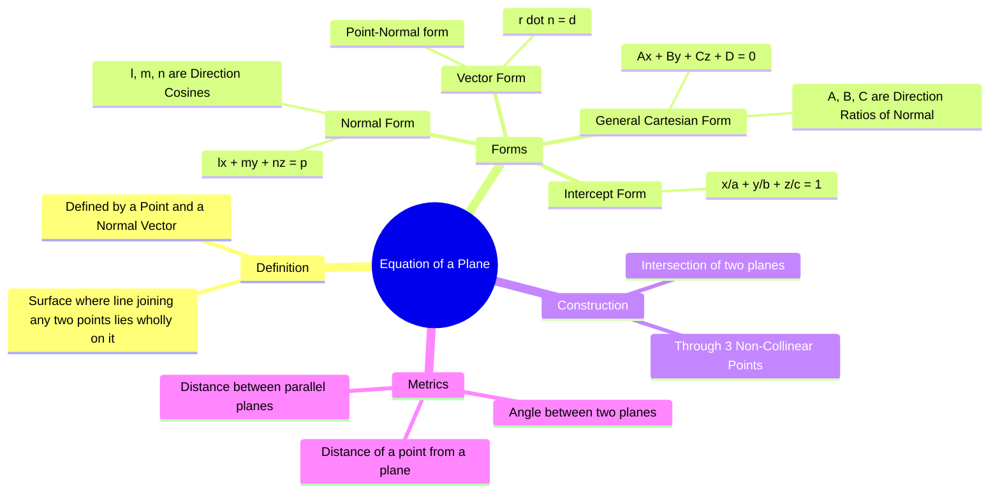

---
tags:
  - mathematics
  - vector-calculus
  - 3d-geometry
  - gate
  - linear-algebra
aliases:
  - Plane Geometry
  - General Equation of a Plane
  - Normal Form of Plane
subject: "[[Mathematics]]"
parent:
  - Vector Calculus
---
### Equation of a Plane
#mathematics/geometry #vector-calculus

> A plane is a flat, two-dimensional surface that extends infinitely far. Uniquely determining a plane requires either **three non-collinear points** or **a point and a normal vector** (a vector perpendicular to the plane).

###### Mind Map

---

#### 1. General Form (Cartesian)
#plane/cartesian

The general equation of a plane in $x, y, z$ coordinates is a linear equation of the first degree:
$$\boxed{\quad Ax + By + Cz + D = 0 \quad}$$
**Key Insight:**
The coefficients $A, B,$ and $C$ are the **Direction Ratios** of the **Normal Vector** ($\vec{n}$) to the plane.
$$\vec{n} = A\hat{i} + B\hat{j} + C\hat{k}$$

> [!warning] Plane in vector form — key geometry
> A plane written as
> $$a^T x = c$$
> has **normal vector**
> $$\vec n = a$$
> Any non-zero scalar multiple of $a$ is also a valid normal.

> [!tip]- Distance & unit normal
> Let
> $$\hat n = \frac{a}{\|a\|}$$
> Then the plane can be written as
> $$\hat n^T x = \frac{c}{\|a\|}$$
> so the **perpendicular distance from origin** to the plane is
> $$p = \frac{|c|}{\|a\|}$$

> [!example]- Example
> Let $w^T x = 1$
> If
> $$w = \begin{bmatrix}1\\2\\3\end{bmatrix}$$
> then the plane
> $$w^T x = 1$$
> has normal vector
> $$\vec n = \begin{bmatrix}1\\2\\3\end{bmatrix}$$
> A point on the plane is
> $$x_0 = \frac{w}{\|w\|^2}$$

> [!important]- Gradient interpretation
> For the scalar field
> $$f(x)=a^T x$$
> the plane $a^T x=c$ is a **level surface**, and
> $$\nabla f = a$$
> Hence, the **gradient is normal to the plane**.

---
#### 2. Vector Form
#plane/vector

Let $\vec{r} = x\hat{i} + y\hat{j} + z\hat{k}$ be the position vector of any point on the plane.

##### A. Point-Normal Form
If a plane passes through a point $A$ with position vector $\vec{a}$ and is perpendicular to a normal vector $\vec{n}$:
$$(\vec{r} - \vec{a}) \cdot \vec{n} = 0$$
$$\boxed{\quad \vec{r} \cdot \vec{n} = \vec{a} \cdot \vec{n} \quad}$$
*Reasoning:* The vector $(\vec{r} - \vec{a})$ lies on the plane. Since $\vec{n}$ is perpendicular to the plane, their dot product is zero.

##### B. Normal Form (Distance from Origin)
$$\boxed{\quad \vec{r} \cdot \hat{n} = p \quad}$$
Where:
*   $\hat{n}$ is the **unit normal vector** to the plane.
*   $p$ is the perpendicular **distance from the origin** to the plane.

---
#### 3. Intercept Form
#plane/intercept

If a plane cuts the coordinate axes at $(a, 0, 0)$, $(0, b, 0)$, and $(0, 0, c)$, the equation is:
$$\boxed{\quad \frac{x}{a} + \frac{y}{b} + \frac{z}{c} = 1 \quad}$$
Where $a, b, c$ are the $x, y, z$ intercepts respectively.

---
#### 4. Plane Passing Through Three Points
#plane/3-points

If a plane passes through three non-collinear points $A(x_1, y_1, z_1)$, $B(x_2, y_2, z_2)$, and $C(x_3, y_3, z_3)$, the equation is found by setting the scalar triple product to zero (coplanarity condition):

$$\boxed{\quad \begin{vmatrix} x - x_1 & y - y_1 & z - z_1 \\ x_2 - x_1 & y_2 - y_1 & z_2 - z_1 \\ x_3 - x_1 & y_3 - y_1 & z_3 - z_1 \end{vmatrix} = 0 \quad}$$

**Vector Method:**
Find two vectors on the plane, $\vec{AB} = \vec{b} - \vec{a}$ and $\vec{AC} = \vec{c} - \vec{a}$.
The normal vector is $\vec{n} = \vec{AB} \times \vec{AC}$.
Then use the Point-Normal form: $(\vec{r} - \vec{a}) \cdot (\vec{AB} \times \vec{AC}) = 0$.

---
#### Angle Between Two Planes
#plane/angle

The angle $\theta$ between two planes is defined as the angle between their normal vectors $\vec{n}_1$ and $\vec{n}_2$.
Given planes $A_1x + B_1y + C_1z + D_1 = 0$ and $A_2x + B_2y + C_2z + D_2 = 0$:

$$\boxed{\quad \cos \theta = \left| \frac{\vec{n}_1 \cdot \vec{n}_2}{|\vec{n}_1| |\vec{n}_2|} \right| = \left| \frac{A_1A_2 + B_1B_2 + C_1C_2}{\sqrt{A_1^2+B_1^2+C_1^2}\sqrt{A_2^2+B_2^2+C_2^2}} \right| \quad}$$

*   **Perpendicular:** If $A_1A_2 + B_1B_2 + C_1C_2 = 0$.
*   **Parallel:** If $\frac{A_1}{A_2} = \frac{B_1}{B_2} = \frac{C_1}{C_2}$.

---
#### Distance Calculations
#plane/distance

##### A. Distance of a Point from a Plane

Perpendicular distance $d$ from point $P(x_1, y_1, z_1)$ to plane $Ax + By + Cz + D = 0$:
$$\boxed{\quad d = \frac{|Ax_1 + By_1 + Cz_1 + D|}{\sqrt{A^2 + B^2 + C^2}} \quad}$$

##### B. Distance Between Parallel Planes

Distance between $Ax + By + Cz + D_1 = 0$ and $Ax + By + Cz + D_2 = 0$:
$$\boxed{\quad d = \frac{|D_1 - D_2|}{\sqrt{A^2 + B^2 + C^2}} \quad}$$
*(Note: Coefficients $A, B, C$ must be identical in both equations before using this formula).*

---
### Related Concepts
#topic/related-concepts

> [[Equation of a Line in 3D]] (Lines are intersections of planes)

[[Vector Calculus - Basics]] (Dot and Cross Products)
[[Direction Cosines and Direction Ratios]]
[[Vector Differential Operators]] (Gradient $\nabla f$ gives the normal vector to a surface)
[[Determinant of a Matrix|Determinant]] (Used for finding equation via 3 points)
