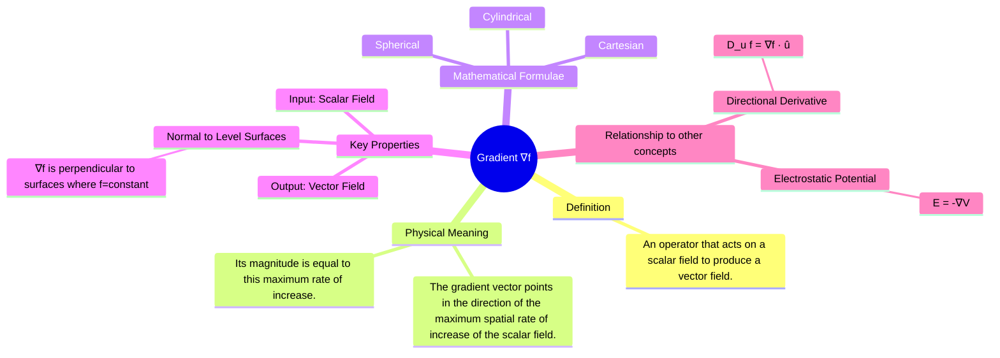

---
tags:
  - vector-calculus
  - electromagnetic-fields
  - mathematics
  - scalar-field
  - vector-field
created: 2025-09-08
aliases:
  - Grad
  - del operator on a scalar
subject: "[[Mathematics]]"
parent:
  - Vector Calculus
---
### Gradient
#gradient #vector-calculus #scalar-field #del-operator 

> ==The gradient is a vector operator that describes the rate of change and direction of a scalar field. When applied to a scalar function $f$, the gradient, denoted as $\nabla f$ (del f), produces a vector field.== This vector at any given point indicates the direction of the steepest ascent of the scalar field, and its magnitude represents the steepness of that ascent.

It is a fundamental tool in physics and engineering, particularly in [[Electromagnetic Fields]] to relate potential fields to force fields.

###### Mind Map

---

#### The Del (∇) Operator
#del-operator #∇-operator 

The Del operator is a vector differential operator, defined as:
$$\nabla = \mathbf{i} \frac{\partial}{\partial x} + \mathbf{j} \frac{\partial}{\partial y} + \mathbf{k} \frac{\partial}{\partial z}$$

---
#### Definition and Formulae
#gradient/definition 

The gradient is defined using the vector differential operator, del ($\nabla$). For a scalar field $f$, the gradient is $\nabla f$. Its formula varies with the coordinate system.

1. **Cartesian Coordinates $(x, y, z)$**:
    $$\boxed{\quad \nabla f = \frac{\partial f}{\partial x}\mathbf{\hat{a}_x} + \frac{\partial f}{\partial y}\mathbf{\hat{a}_y} + \frac{\partial f}{\partial z}\mathbf{\hat{a}_z} \quad}$$

2. **Cylindrical Coordinates $(\rho, \phi, z)$**:
    $$\boxed{\quad \nabla f = \frac{\partial f}{\partial \rho}\mathbf{\hat{a}_\rho} + \frac{1}{\rho}\frac{\partial f}{\partial \phi}\mathbf{\hat{a}_\phi} + \frac{\partial f}{\partial z}\mathbf{\hat{a}_z} \quad}$$

3. **Spherical Coordinates $(r, \theta, \phi)$**:
    $$\boxed{\quad \nabla f = \frac{\partial f}{\partial r}\mathbf{\hat{a}_r} + \frac{1}{r}\frac{\partial f}{\partial \theta}\mathbf{\hat{a}_\theta} + \frac{1}{r\sin\theta}\frac{\partial f}{\partial \phi}\mathbf{\hat{a}_\phi} \quad}$$

---
#### Physical and Geometric Interpretation
#gradient/interpretation 

1. **Direction**: The vector $\nabla f$ at a point $(x_0, y_0, z_0)$ points in the direction in which the scalar field $f$ increases most rapidly.
2. **Magnitude**: The magnitude $|\nabla f|$ is the maximum rate of increase of $f$ per unit distance at that point.
3. **Normal to Level Surfaces**: This is a critical property. The gradient vector $\nabla f$ at any point is always **normal (perpendicular)** to the level surface (or level curve in 2D) that passes through that point. A level surface is a surface where the function value is constant, i.e., $f(x, y, z) = C$. This property is often used to find the normal vector to a surface.

> [!memory]
> A vector field $\mathbf{F}$ is conservative if it is the gradient of some scalar [[potential function]] $f$ (i.e., $\mathbf{F} = \nabla f$).

---
#### Directional Derivative
#directional-derivative 

The directional derivative gives the rate of change of a scalar field $f$ at a point in a specific direction, defined by a unit vector $\mathbf{\hat{u}}$. It is found by taking the dot product of the gradient and the unit vector.
$$\boxed{\quad D_{\mathbf{\hat{u}}}f = \nabla f \cdot \mathbf{\hat{u}} \quad}$$
This can be interpreted as the projection of the gradient vector (the direction of steepest ascent) onto the desired direction $\mathbf{\hat{u}}$.

---
#### Application in Electromagnetism
#gradient/applications #electrostatics 

The most important application of the gradient in electrical engineering is the relationship between the static electric field ($\mathbf{E}$) and the electric scalar potential ($V$). The electric field is the negative gradient of the potential.
$$\boxed{\quad \mathbf{E} = -\nabla V \quad}$$
This relationship implies:
* The electric field vector $\mathbf{E}$ points in the direction of the steepest **decrease** in electric potential (hence the negative sign).
* The magnitude of the electric field $|\mathbf{E}|$ is the maximum rate of change of potential with distance.
* The electric field lines are always perpendicular to the equipotential surfaces ($V = \text{constant}$).

---
### Related Concepts
#related-concepts

> [[Vector Calculus]]

[[Divergence]] (Del operator acting on a vector, producing a scalar)
[[Curl]] (Del operator acting on a vector, producing a vector)
[[Laplacian of a Scalar Field|Laplacian]] (Divergence of the gradient of a scalar)
[[Electromagnetic Fields]]
[[Vector Analysis and Coordinate Systems]]
[[Scalar Fields and Vector Fields]]