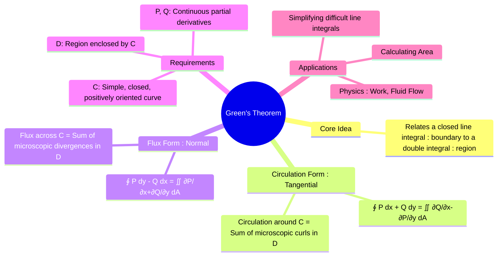

---
tags:
  - vector-calculus
  - calculus
  - line-integrals
  - double-integrals
  - greens-theorem
  - engineering-math
created: 2025-09-09
aliases:
  - Green's Theorem
  - Area Calculation using Green's Theorem
subject: "[[Mathematics]]"
parent:
  - "[[Line Integrals]]"
confidence: 9
---
###### Mind Map

---
### Green's Theorem
#greens-theorem #vector-calculus #line-integrals

> **Green's Theorem** establishes a fundamental relationship between a [[Line Integrals|line integral]] around a simple closed curve $C$ in a plane and a [[Double Integrals|double integral]] over the plane region $D$ bounded by $C$. It is a two-dimensional version of the more general [[Stokes' Theorem|Stokes' Theorem]] and provides a powerful tool for simplifying line integrals and calculating area.

![[Curve C and Area D.png]]

The theorem requires that the curve $C$ is **simple** (does not cross itself), **closed**, and **positively oriented** (traversed counter-clockwise).

---
#### Circulation Form (Tangential Form)
#greens-theorem/circulation

This is the standard and most common form of the theorem. It relates the macroscopic circulation of a vector field along a curve to the sum of the microscopic rotations (curl) within the region.

Let $C$ be a positively oriented, piecewise-smooth, simple closed curve in the plane, and let $D$ be the region bounded by $C$. If $\mathbf{F} = P(x,y)\mathbf{i} + Q(x,y)\mathbf{j}$ is a vector field where $P$ and $Q$ have continuous partial derivatives on an open region containing $D$, then:
$$\boxed{\quad \oint_C P\,dx + Q\,dy = \iint_D \left( \frac{\partial Q}{\partial x} - \frac{\partial P}{\partial y} \right) dA \quad}$$
The term $(\frac{\partial Q}{\partial x} - \frac{\partial P}{\partial y})$ is the k-component of the curl of the 2D vector field $\mathbf{F}$. So, the theorem states:
$$ \oint_C \mathbf{F} \cdot d\mathbf{r} = \iint_D (\nabla \times \mathbf{F}) \cdot \mathbf{k} \, dA $$

---
#### Flux Form (Normal or Divergence Form)
#greens-theorem/flux

This second form of the theorem relates the flux of a vector field across the boundary curve $C$ to the sum of the divergences inside the region $D$. It is a 2D version of the [[Gauss's Divergence Theorem|Divergence Theorem]].
$$\boxed{\quad \oint_C \mathbf{F} \cdot \mathbf{n} \, ds = \oint_C P\,dy - Q\,dx = \iint_D \left( \frac{\partial P}{\partial x} + \frac{\partial Q}{\partial y} \right) dA \quad}$$
Here, $\mathbf{n}$ is the outward unit normal vector to the curve $C$. The term $(\frac{\partial P}{\partial x} + \frac{\partial Q}{\partial y})$ is the divergence of the field $\mathbf{F} = \langle P, Q \rangle$. So, the theorem states:
$$ \oint_C \mathbf{F} \cdot \mathbf{n} \, ds = \iint_D (\nabla \cdot \mathbf{F}) \, dA $$

---
#### Application: Calculating Area
#area-calculation

Green's Theorem provides an elegant method for calculating the area of a region $D$ using only a line integral over its boundary $C$. If we can choose $P$ and $Q$ such that $\frac{\partial Q}{\partial x} - \frac{\partial P}{\partial y} = 1$, then the theorem becomes:
$$ \text{Area}(D) = \iint_D 1 \, dA = \oint_C P\,dx + Q\,dy $$
Common choices for $P$ and $Q$ that achieve this are:
$$\boxed{\begin{align}
\text{Area} &= \oint_C x \, dy \quad (P=0, Q=x) \\
\text{Area} &= -\oint_C y \, dx \quad (P=-y, Q=0) \\
\text{Area} &= \frac{1}{2}\oint_C (x \, dy - y \, dx) \quad (P=-y/2, Q=x/2)
\end{align}}$$

---
### Related Concepts
#related-concepts

> [[Stokes' Theorem]] (The 3D generalization of the circulation form)

[[Gauss's Divergence Theorem|Divergence Theorem]] (The 3D generalization of the flux form)
[[Line Integrals]]
[[Double Integrals]]
[[Gradient, Divergence, and Curl]]