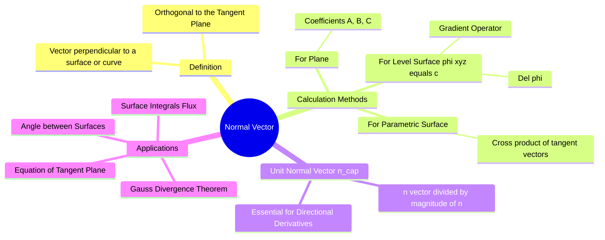

---
tags:
  - mathematics
  - vector-calculus
  - 3d-geometry
  - gate
aliases:
  - Surface Normal
  - Unit Normal Vector
  - Gradient Vector
subject: "[[Mathematics]]"
parent:
  - Vector Calculus
confidence: 10
---
###### Mind Map

---
### Normal Vector
#vector-calculus #geometry #gradient

> A **Normal Vector** ($\vec{n}$) is a vector that is perpendicular (orthogonal) to a curve, a plane, or a surface at a specific point. It is the fundamental tool for defining orientation in 3D space and is crucial for calculating flux, tangent planes, and directional derivatives.

#### 1. Normal to a Plane
#normal-vector/plane

For a flat plane described by the linear equation:
$$Ax + By + Cz + D = 0$$
The normal vector is simply formed by the coefficients of $x, y,$ and $z$. This vector is constant everywhere on the plane.
$$\boxed{\quad \vec{n} = A\hat{i} + B\hat{j} + C\hat{k} \quad}$$

---
#### 2. Normal to a Surface (The Gradient)
#normal-vector/surface #gradient

For a curved surface defined by a scalar function $\phi(x, y, z) = c$ (a level surface), the normal vector at any point $P(x,y,z)$ is given by the **Gradient** of the function at that point.

$$\boxed{\quad \vec{n} = \nabla \phi = \frac{\partial \phi}{\partial x}\hat{i} + \frac{\partial \phi}{\partial y}\hat{j} + \frac{\partial \phi}{\partial z}\hat{k} \quad}$$

*   **Geometric Property:** The gradient vector $\nabla \phi$ is always perpendicular to the level surface $\phi(x, y, z) = constant$.
*   *Note:* If the surface is given as $z = f(x, y)$, rewrite it as $\phi(x, y, z) = z - f(x, y) = 0$ before calculating the gradient.

---
#### 3. Unit Normal Vector ($\hat{n}$)
#normal-vector/unit-normal

Many applications (like Flux calculation or Directional Derivatives) require the normal vector to have a magnitude of 1.
$$\boxed{\quad \hat{n} = \frac{\vec{n}}{|\vec{n}|} = \frac{\nabla \phi}{|\nabla \phi|} \quad}$$

*   **Directional Derivative:** The directional derivative is maximum along the direction of the normal vector. The maximum value is $|\nabla \phi|$.

---
#### Equation of Tangent Plane
#normal-vector/tangent-plane

Once the normal vector $\vec{n} = a\hat{i} + b\hat{j} + c\hat{k}$ is found at a specific point $P(x_0, y_0, z_0)$, the equation of the **Tangent Plane** touching the surface at $P$ is:

$$\boxed{\quad a(x - x_0) + b(y - y_0) + c(z - z_0) = 0 \quad}$$
(This is derived from the dot product definition: $\vec{n} \cdot (\vec{r} - \vec{r}_0) = 0$).

---
#### Angle Between Two Surfaces
#normal-vector/angle

The angle $\theta$ between two surfaces at a point of intersection is defined as the angle between their respective normal vectors ($\vec{n}_1$ and $\vec{n}_2$) at that point.

$$\boxed{\quad \cos \theta = \frac{\vec{n}_1 \cdot \vec{n}_2}{|\vec{n}_1| |\vec{n}_2|} \quad}$$

---
#### Normal to Parametric Surfaces

If a surface is defined parametrically by $\vec{r}(u, v)$, the normal vector is the cross product of the partial tangent vectors:
$$\vec{n} = \frac{\partial \vec{r}}{\partial u} \times \frac{\partial \vec{r}}{\partial v}$$

---
### Related Concepts
#topic/related-concepts

> [[Gradient, Divergence, and Curl]] (The mathematical operator for finding normals)

[[Equation of a Plane]]
[[Surface Integrals]] (Flux $\iint \vec{F} \cdot \hat{n} dS$ relies entirely on $\hat{n}$)
[[Directional Derivatives]]
[[Vector Calculus - Basics]]
[[Gauss's Divergence Theorem]] (Uses the outward unit normal)
