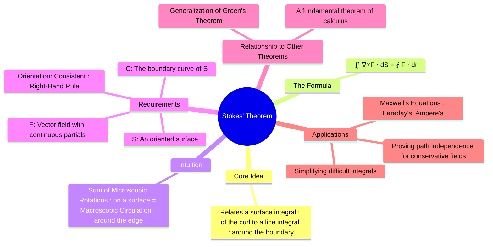

---
tags:
  - vector-calculus
  - calculus
  - fundamental-theorems
  - line-integrals
  - surface-integrals
  - stokes-theorem
  - engineering-math
created: 2025-09-09
aliases:
  - Stokes' Theorem
  - Curl Theorem
subject: "[[Mathematics]]"
parent: Vector Calculus
confidence: 9
---
###### Mind Map

---
### Stokes' Theorem
#stokes-theorem #vector-calculus #fundamental-theorems

> **Stokes' Theorem** is one of the major theorems of vector calculus. It establishes a powerful connection between the integral of the [[Curl]] of a vector field over a surface and the [[Line Integrals|line integral]] of the vector field itself around the boundary curve of that surface. In essence, it states that the total "microscopic rotation" on a surface is equal to the total "macroscopic circulation" around its edge.

Stokes' Theorem is the three-dimensional generalization of [[Green's Theorem]].

---
#### The Theorem Statement
#stokes-theorem/formula

Let $S$ be an oriented, piecewise-smooth surface that is bounded by a simple, closed, piecewise-smooth boundary curve $C$ with a positive orientation consistent with $S$. Let $\mathbf{F}$ be a vector field whose components have continuous partial derivatives on an open region containing $S$. Then:
$$\boxed{\quad \iint_S (\nabla \times \mathbf{F}) \cdot d\mathbf{S} = \oint_C \mathbf{F} \cdot d\mathbf{r} \quad}$$
Where:
*   $\nabla \times \mathbf{F}$ is the curl of the vector field.
*   The left side is a [[Surface Integrals|flux integral]] of the curl through the surface $S$.
*   The right side is a line integral for the circulation of the field around the boundary curve $C$.

---
#### Intuitive Meaning and Orientation
#right-hand-rule #circulation

**Intuitive Meaning**: Imagine a fluid flowing over the surface $S$. The curl, $\nabla \times \mathbf{F}$, represents the local spinning motion of the fluid (the "vorticity"). Stokes' Theorem says that if you add up all the tiny spinning motions over the entire surface, the net result is equal to the overall flow, or circulation, of the fluid around the boundary of that surface. The internal rotations all cancel each other out, leaving only the effect at the edge.

**Orientation**: The orientation of the curve $C$ and the surface $S$ must be consistent. This is determined by the **right-hand rule**: If you curl the fingers of your right hand in the direction of the traversal of the curve $C$, your thumb must point in the direction of the surface's normal vector $\mathbf{\hat{n}}$ (the direction of $d\mathbf{S}$).

---
#### Applications
#stokes-theorem/applications

1.  **Simplifying Integrals**: Stokes' Theorem allows us to convert a surface integral into a line integral, or vice versa. Often, one is much easier to compute than the other. If the curl of a field is simple, but the surface is complex, calculating the line integral might be easier.

2.  **Electromagnetism (Maxwell's Equations)**: The theorem is the mathematical foundation for two of Maxwell's equations in their integral form:
    *   **Faraday's Law of Induction**: Relates the circulation of the electric field ($\oint \mathbf{E} \cdot d\mathbf{l}$) to the rate of change of magnetic flux through the surface.
    *   **Ampere's Law**: Relates the circulation of the magnetic field ($\oint \mathbf{B} \cdot d\mathbf{l}$) to the electric current and changing electric flux through the surface.

3.  **Conservative Fields**: Stokes' Theorem provides a beautiful proof that a field is conservative if its curl is zero. If $\nabla \times \mathbf{F} = \mathbf{0}$, then for any closed loop $C$ that is the boundary of a surface $S$:
    $$ \oint_C \mathbf{F} \cdot d\mathbf{r} = \iint_S (\mathbf{0}) \cdot d\mathbf{S} = 0 $$
    Since the line integral around any closed loop is zero, the field must be conservative.

---
### Related Concepts
#related-concepts

> [[Green's Theorem]] (The 2D special case of Stokes' Theorem)

[[Gauss's Divergence Theorem|Divergence Theorem]]
[[Line Integrals]]
[[Surface Integrals]]
[[Gradient, Divergence, and Curl]]
[[Electromagnetic Fields]]
