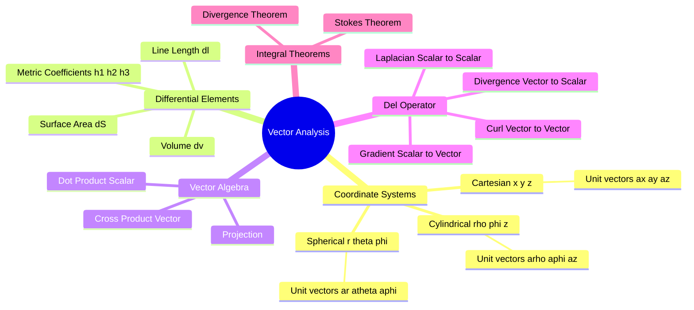

---
tags:
  - mathematics
  - vector-calculus
  - electromagnetic-fields
  - gate
  - coordinate-geometry
aliases:
  - Coordinate Systems
  - Differential Elements
  - Del Operator
  - Gradient Divergence Curl
subject: "[[Mathematics]]"
parent: "Vector Calculus"
confidence: 10
---
###### Mind Map

---
### Vector Analysis and Coordinate Systems
#mathematics/vector-calculus #electromagnetics

> **Vector Analysis** provides the mathematical language for Electromagnetics. Understanding the geometry of different **Coordinate Systems** and the corresponding **Differential Elements** ($d\mathbf{l}, d\mathbf{S}, dv$) is crucial for setting up integrals in GATE problems involving symmetry (e.g., fields around a wire or sphere).

#### Coordinate Systems Overview
#coordinate-systems

We utilize orthogonal coordinate systems where unit vectors are mutually perpendicular.

**A. Cartesian (Rectangular) Coordinates $(x, y, z)$:**
*   **Ranges:** $-\infty < x, y, z < \infty$.
*   **Unit Vectors:** $\hat{a}_x, \hat{a}_y, \hat{a}_z$ are constant in direction.

**B. Circular Cylindrical Coordinates $(\rho, \phi, z)$:**
*   Used for problems with axial symmetry (long wires, cables).
*   **Variables:**
    *   $\rho$: Radius from z-axis ($0 \le \rho < \infty$).
    *   $\phi$: Azimuthal angle from x-axis ($0 \le \phi < 2\pi$).
    *   $z$: Height along z-axis ($-\infty < z < \infty$).
*   **Relation to Cartesian:** $x = \rho \cos\phi, \quad y = \rho \sin\phi, \quad z = z$.

**C. Spherical Coordinates $(r, \theta, \phi)$:**
*   Used for problems with point symmetry (point charges, antennas).
*   **Variables:**
    *   $r$: Distance from origin ($0 \le r < \infty$).
    *   $\theta$: Polar angle (Co-latitude) from **positive z-axis** ($0 \le \theta \le \pi$).
    *   $\phi$: Azimuthal angle (Longitude) from **positive x-axis** ($0 \le \phi < 2\pi$).
*   **Relation to Cartesian:** $x = r \sin\theta \cos\phi, \quad y = r \sin\theta \sin\phi, \quad z = r \cos\theta$.

> [!warning] GATE Trap
> Note the range of $\theta$ is only $0$ to $\pi$, while $\phi$ is $0$ to $2\pi$.

---
#### Metric Coefficients and Differential Elements
#differential-elements

To define length, area, and volume in curvilinear coordinates, we use **Metric Coefficients** (scale factors) denoted as $(h_1, h_2, h_3)$.

**General Formulas:**
*   **Differential Length:** $d\mathbf{l} = h_1 du_1 \hat{a}_1 + h_2 du_2 \hat{a}_2 + h_3 du_3 \hat{a}_3$.
*   **Differential Volume:** $dv = h_1 h_2 h_3 \, du_1 du_2 du_3$.
*   **Differential Area ($d\mathbf{S}$):** Depends on the surface. E.g., normal to $u_1$: $d\mathbf{S}_1 = (h_2 du_2)(h_3 du_3) \hat{a}_1$.

**Table of Coefficients:**

| System | Coords $(u_1, u_2, u_3)$ | Scale Factors $(h_1, h_2, h_3)$ | Differential Volume ($dv$) |
| :--- | :--- | :--- | :--- |
| **Cartesian** | $x, y, z$ | $1, 1, 1$ | $dx \, dy \, dz$ |
| **Cylindrical** | $\rho, \phi, z$ | $1, \rho, 1$ | $\rho \, d\rho \, d\phi \, dz$ |
| **Spherical** | $r, \theta, \phi$ | $1, r, r\sin\theta$ | $r^2 \sin\theta \, dr \, d\theta \, d\phi$ |

> [!warning] Application
> *  **Cylindrical $d\mathbf{l}$:** $d\rho \hat{a}_\rho + \rho d\phi \hat{a}_\phi + dz \hat{a}_z$.
> *  **Spherical Surface Area ($r=$const):** $dS = (r d\theta)(r \sin\theta d\phi) = r^2 \sin\theta \, d\theta \, d\phi$.

---
#### Vector Differential Operations (The Del Operator $\nabla$)
#vector-calculus/operators

The Del operator is a vector differential operator. Its definition changes based on the coordinate system.

**A. Gradient ($\nabla V$):**
Max spatial rate of change of a scalar $V$. Result is a **Vector**.
$$\nabla V = \frac{1}{h_1}\frac{\partial V}{\partial u_1}\hat{a}_1 + \frac{1}{h_2}\frac{\partial V}{\partial u_2}\hat{a}_2 + \frac{1}{h_3}\frac{\partial V}{\partial u_3}\hat{a}_3$$

**B. Divergence ($\nabla \cdot \mathbf{A}$):**
Net outward flux per unit volume. Result is a **Scalar**.
$$\nabla \cdot \mathbf{A} = \frac{1}{h_1 h_2 h_3} \left[ \frac{\partial}{\partial u_1}(h_2 h_3 A_1) + \frac{\partial}{\partial u_2}(h_1 h_3 A_2) + \frac{\partial}{\partial u_3}(h_1 h_2 A_3) \right]$$

*   *Example (Cylindrical):* $\frac{1}{\rho} \frac{\partial}{\partial \rho}(\rho A_\rho) + \frac{1}{\rho} \frac{\partial A_\phi}{\partial \phi} + \frac{\partial A_z}{\partial z}$.

**C. Curl ($\nabla \times \mathbf{A}$):**
Rotation or circulation per unit area. Result is a **Vector**.
$$\nabla \times \mathbf{A} = \frac{1}{h_1 h_2 h_3} \begin{vmatrix} h_1 \hat{a}_1 & h_2 \hat{a}_2 & h_3 \hat{a}_3 \\ \frac{\partial}{\partial u_1} & \frac{\partial}{\partial u_2} & \frac{\partial}{\partial u_3} \\ h_1 A_1 & h_2 A_2 & h_3 A_3 \end{vmatrix}$$

**D. Laplacian ($\nabla^2 V = \nabla \cdot (\nabla V)$):**
$$\nabla^2 V = \frac{1}{h_1 h_2 h_3} \left[ \frac{\partial}{\partial u_1}\left(\frac{h_2 h_3}{h_1} \frac{\partial V}{\partial u_1}\right) + \dots \right]$$

---
#### Integral Theorems
#vector-calculus/theorems

**A. Divergence Theorem (Gauss's Theorem):**
Relates closed surface integral to volume integral.
$$\boxed{\quad \oiint_S \mathbf{A} \cdot d\mathbf{S} = \iiint_V (\nabla \cdot \mathbf{A}) dv \quad}$$

**B. Stokes' Theorem:**
Relates closed line integral (circulation) to open surface integral (curl).
$$\boxed{\quad \oint_L \mathbf{A} \cdot d\mathbf{l} = \iint_S (\nabla \times \mathbf{A}) \cdot d\mathbf{S} \quad}$$

---
### Related Concepts
#topic/related-concepts

> [[Gradient, Divergence, and Curl]] (Specifics of operators)
> [[Normal Vector]] (Gradient application)

[[Area in Polar Coordinates]] (2D version of Cylindrical)
[[Electrostatics]] (Uses Divergence Theorem / Gauss Law)
[[Magnetostatics]] (Uses Stokes Theorem / Ampere Law)
[[Multiple Integrals]] (Evaluating volume integrals)
