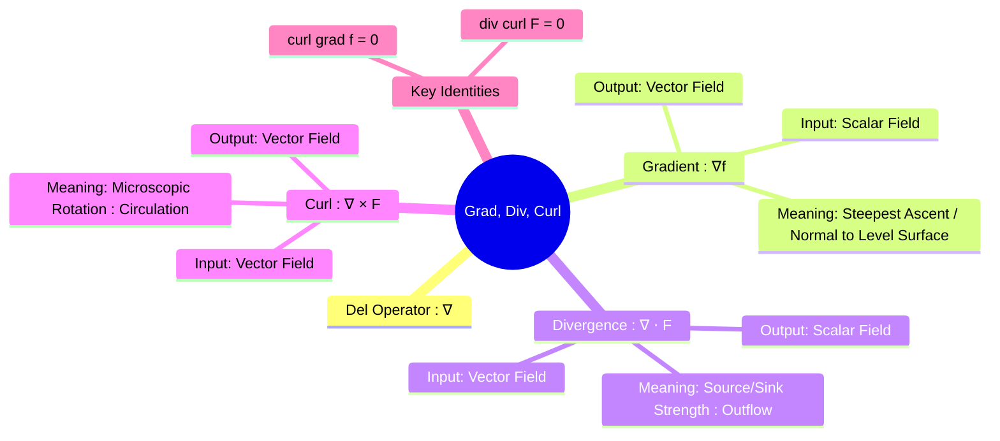

---
tags:
  - vector-calculus
  - multivariable-calculus
  - gradient
  - divergence
  - curl
  - del-operator
  - electromagnetic-fields
  - engineering-math
created: 2025-09-09
aliases:
  - Gradient
  - Divergence
  - Curl
  - Grad, Div, Curl
  - Del Operator
  - "∇⋅F = 0 : Solenoidal or Incompressible in Divergence"
  - Irrotational in Curl
subject: "[[Mathematics]]"
parent: Vector Calculus
formula:
  - "Del (∇) Operator : $$\\nabla = \\mathbf{i} \\frac{\\partial}{\\partial x} + \\mathbf{j} \\frac{\\partial}{\\partial y} + \\mathbf{k} \\frac{\\partial}{\\partial z}$$"
---
### Gradient, Divergence, and Curl
#vector-calculus #gradient #divergence #curl

> Gradient, Divergence, and Curl are the three fundamental differential operators of vector calculus. They describe the different ways a field can vary at a point. All three are based on the **Del (∇) operator** and are essential for describing physical laws in fields like electromagnetism and fluid dynamics.

###### Mind Map

---

#### The Del (∇) Operator
The Del operator is a vector differential operator, defined as:
$$\nabla = \mathbf{i} \frac{\partial}{\partial x} + \mathbf{j} \frac{\partial}{\partial y} + \mathbf{k} \frac{\partial}{\partial z}$$

---
#### Gradient (∇f) - Rate of Change of a Scalar Field
#gradient

The gradient operates on a **scalar function** $f(x,y,z)$ and produces a **vector field**.
$$\boxed{\quad \text{grad}(f) = \nabla f = \frac{\partial f}{\partial x}\mathbf{i} + \frac{\partial f}{\partial y}\mathbf{j} + \frac{\partial f}{\partial z}\mathbf{k} \quad}$$
**Physical Meaning**:
*   The gradient vector $\nabla f$ at a point points in the direction of the **steepest increase** of the function $f$.
*   The magnitude of the gradient, $|\nabla f|$, is the value of this maximum rate of change.
*   The gradient vector is always **normal (perpendicular)** to the level curves (2D) or level surfaces (3D) of the function $f$.

---
#### Divergence (∇ ⋅ F) - Source Strength of a Vector Field
#divergence

The divergence operates on a **vector field** $\mathbf{F} = P\mathbf{i} + Q\mathbf{j} + R\mathbf{k}$ and produces a **scalar field**. It is the dot product of the Del operator and the vector field.
$$\boxed{\quad \text{div}(\mathbf{F}) = \nabla \cdot \mathbf{F} = \frac{\partial P}{\partial x} + \frac{\partial Q}{\partial y} + \frac{\partial R}{\partial z} \quad}$$
**Physical Meaning**:
*   Divergence measures the net "outflow" or "flux density" of a vector field from an infinitesimal volume around a point. It represents the strength of a **source** or **sink**.
*   If $\nabla \cdot \mathbf{F} > 0$, the point is a source.
*   If $\nabla \cdot \mathbf{F} < 0$, the point is a sink.
*   If $\nabla \cdot \mathbf{F} = 0$, the field is called **solenoidal** or **incompressible**. (e.g., Magnetic field, $\nabla \cdot \mathbf{B} = 0$).

---
#### Curl (∇ × F) - Rotation of a Vector Field
#curl

The curl operates on a **vector field** $\mathbf{F}$ and produces another **vector field**. It is the cross product of the Del operator and the vector field.
$$\boxed{\quad \text{curl}(\mathbf{F}) = \nabla \times \mathbf{F} = \begin{vmatrix} \mathbf{i} & \mathbf{j} & \mathbf{k} \\ \frac{\partial}{\partial x} & \frac{\partial}{\partial y} & \frac{\partial}{\partial z} \\ P & Q & R \end{vmatrix} \quad}$$
**Physical Meaning**:
*   Curl measures the microscopic **circulation** or **rotation** of a vector field at a point. Imagine placing a tiny paddlewheel in a fluid flow; the curl describes how fast and around which axis it would spin.
*   The **direction** of the curl vector indicates the axis of rotation (by the right-hand rule).
*   The **magnitude** of the curl vector indicates the speed of rotation.
*   If $\nabla \times \mathbf{F} = \mathbf{0}$, the field is called **irrotational**. ([[Vector Fields|Conservative]] fields are irrotational).

---
#### Summary and Key Identities

| Operator | Definition | Input | Output | Meaning |
| :--- | :--- | :--- | :--- | :--- |
| **Gradient** | $\nabla f$ | Scalar Field | Vector Field | Steepest Ascent |
| **Divergence**| $\nabla \cdot \mathbf{F}$ | Vector Field | Scalar Field | Source/Sink |
| **Curl** | $\nabla \times \mathbf{F}$ | Vector Field | Vector Field | Rotation |

Two fundamental second-order identities are crucial:
1.  **Curl of a Gradient is always Zero**:
    $$\boxed{\quad \nabla \times (\nabla f) = \mathbf{0} \quad}$$
    This means that a gradient field (which is a conservative field) is always irrotational.

2.  **Divergence of a Curl is always Zero**:
    $$\boxed{\quad \nabla \cdot (\nabla \times \mathbf{F}) = 0 \quad}$$
    This means that a field which is the curl of another field is always solenoidal (has no sources or sinks).

---
### Related Concepts
#related-concepts

> [[Vector Fields]]

[[Directional Derivatives]]
[[Line Integrals]]
[[Surface Integrals]]
[[Divergence]]
[[Stokes' Theorem]]
[[Electromagnetic Fields]] (Maxwell's equations are written in terms of divergence and curl)