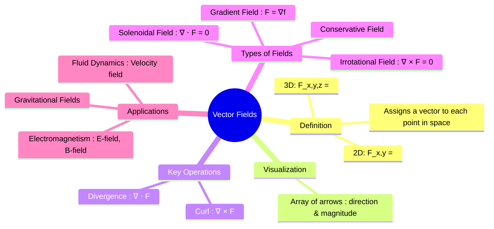

---
tags:
  - vector-calculus
  - multivariable-calculus
  - vector-fields
  - electromagnetic-fields
  - fluid-dynamics
  - engineering-math
created: 2025-09-09
aliases:
  - Vector Field
  - Vector Functions
  - "Properties : Conservative Fields"
  - "∇⋅F = 0 : Solenoidal or Incompressible in Divergence"
  - Irrotational in Curl
subject: "[[Mathematics]]"
parent:
  - Vector Calculus
confidence: 9
---
###### Mind Map

---
### Vector Fields
#vector-fields #vector-calculus

> A **vector field** is a function that assigns a vector to each point in a subset of space. They are used to model physical quantities that have both a magnitude and a direction at every point, such as the flow of a fluid, a gravitational field, or an electric field.

A vector field in $\mathbb{R}^2$ is a function $\mathbf{F}$ that assigns to each point $(x,y)$ a two-dimensional vector $\mathbf{F}(x,y)$.
$$ \mathbf{F}(x,y) = P(x,y)\mathbf{i} + Q(x,y)\mathbf{j} $$
Similarly, a vector field in $\mathbb{R}^3$ assigns a three-dimensional vector $\mathbf{F}(x,y,z)$ to each point $(x,y,z)$.
$$ \mathbf{F}(x,y,z) = P(x,y,z)\mathbf{i} + Q(x,y,z)\mathbf{j} + R(x,y,z)\mathbf{k} $$

---
#### Key Operations on Vector Fields
#divergence #curl

The behavior of a vector field is characterized by two fundamental differential operators: divergence and curl.

1.  **[[Divergence of a Vector Field|Divergence]] ($\nabla \cdot \mathbf{F}$)**
    *   Measures the rate of "outflow" or "source strength" of a vector field at a point.
    *   It is a **scalar** quantity.
    *   $\nabla \cdot \mathbf{F} > 0$: Source (net outflow)
    *   $\nabla \cdot \mathbf{F} < 0$: Sink (net inflow)
    *   $\nabla \cdot \mathbf{F} = 0$: The field is **solenoidal** or **incompressible**.

2.  **[[Curl of a Vector Field|Curl]] ($\nabla \times \mathbf{F}$)**
    *   Measures the microscopic "rotation" or "circulation" of a vector field at a point.
    *   It is a **vector** quantity.
    *   The direction of the curl vector indicates the axis of rotation (by the right-hand rule).
    *   $\nabla \times \mathbf{F} = \mathbf{0}$: The field is **irrotational**.

---
#### Conservative Vector Fields
#conservative-fields #potential-function #path-independence

A vector field $\mathbf{F}$ is called **conservative** if it is the [[Gradient of a Scalar Field|gradient]] of some scalar function $f$. This scalar function $f$ is called the **potential function** for $\mathbf{F}$.
$$\boxed{\quad \mathbf{F} = \nabla f \quad}$$

**Properties of Conservative Fields**: For a vector field $\mathbf{F}$ defined on a simply connected domain, the following are equivalent:
1.  $\mathbf{F}$ is conservative ($\mathbf{F} = \nabla f$ for some $f$).
2.  The [[Line Integrals|line integral]] of $\mathbf{F}$ is path-independent.
3.  The line integral of $\mathbf{F}$ around any closed loop is zero ($\oint \mathbf{F} \cdot d\mathbf{r} = 0$).
4.  The field is irrotational ($\nabla \times \mathbf{F} = \mathbf{0}$).

---
#### Applications in Engineering
#electromagnetism #fluid-dynamics

*   **Electromagnetism**:
    *   **Electric Field ($\mathbf{E}$)**: For static charges, the electric field is conservative, $\mathbf{E} = -\nabla V$, where $V$ is the electric potential.
    *   **Magnetic Field ($\mathbf{B}$)**: The magnetic field is always solenoidal, $\nabla \cdot \mathbf{B} = 0$ (Gauss's law for magnetism).
*   **Fluid Dynamics**:
    *   A **velocity field** $\mathbf{v}$ describes the motion of a fluid.
    *   $\nabla \cdot \mathbf{v}$ measures the compressibility of the fluid.
    *   $\nabla \times \mathbf{v}$ measures the **vorticity**, or the local spinning motion of the fluid.

---
### Related Concepts
#related-concepts

> [[Gradient]] (Creates a conservative vector field from a scalar field)

[[Divergence]] (A scalar property of a vector field)
[[Curl]] (A vector property of a vector field)
[[Line Integrals]] (Work done by a field)
[[Stokes' Theorem]] (Relates curl to circulation)
[[Divergence of a Vector Field]] (Relates divergence to flux)
[[Electromagnetic Fields]]
