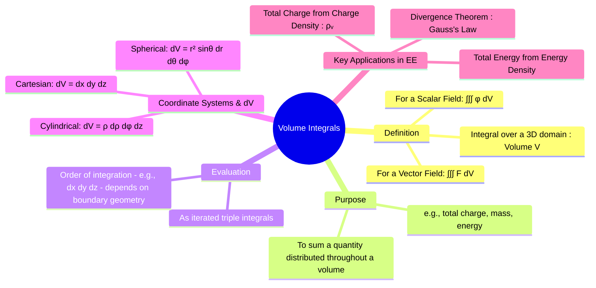

---
tags:
  - vector-calculus
  - integral-calculus
  - electromagnetic-fields
  - engineering-math
created: 2025-09-15
aliases:
  - Triple Integrals
  - Volumetric Integral
  - "Example : Total Charge : Volume Integrals"
subject: "[[Mathematics]]"
parent:
  - Vector Calculus
---
### Volume Integrals
#volume-integral #triple-integral #vector-calculus

> A **volume integral** (or triple integral) is used to integrate a function over a three-dimensional region (a volume). In engineering, its primary purpose is to calculate a total quantity when its density is known throughout a volume. The most important application in electrical engineering is finding the total electric charge within a region from a given volume charge density, which is a cornerstone of electrostatics and [[Electromagnetism - Gauss's Law|Gauss's Law]].

###### Mind Map

---

#### Definition of a Volume Integral
#volume-integral/definition
A volume integral can be computed for both scalar and vector fields.

1.  **Integral of a Scalar Field ($\phi$)**: This calculates a total scalar quantity. If $\phi$ represents a density (e.g., charge density, mass density), the integral gives the total amount of that quantity.
    $$\text{Total Scalar Quantity} = \iiint_V \phi \, dV$$
2.  **Integral of a Vector Field ($\vec{F}$)**: This is performed by integrating each component of the vector separately. The result is a vector.
    $$\vec{R} = \iiint_V \vec{F} \, dV = \left(\iiint_V F_x \, dV\right)\hat{a}_x + \left(\iiint_V F_y \, dV\right)\hat{a}_y + \left(\iiint_V F_z \, dV\right)\hat{a}_z$$

---
#### Evaluation in Different Coordinate Systems
#cartesian-coordinates #cylindrical-coordinates #spherical-coordinates
The key to evaluating a volume integral is choosing the appropriate coordinate system that matches the symmetry of the volume V and correctly defining the differential volume element $dV$.

1.  **Cartesian Coordinates $(x, y, z)$**: Used for rectangular or cuboid shapes.
    $$\boxed{\quad dV = dx \, dy \, dz \quad}$$
    The integral is: $\iiint_V \phi(x,y,z) \, dx \, dy \, dz$.

2.  **Cylindrical Coordinates $(\rho, \phi, z)$**: Used for problems involving cylinders, cones, or wires.
    $$\boxed{\quad dV = \rho \, d\rho \, d\phi \, dz \quad}$$
    The integral is: $\iiint_V \phi(\rho,\phi,z) \, \rho \, d\rho \, d\phi \, dz$.

3.  **Spherical Coordinates $(r, \theta, \phi)$**: Used for problems with spherical symmetry, like point charges or spherical charge distributions.
    $$\boxed{\quad dV = r^2 \sin\theta \, dr \, d\theta \, d\phi \quad}$$
    The integral is: $\iiint_V \phi(r,\theta,\phi) \, r^2 \sin\theta \, dr \, d\theta \, d\phi$.

---
#### Applications in Electrical Engineering
#charge-density #gausss-law #divergence-theorem

##### 1. Calculating Total Charge
This is the most fundamental application. The total charge $Q_{enc}$ enclosed within a volume $V$ is the volume integral of the volume charge density $\rho_v$ (in C/m³).
$$\boxed{\quad Q_{enc} = \iiint_V \rho_v \, dV \quad}$$
*   **Example**: To find the charge in a sphere of radius 'a' with charge density $\rho_v = k r^2$, we would use spherical coordinates:
    $$ Q = \int_0^{2\pi} \int_0^\pi \int_0^a (kr^2) (r^2 \sin\theta \, dr \, d\theta \, d\phi) $$

##### 2. Divergence (Gauss's) Theorem
The volume integral is the core of the right-hand side of the Divergence Theorem, which is the integral form of Gauss's Law.
$$\oint_S \vec{D} \cdot d\vec{s} = \iiint_V (\nabla \cdot \vec{D}) \, dV$$
From Maxwell's first equation, we know $\nabla \cdot \vec{D} = \rho_v$. Substituting this gives:
$$ \oint_S \vec{D} \cdot d\vec{s} = \iiint_V \rho_v \, dV = Q_{enc} $$
This shows that the volume integral of the divergence of the electric flux density equals the total charge enclosed—a foundational concept in electromagnetics.

---
### Related Concepts
#vector-calculus/related-concepts

> [[Divergence#Divergence Theorem (Gauss's Theorem)]]

[[Line Integrals]]
[[Surface Integrals]]
[[Coordinate Systems (Cartesian, Cylindrical, Spherical)]]
[[3. Electromagnetic Fields/1. Electrostatics/Electromagnetic Fields]]
[[Gauss's Law - Maxwell's equations]]
